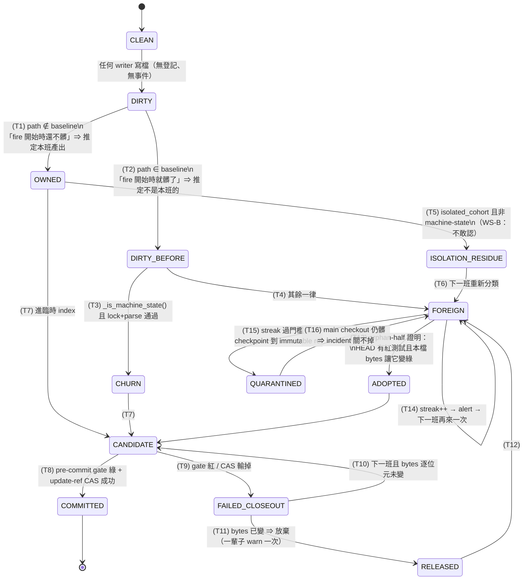
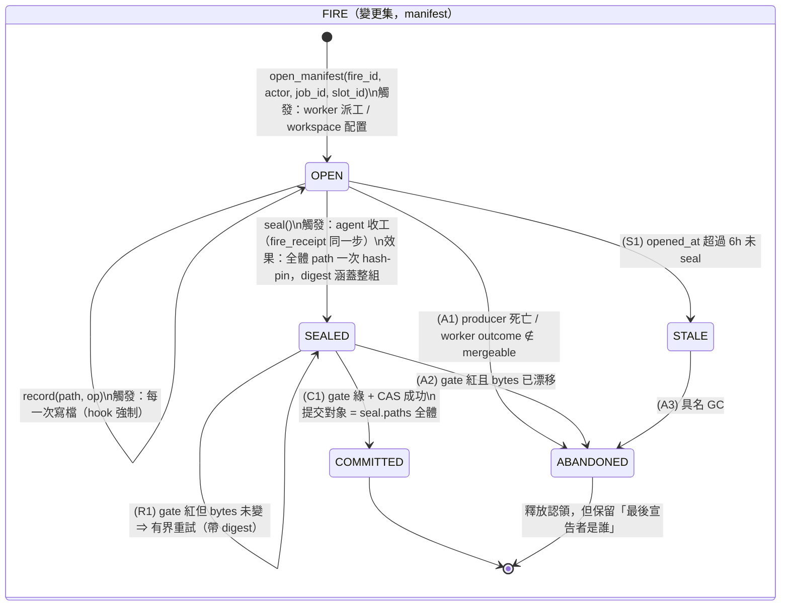

# Commit ownership 重新設計：fire 產出 → 認領 → gate → commit 狀態機

**觸發**：老闆 2026-07-21 telegram-1270（第三次要求）「你連 commit 這麼簡單的事情都可以出錯，整個流程重新設計過」+ 明確「不要再補丁」。
**前置文件**：`docs/refactor_plan_agent_output_ownership.md`（2026-07-13，receipt 重構）、`docs/governance/2026-07/phase_z_ownership_external_review.md`（外部裁決）、`docs/error_log.md` §B。
**本文件的定位**：前兩份是「誰負責 commit」與「不要再加 recognizer」；本文件是**把那個裁決畫成狀態機並落地**。

---

## 0. 三句話摘要

1. 現行流程裡「檔案屬於誰」是**在收班時用時間差推測**的（`owned = dirty_now − baseline`），推測的輸入是**整個共享 checkout**，所以併發度一上去，每個 slot 看到的「別人的髒檔」就淹掉自己的訊號。
2. 狀態機因此有一條**只進不出的吸收態 `FOREIGN`**：唯一的自動出口（orphan-half 認領）其守衛是 `len(candidates) <= 8`，而 candidates 的數量由**別人有多髒**決定 —— 這就是 38 次 `candidates exceeds cap 8` 的空轉點。
3. 替代設計把 ownership 從**推測**改成**宣告**：寫檔當下就登記到該 fire 的 workspace-scoped manifest，PHASE-Z 只 commit 自己 manifest 裡的檔，沒登記的檔一律不碰但**有具名出口**（orphan queue / abandoned-by-job-X），不再靜默腐爛。

---

## 1. 現況狀態機（缺陷版）

`run_phase_z()` 對「一個 dirty path」實際跑的狀態機。狀態標在路徑上，不在 fire 上 —— 這是第一個要看清楚的事：**現行設計沒有「變更集」這個單位**，只有一個一個獨立的 path（2026-07-21 00:29 部分 commit 事故的形狀來源）。



### 1.1 每個轉移對應哪一次事故

| 轉移 | 缺陷 | 對應事故 |
|---|---|---|
| **T1** 推定本班產出 | baseline 是**開班瞬間**的快照。多 slot 併發時，A 班的快照拍不到 B 班中途才開始寫的檔 → B 的檔落進 A 的 `dirty_now − baseline` | telegram-1203 孤兒檔（誤收/漏收兩面）；`docs/error_log.md` 2026-07-10 `git add -A` 收走截斷的 `next_tasks.json`、把繞過測試閘門的改寫送進 main、把互動 session 沒改完的 `merge_worktree.sh` commit 進不相干訊息 |
| **T2** 推定不是本班的 | 開班前已髒、本班又改過的檔，**貢獻直接消失**。集合差沒有「兩個作者」這個表示法 | 2026-07-19 外部裁決三個必然誤判之二；2026-07-20 14:04 watchdog 誤殺留下的兩個 derived artifact |
| **T4 → T14 自迴圈** | `FOREIGN` 是**吸收態**：唯一自動出口是 T13，其他只會 streak++ 再 alert。alert 沒有 actuator | telegram-1263「檔案連續多班沒人收」；2026-07-19「40 個檔連續 78 班沒人收」 |
| **T13 的守衛** | `len(_orphan_half_candidates(...)) > 8 ⇒ 整批放棄`。candidates 的長度由**同一個 checkout 上所有人的髒檔**決定 | **`phase_z_orphan_half_cap_high_concurrency_20260721`：38 次 `candidates exceeds cap 8`（實例 2026-07-20 03:12 為 23 candidates）** |
| **T9 → T10** | 恢復單位是「路徑」，不是「變更集」 | 2026-07-21 00:29：`failure_class.py` 沒跟著 `worker.py` 一起 commit，main 紅 32 分鐘，且那 32 分鐘裡 production 判死路徑是壞的 |
| **T15 → T16** | 保存了 bytes 但 main checkout 仍髒 ⇒ `foreign_incident --check` 永遠 `closeable=false` ⇒ `dispatch_slot_budget.py` 永久降載 | 2026-07-20 一次 watchdog 誤殺讓後續 **13 班** slot cap 減半；2026-07-21 現況 blocker `scripts/detect_price_split_breaks.py` |
| **T5/T6** | WS-B 為了不猜而「不敢認」，但沒有把責任交給任何人 | `candidate_gate_self_modification` 重試 3 次收不了班（telegram-1208）：候選被 gate 擋 → 沒有具名 owner → 下一班重來 |

### 1.2 38 次空轉的精確機制（老闆點名要看的那一條）

```
_adopt_orphan_halves(repo_root, foreign, ...)
  candidates = [p for p in foreign if 在 gated tree、非 test、檔案存在]
  if len(candidates) > 8:            # ← _ORPHAN_HALF_MAX_CANDIDATES
      return {"reason": "too_many_candidates"}   # 整批放棄，一個都不驗
```

**空轉的三段論**：

1. `foreign` 的內容 = 「fire 開始時就髒、且不是 machine state 的所有路徑」。它**不是**本 fire 的東西，而是**這個共享 checkout 上所有人的未提交工作**。
2. `max_slots` 2→4 之後，任一時刻 canonical checkout 上同時有 3 個別的 slot 在寫檔 → 單次 drain 的 foreign 清單長達 50+ 檔，candidates 常態 20–30。
3. 於是守衛 `> 8` **永遠成立**，T13 這條轉移**一次都不會執行**。而沒被認領的檔繼續髒著，成為下一班 foreign 的一部分 → candidates 只增不減 → **自我增強**。

**這條轉移是「cost ceiling」寫在錯誤的軸上**：cap 想控制的是「我要花多少 clone+pytest 去驗證**我自己的**孤兒半成品」，但它量的是「**別人**留了多少髒檔」。兩者在單 writer 的世界裡數值相同，在 4-slot 併發的世界裡完全脫鉤。

**注意這裡不能靠調大 cap 修**（那就是老闆說的補丁）：cap 調到 64，成本就是 64 次 clone + pytest（每次 240s 上限、總預算 900s），預算耗盡後照樣 `budget_exhausted` 整批放棄，只是換一個 reason 字串。**病根是「用測試變綠反推 producer identity」這件事本身** —— 這正是外部裁決 D1 點名的第 4 種猜法，`test_phase_z_ownership_class_gate.py` 已經把它凍在 census 裡。新設計直接讓這條轉移**沒有存在必要**：宣告過的檔不需要被證明，沒宣告的檔不會被猜。

---

## 2. 替代設計：ownership 是宣告的

### 2.1 一句話

**寫檔的那一刻就登記「這是誰的」；收班時 commit 的對象是 manifest，不是 working tree 的掃描結果。**

`git status` 回答「什麼變了」，它從來就回答不了「誰改的」。現行設計花了六次修復想從前者推出後者。新設計不再問 git，改問**寫的人**——寫的人一定知道。

### 2.2 新狀態機

兩層：**fire（變更集）** 是主體，**path** 是它的成員。這是與現行設計最大的結構差異 —— 原子性從此有表示法。



Path 的歸屬只有一個查表動作（`resolve_ownership`），沒有推理：

| path 狀態 | 判準 | 出口 |
|---|---|---|
| `owned` | 恰有一個 live manifest 宣告，且就是我 | 進本 fire 的變更集 |
| `foreign` | 恰有一個 live manifest 宣告，是別人 | 不碰。**具名**：知道是哪個 job/slot |
| `contested` | ≥2 個 live manifest 宣告同一路徑 | **永不自動 commit**，直接 alert（這是真衝突，集合差只會靜默選錯邊） |
| `stale` | 最後宣告者已死（>6h 未 seal） | 具名 GC：「這檔是 job X 在 03:12 放棄的」 |
| `orphan` | 沒有任何 manifest 宣告 | **唯一殘留車道**，且它的大小現在是一個可以看著它收斂的數字，而不是所有東西的預設答案 |

### 2.3 為什麼這不是「再加一個 recognizer」

`test_phase_z_ownership_class_gate.py` 凍住的 census 是「從**結果特徵**反推 producer」的清單：目錄、副檔名、mtime、receipt、測試變綠。本設計**一個都沒新增**，而且讓其中一個（orphan-half）失去存在理由。差別在資訊來源：

- recognizer：看著 bytes 猜是誰寫的 → 資訊在事後根本不存在，猜是唯一選項。
- manifest：寫的人自己說 → 資訊在**寫入當下**存在且免費，只是以前沒人記下來。

這是外部裁決那句話的直譯：「Ownership 必須由 execution isolation 產生，不能由 cleanup layer 事後推理。」WS-B（producer-scoped worktree）是這句話的**強形式**；manifest 是**弱形式** —— 它涵蓋 WS-B 涵蓋不到的車道（canonical checkout 上的 scheduled writer、未隔離的 fire、互動 session），而那些車道正是目前殘留的來源。兩者互補，不是二選一。

---

## 3. Manifest schema

**位置**：`<git-common-dir>/volpred_fire_manifests/<fire_id>.json`

- **git dir 而非 `storage/`**：`git status` 從不走訪它 → 這個帳本**不可能變成它要防止的那種孤兒檔**，也不需要 `.gitignore` 規則（同 pre-fire snapshot 的既有慣例）。
- **common dir 而非 per-worktree git dir**：跑在 producer-scoped worktree 裡的 fire，其 manifest 必須被 canonical checkout 的 PHASE-Z 讀得到。
- **併發**：每次 mutation 是「對 manifest 自己那個檔 `fcntl` 獨佔鎖 → read-modify-write → `os.replace`」。四個 slot 寫四份 manifest 完全不競爭；同一份 manifest 的兩個寫入序列化；讀者永遠讀不到半寫狀態。

```jsonc
{
  "schema": 1,
  "fire_id": "20260721T134500123456Z-slot-1-bd00f90a",  // 檔名，正規表達式受限
  "actor": "dispatch-supervisor/worker",   // 必填。無名的 owner 不是 owner
  "job_id": "bd00f90a-...",
  "slot_id": "slot-1",
  "workspace": {
    "kind": "canonical" | "worktree",
    "path": ".claude/worktrees/dispatch-slot-1-bd00f90a",
    "branch": "dispatch-slot-1-bd00f90a"
  },
  "task_ids": ["assign_de13fd1b"],
  "opened_at": "2026-07-21T13:45:00.123456Z",
  "opened_at_ts": 1784646300.123456,       // staleness 判定用的機器時鐘
  "state": "open" | "sealed" | "committed" | "abandoned",

  "entries": [                              // append-only；同一路徑可多筆，最後一筆為準
    {
      "path": "src/volpred/ops/fire_manifest.py",  // 一律 repo-relative POSIX
      "op": "write" | "delete",
      "at": "2026-07-21T13:45:02.500000Z",
      "sha256": "…",                        // 宣告當下的 bytes；delete 為 null
      "bytes": 21504,                       // delete 為 null
      "tool": "Write",                      // 誰寫的（Write / Edit / script 名）
      "note": ""
    }
  ],

  "seal": {                                 // state=sealed 之後才有
    "at": "2026-07-21T14:02:11.000000Z",
    "paths": [ {"path": "…", "op": "write", "sha256": "…", "bytes": 123} ],
    "digest": "sha256(全體 (path, op, sha256) 排序後)"   // ← 變更集的身分
  },

  "closed_at": null,
  "commit": null,                           // state=committed 時的 oid
  "close_reason": ""
}
```

**`seal.digest` 是整個設計的原子性支點**：它涵蓋**全體**宣告路徑。「只 commit 其中一半」在這個表示法裡**無法表達** —— 2026-07-21 00:29 那次 `failure_class.py` 掉隊的形狀，在 sealed manifest 下要嘛整組進、要嘛整組不進。

---

## 4. 與現行 `phase_z.py` 的差異

| 面向 | 現行 | 新設計 |
|---|---|---|
| ownership 來源 | `dirty_now − baseline`（推測） | manifest 查表（宣告） |
| ownership 的單位 | 單一 path | 變更集（sealed manifest），path 是成員 |
| 資訊取得時機 | 收班時（資訊已不存在） | 寫入當下（資訊免費） |
| 併發正確性 | 隨 slot 數惡化（本文 §1.2） | 與 slot 數無關；四份帳本互不相干 |
| 「兩個作者改同一檔」 | 無表示法，靜默選一邊 | `contested`，永不自動 commit |
| 別人的髒檔 | `foreign` + streak alert（無 actuator） | `foreign` 具名到 job_id/slot_id |
| 無主檔 | 預設答案，靜默腐爛 78 班 | `orphan`，唯一殘留車道，數量是可收斂的指標 |
| 死掉的 producer | 無記錄 | `stale` → 具名 GC「job X 在 03:12 放棄」 |
| orphan-half 認領 | 用「測試變綠」反推作者，高併發下 38 次空轉 | **移除**（宣告過的不必證明，沒宣告的不猜） |
| 失敗恢復粒度 | 逐路徑 fingerprint 比對 | 整組 `seal.digest` |
| commit 決策輸入 | `git status` 掃描 | `seal.paths` |

**保留不動的**：pre-commit gate、臨時 `GIT_INDEX_FILE` 候選、`update-ref` CAS、post-commit clone 測試閘門、`git_writer_lock` transaction lease、fire receipt（agent 說「為什麼」）。這次動的**只有「收哪些檔」這個輸入**，不是提交機制本身。

---

## 5. 分階段落地

### 階段 1 — 帳本 + shadow（**本班已完成**）

**做了什麼**

- `src/volpred/ops/fire_manifest.py`：完整的宣告/查詢 library（open / record / seal / close / resolve_ownership / prune）+ shadow 比對 + CLI（`python -m volpred.ops.fire_manifest`）。
- `scripts/tests/test_fire_manifest.py`：25 個 test，每個釘住一次歷史事故的觸發條件。
- `scripts/dispatch_supervisor/phase_z.py`：**唯二兩行**改動 —— 新增 `_observe_ownership_shadow()`（全 `try/except` 包覆、只讀、只寫 git dir 內的 JSONL）與 `run_phase_z()` 內一次呼叫。**commit 決策路徑一個字元都沒動**。

**shadow 記錄什麼**（`<git-dir>/volpred_phase_z_shadow.jsonl`，每班一列）

| 欄位 | 意義 |
|---|---|
| `inferred` | 現行 `dirty_now − baseline` 的答案 |
| `declared` | manifest 說是本 fire 的 |
| `inferred_not_declared` | **PHASE-Z 會用本班名義收走、但沒人宣告過的檔** ← 所有誤收事故住在這裡 |
| `declared_not_inferred` | 本班宣告了但算術漏掉的 ← 所有「我的貢獻不見了」住在這裡 |
| `orphan` / `foreign_attributed` / `stale_attributed` / `contested` | 殘留車道的組成 |

**驗收條件（階段 1）**：
- [x] `uv run pytest scripts/tests/test_fire_manifest.py` 全綠（25 passed）
- [x] break-then-verify：把 `resolve_ownership` 的殘留答案改回「問的人就是 owner」（＝現行預設），4 個 test 轉紅；還原後 25 綠。gate 咬得住。
- [x] 既有 8 支 phase_z 測試 + 新測試合跑 109 passed → 現行行為零回歸
- [x] shadow 在真 repo 上實測可跑：`dirty_total=26 / declared=0 / orphan=26`（尚無 producer 宣告，符合預期）
- [ ] **下一班起**：`.git/volpred_phase_z_shadow.jsonl` 每班一列，可直接量出 `inferred_not_declared` 的規模

### 階段 2 — producer 開始宣告（下一班可起跑）

**做什麼**
1. `worker.py` / `workspace.py`：派工時 `open_manifest(fire_id=…, actor="dispatch/slot-N", job_id, slot_id)`，fire_id 寫進 agent 環境（`VOLPRED_FIRE_ID`）。
2. **PostToolUse hook**：agent 每次 `Write`/`Edit`/`NotebookEdit` 落地後自動 `record()`。**這是關鍵設計選擇** —— 宣告必須是 hook 強制的機械動作，不能是 prompt 散文請 agent 自己記。`docs/refactor_plan_agent_output_ownership.md` 已經證明過一次：「一個大家都要記得、但沒有東西在檢查的步驟，不是偶爾漏，它就是預設路徑」（14 天 186/266 漏 receipt）。
3. `scripts/fire_receipt.py`：收 receipt 的同一步呼叫 `seal()`（agent 只有一個收工動作，不新增第二個要記得的步驟）。
4. scheduled writer（`scheduled_writer_commit.py` 等）比照：各自開自己的 manifest。
5. shadow 繼續跑，但現在兩邊都有內容，差異變成**真的訊號**。

**驗收條件（階段 2）**：
- 連續 7 天，`declared_not_inferred` 每班可量測；shadow log 覆蓋率（有 `fire_id` 的班次 / 總班次）≥ 95%
- `inferred_not_declared` 的中位數收斂：目標 ≤ 2 檔/班（現況全部 26 檔皆無宣告）
- **不得**因為宣告缺漏而讓任何檔案漏掉 commit —— 階段 2 期間 PHASE-Z 仍以 baseline 為準，manifest 只觀察
- 機械 gate：hook 未安裝 / manifest 未開 → daily checkup 出 finding（沉默的 hook = 沒有 hook）

### 階段 3 — 切換決策權 + 退役猜測

**做什麼**
1. `run_phase_z()` 的收檔輸入從 `dirty_now − baseline` 換成 `seal.paths`；baseline 降級成**驗證器**（兩邊不一致就 alert，不再是決策者）。
2. **刪除 `_adopt_orphan_halves` 與 `_orphan_half_candidates`**（38 次空轉的那條轉移），同時更新 `test_phase_z_ownership_class_gate.py` 的 census —— census 從 1 變 0 是這次重構真正的結案證明。
3. `orphan` / `stale` 車道接上 actuator：具名 GC + 認領佇列，取代目前「streak → alert → 無人行動」。alert 必須有 actuator，否則就是紅色日誌（外部裁決 D3）。
4. `contested` 接 incident。
5. 原子性：`SEALED → COMMITTED` 以整組 digest 為單位，`FAILED_CLOSEOUT` 的逐路徑恢復隨之退役。

**驗收條件（階段 3）**：
- 連續 14 天零筆 `ownership_unknown`、零筆 `too_many_candidates`
- 連續多班無人收的檔案數 = 0；任何 orphan 在 2 班內獲得具名處置（認領 / abandoned-by-X / quarantine）
- `foreign_incident --check` 不再出現「已保存但仍髒 ⇒ 永遠關不掉」的死結（`dispatch_slot_budget.py` 不再被無出口 incident 降載）
- 部分 commit 不可表達：以「刻意只 seal 一半」的 test 釘住
- `KNOWN_PROVENANCE_GUESSES == frozenset()`
- break-then-verify：拆掉 manifest 決策後，至少 3 個歷史事故 test 轉紅

---

## 6. 每一次歷史事故在新設計下如何被擋掉（逐條）

| # | 事故 | 舊路徑為何失敗 | 新設計擋在哪一步 | 釘住它的 test |
|---|---|---|---|---|
| 1 | **telegram-1203 孤兒檔** | 併發下 baseline 拍不到別班中途寫的檔，該收的沒收、不該收的收了 | 宣告與時間窗無關；B 班寫多少檔都不改變 A 班 `resolve_ownership` 的答案 | `test_concurrent_slots_do_not_claim_each_others_output` |
| 2 | **telegram-1208 `candidate_gate_self_modification` 重試 3 次收不了班** | 候選被 gate 擋下後，ownership 證據只活 3 次重試；沒有具名 owner 承接 | `SEALED` 狀態帶 `digest`，bytes 未變就用同一個 digest 重試（`R1`）；bytes 已變則 `ABANDONED` 並具名，不會無限重試也不會靜默 | `test_seal_digest_changes_when_any_member_of_the_set_changes` |
| 3 | **telegram-1263 檔案連續多班沒人收** | `FOREIGN` 是吸收態，唯一出口 T13 幾乎不觸發，alert 無 actuator | 死掉的 producer 6h 後轉 `stale`，**帶著名字**（「job X 放棄的」），可具名 GC 而非匿名腐爛 | `test_a_dead_producers_claim_expires_but_keeps_its_name`、`test_abandoned_manifest_releases_its_claim` |
| 4 | **`phase_z_orphan_half_cap_high_concurrency_20260721`：38 次 `candidates exceeds cap 8`** | 守衛量的是「別人有多髒」，但要決定的是「我的孤兒半成品」；併發下守衛永遠成立，且不認領 → 下一班更髒 → 自我增強 | **這條轉移整條移除**（階段 3）。宣告過的檔不需要被證明，沒宣告的檔不猜。沒有 cap，就沒有 cap 被淹掉 | 階段 3：`KNOWN_PROVENANCE_GUESSES == frozenset()`；階段 1 已用 `test_concurrent_slots_…` 證明併發不再放大 |
| 5 | **2026-07-10 `git add -A` 收走截斷的 `next_tasks.json`** | 預設答案是「都是你的」 | 未宣告 ⇒ `orphan`，預設答案是「**沒人的**」，永不進候選 | `test_undeclared_dirt_is_orphan_not_this_fires_output` |
| 6 | **2026-07-10 繞過測試閘門的改寫送進 main** | 同上（來源是全樹掃描，不是宣告） | 同上；且變更集是 seal 的單位，非法成員無法搭便車 | `test_undeclared_dirt_is_orphan_not_this_fires_output` |
| 7 | **2026-07-10 互動 session 沒改完的 `merge_worktree.sh` 被 commit 進不相干訊息** | 互動 session 不在任何 fire 的帳本上，卻在 dirty 集裡 | 互動 session 不宣告 ⇒ 永遠 `orphan` ⇒ 永遠不被 fire 收走 | `test_undeclared_dirt_is_orphan_not_this_fires_output`、`test_shadow_reports_what_the_arithmetic_would_have_over_claimed` |
| 8 | **2026-07-19 40 個檔連續 78 班沒人收** | `owned = dirty_now − baseline` 照規格運作的必然結果 | 殘留從「預設答案」降為「唯一殘留車道」，且大小可量測、可設收斂目標（階段 2/3 驗收） | `test_shadow_reports_what_the_arithmetic_would_have_over_claimed` |
| 9 | **2026-07-21 00:29 `failure_class.py` 掉隊，main 紅 32 分鐘且 production 判死路徑壞掉** | 恢復單位是路徑，不是變更集；「部分 commit」是可表達的狀態 | `seal.digest` 涵蓋全體宣告路徑；「只 commit 一半」無法表達 | `test_seal_pins_the_whole_change_set_with_one_digest`、`test_a_sealed_fire_cannot_grow_new_output` |
| 10 | **2026-07-20 watchdog 誤殺留下 derived artifact → 13 班降載** | 被殺在「產出 → (長工作) → 提交」之間，留下無主檔；incident 無出口 | 產出當下就已宣告；producer 死亡 ⇒ `STALE → ABANDONED` 具名出口，不落進匿名 foreign incident | `test_a_dead_producers_claim_expires_but_keeps_its_name` |
| 11 | **2026-07-18 unreadable receipt 永久 CRITICAL、唯一 off switch 是人工刪檔** | fail-closed 讀取讓模組永遠再也記不了 ownership，且不出聲 | 壞掉的 manifest 降級為「這一份沒有宣告」並 log，不影響其他帳本 | `test_a_corrupt_manifest_degrades_to_no_declaration_not_an_exception` |
| 12 | **開班前已髒、本班又改過 ⇒ 貢獻消失** | 集合差沒有「兩個作者」表示法 | 宣告直接覆蓋此情形 | `test_a_path_dirty_before_the_fire_is_still_owned_when_declared` |
| 13 | **兩個 writer 改同一檔** | 靜默選一邊 | `contested`，永不自動 commit | `test_two_declared_owners_is_contested_and_never_silently_owned` |

---

## 7. 這次為什麼不是又一個補丁

`.claude/rules/control-plane.md` 的 anti-stacking：一個 concern 只能有一個 enforcement owner。

盤點層數變化：

- **移除**：`_adopt_orphan_halves` + `_orphan_half_candidates`（階段 3）、逐路徑 failed-closeout 恢復（被 digest 取代）、`isolation_residue` 這個「不敢認也不交給誰」的中間態。
- **新增**：一個 library（`fire_manifest.py`）+ 一個 hook（宣告）。
- **淨變化**：census 從 1 個 provenance guess 變成 0；PHASE-Z 從「決策者 + 猜測者」變成「決策者」，baseline 從決策者降級成驗證器。

**層數是少了，不是多了。** 而且這次改的是**資訊在哪裡產生**（寫入端），不是**如何更聰明地事後推理**（cleanup 端）—— 那正是外部裁決 D1 禁止的方向，也是前六次修復共同的失敗形狀。
