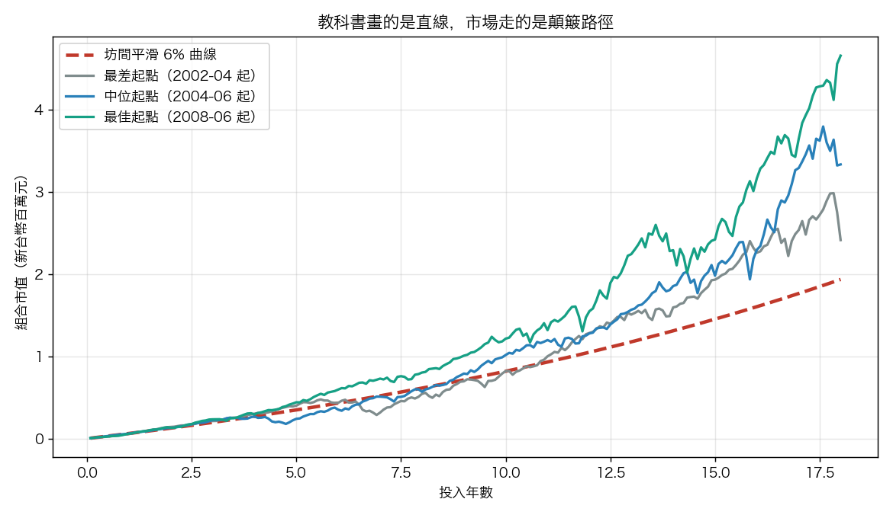
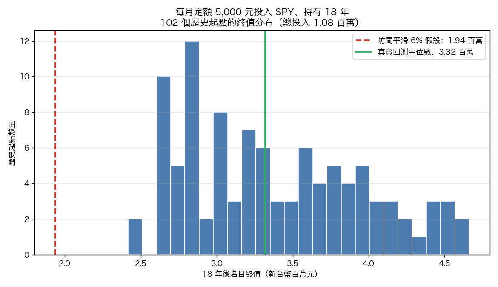

# 幫小孩開投資帳戶之前，先看懂這張顛簸的曲線

政府在討論兒少版的個人投資儲蓄帳戶，家長群組也熱烈轉發各種試算：每月幫小孩存五千、放十八年、年報酬抓 6%，十八年後帳戶會長到多少。試算表通常給出一個漂亮的整數，配一條光滑上揚的曲線。

這條曲線有個問題。它假設市場每年都乖乖給你 6%，從不回檔。真實市場不是這樣走的。我們用 SPY（美國標普 500 ETF，含息）2000 到 2026 年的實際歷史，把同一套「每月定額、持有十八年」的策略完整跑了一遍，結果跟試算表差很多。

## 先說資料怎麼跑的

資料是 SPY 調整後收盤價，2000 年 1 月到 2026 年 5 月，6,644 個交易日，沒有缺值，每月取月末值。策略很單純：每個月底投入 5,000 元，用當月收盤價買進，持有十八年（216 個月）。十八年總共投入 108 萬。

關鍵在於我們不是只跑一次。在 26 年的資料裡，可以切出 102 個不同的十八年起點：2000 年 1 月開始的人是一條路徑，2000 年 2 月開始的人是另一條，一路到能完整跑完十八年的最後一個起點。102 個起點，102 個結果。

## 第一件事：路徑是顛簸的

下面這張圖把三條真實路徑跟坊間的平滑 6% 曲線疊在一起。紅色虛線是教科書畫的那條，另外三條是真實回測裡最差、中位、最佳的起點。

平滑曲線像用尺畫出來的。真實路徑前八年幾乎貼著它走，之後開始劇烈分岔。中位起點那條藍線在第 12 到 17 年之間上沖下洗，單月帳戶市值來回擺動的幅度，比很多家長想像的大得多。最差的灰線（2002 年 4 月進場、2020 年 3 月收尾）在最後一年直接被 COVID 崩盤砍掉一大塊，從接近 300 萬掉回 240 萬。

如果你只看試算表，你不會知道帳戶在某些月份會「倒退嚕」。小孩十八歲那年剛好碰上空頭，帳戶數字可能比十七歲時還難看。這不是策略出錯，是市場本來的樣子。

## 第二件事：波動會偷走複利速度

試算表用「6%」這個數字，但 6% 到底是什麼意思，多數人沒想清楚。報酬有兩種平均：算術平均和幾何平均。算術平均是把每年報酬加起來除以年數；幾何平均是真正能拿來複利的那一個。

我們算了 SPY 在 2001 到 2025 這 25 個完整年的數字：

| 指標 | 數值 |
|---|---|
| 算術平均年報酬 | 10.36% |
| 幾何平均年報酬（能複利的那個） | 8.76% |
| 兩者差距（波動拖累） | 1.59%/年（約 159 個基點） |
| 年報酬標準差 | 17.81% |

算術平均 10.36%，但實際能讓帳戶複利成長的只有 8.76%。中間蒸發掉的 1.59% 就是波動拖累。原理不難懂：今年跌 20%、明年漲 20%，算術平均是 0%，但你的本金其實剩 0.8×1.2 = 0.96，虧了 4%。波動越大，這個缺口越大。

這對兒少帳戶的意義很直接。如果你在試算表填 6%，而那個 6% 是你心裡某檔股票「平均每年漲 6%」的算術印象，那麼資產實際複利的速度會低於 6%。波動越高的標的，這個高估越嚴重。試算表給你的安全感，有一部分是假的。

## 第三件事：你家小孩生在哪一年，結果差很多

這是最少人談、卻最該談的一件。同樣每月五千、同樣十八年、同樣買 SPY，差別只在「哪一年開始」，102 個起點的十八年終值分布長這樣：

| 結果（總投入 108 萬） | 名目終值 | 扣 2% 通膨後實質終值 | 金額加權年報酬 |
|---|---|---|---|
| 最差起點 | 241.6 萬 | 169.2 萬 | 8.37% |
| 第 10 百分位 | 269.3 萬 | 188.5 萬 | 9.42% |
| 中位數 | 331.9 萬 | 232.4 萬 | 11.43% |
| 第 90 百分位 | 419.7 萬 | 293.9 萬 | 13.64% |
| 最佳起點 | 466.1 萬 | 326.4 萬 | 14.62% |

最佳起點的終值是最差的 1.93 倍。兩個小孩，爸媽用一模一樣的紀律幫他們存了十八年，一個拿到 466 萬，一個拿到 242 萬。差別不在誰比較認真，在運氣，在出生年份決定的進出場時點。學術上這叫報酬順序風險。

圖上那條紅色虛線是坊間平滑 6% 算出來的終值，193.7 萬。它落在整個真實分布的最左邊，比最差的歷史起點還低。這裡要誠實講清楚：6% 偏保守，真實 SPY 過去 26 年表現比這好，所以平滑試算這次是低估，不是高估。但低估不代表平滑試算沒問題。它真正的毛病在於只給你一個點，從不告訴你有「分布」這回事。真相是一整段範圍，試算表只挑了其中一格給你看。

## 把這件事放回理財教育

講到兒少投資帳戶，很多人把焦點放在「複利有多神奇」。複利會長大，這是常識，國中數學就教過。理財教育真正該補上的是另外三層認知。

第一層，路徑是波動的。帳戶數字會有好幾年看起來停滯甚至倒退，這是正常的，不是策略壞掉。教小孩看懂這件事，他長大後才不會在第一次帳戶縮水時恐慌賣出。

第二層，結果是一個分布。沒有人能保證十八年後拿到某個確定數字。我們能講的是一個範圍：在 SPY 的歷史裡，這個範圍大約是 240 萬到 466 萬。把預期設成一個範圍，而不是一個點，小孩未來做財務規劃時才不會被單一數字綁架。

第三層，正因為前兩層成立，「越早開始、放得夠久、不在低點恐慌賣出」才真的有用。時間長不能消除波動，但能讓你有更多次機會熬過空頭、等到反彈。我們回測裡最差的那個起點，最後一年慘遭 COVID，年化報酬還是有 8.37%。撐得夠久，連最壞的歷史起點都沒輸。波動是靠時間熬過去的，靠的不是預測下一年漲跌。

幫小孩開帳戶、每月扣款、長期持有，方向完全正確。但如果連大人都以為帳戶會照著那條光滑曲線走，第一次看到帳戶縮水時最先動搖的，會是大人自己。先看懂這張顛簸的曲線，才有資格教下一代怎麼跟它相處。

---

**數據來源**：SPY 調整後收盤價（含股息再投資），2000-01-03 至 2026-05-19，6,644 個交易日。回測為 VolPred 實驗 K1394，每月定額 5,000 元、持有 18 年、102 個 rolling 歷史起點，金額加權年報酬以 IRR 計算，實質終值扣 2%/年通膨。SPY 為美國大盤，屬 survivorship-favourable 市場；台灣或其他市場的結果分布通常更寬、更偏，本文數字不宜直接外推為對其他標的的預期。
