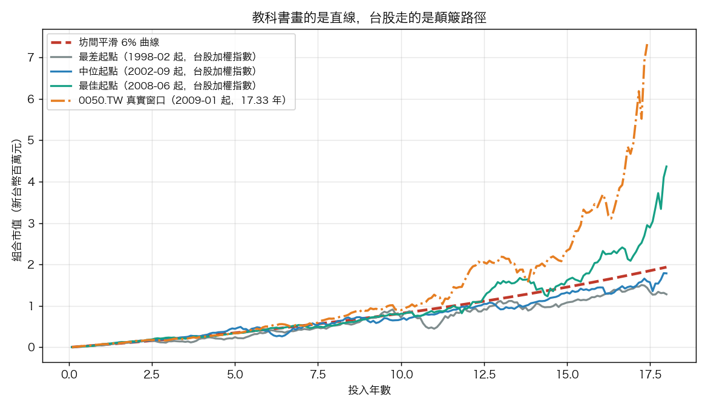
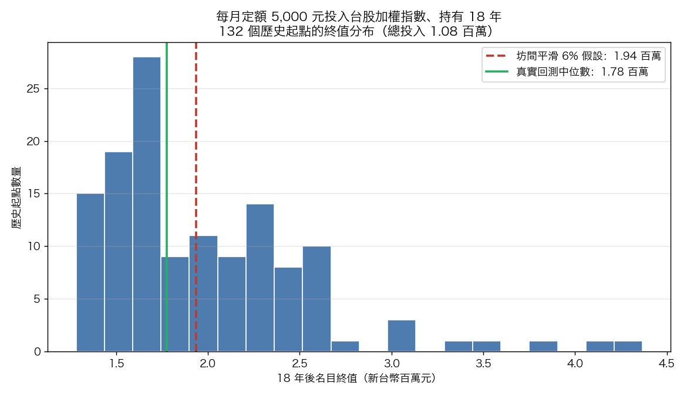

# 幫小孩買 0050 存十八年，那條曲線其實是顛簸的

政府在推兒少版的個人投資儲蓄帳戶，家長群組這幾週瘋傳各種試算：每月幫小孩存五千，買 0050，放十八年，年報酬抓 6%，到小孩成年時帳戶會長到多少。試算表給一個漂亮的整數，配一條光滑上揚的曲線。

那條曲線假設市場每年都乖乖給你 6%，從不回檔。台股不是這樣走的。我們用 0050.TW 與台股加權指數的真實歷史，把同一套「每月定額、持有十八年」完整跑過一遍，結果跟試算表差很多。

## 一個 2008 年出生的小孩，他的帳戶長什麼樣

先看一個真實案例。0050 在二○○九年初還在金融海嘯的谷底邊緣。假設有位家長從那時起，每月底投五千元買 0050，一路扣到二○二六年五月，剛好十七年又四個月，接近一個完整的十八年。

這位小孩的帳戶：總共投入 104.5 萬，最後名目價值 732.4 萬，扣掉每年 2% 通膨後的實質購買力約 519.6 萬。金額加權年報酬 19.79%，本金翻了七倍。

數字很漂亮，但要先講清楚一件事：這個起點是運氣好的。二○○九年初進場，等於早期每一筆扣款都全程吃到海嘯後的反彈，又搭上二○二四年 0050 因台積電與 AI 權重的大漲。換另一個起點，故事會完全不同。這正是接下來要談的重點。

## 第一件事：路徑是顛簸的

下面這張圖把三條真實的台股加權指數路徑，跟坊間的平滑 6% 曲線疊在一起。紅色虛線是試算表畫的那條，另外三條是真實回測裡最差、中位、最佳的起點，再加上 0050 那位小孩的真實窗口。

平滑曲線像用尺畫出來的。真實路徑前幾年大致貼著它，之後劇烈分岔。中位起點那條藍線在後半段上沖下洗，單月帳戶市值來回擺動的幅度，比多數家長想像的大。最差的灰線在十八年裡幾乎一直被壓著走。

如果你只看試算表，你不會知道帳戶在某些月份會「倒退嚕」。小孩成年那年剛好碰上空頭，帳戶數字可能比前一年還難看。這不是策略出錯，是市場本來的樣子。

## 第二件事：波動會偷走複利速度

試算表用「6%」這個數字，但 6% 到底是什麼，多數人沒想清楚。報酬有兩種平均：算術平均把每年報酬加起來除以年數，幾何平均才是真正能拿來複利的那一個。

我們算了兩個市場完整年份的數字：

| 標的 | 期間 | 算術年報酬 | 幾何年報酬（能複利的） | 波動拖累 | 年報酬標準差 |
|---|---|---|---|---|---|
| 台股加權指數 | 1998-2025 | 7.85% | 4.62% | 323 個基點 | 25.70% |
| 0050.TW | 2010-2025 | 15.05% | 13.31% | 174 個基點 | 19.97% |
| 美股標普 500 | 2001-2025 | 10.36% | 8.76% | 159 個基點 | 17.81% |

原理不難懂：今年跌 20%、明年漲 20%，算術平均是 0%，但本金剩 0.8×1.2＝0.96，虧了 4%。波動越大，這個缺口越大。

台股加權指數的算術平均 7.85%，能拿來複利的只剩 4.62%，中間 323 個基點被波動吃掉。它的樣本含一九九七亞洲金融風暴、二○○○網路泡沫、二○○八海嘯三次大空頭，所以拖累最重。0050 的樣本從二○一○才起算，沒碰到這些事件，拖累 174 個基點。美股 159 個基點。三個市場都明顯非零。

對兒少帳戶的意義很直接。你在試算表填的 6%，如果是某個「平均每年漲 6%」的算術印象，那麼帳戶實際複利的速度會低於 6%。波動越高的市場，這個高估越嚴重。

## 第三件事：小孩生在哪一年，結果差很多

這是最少人談、最該談的一件。同樣每月五千、同樣十八年，差別只在「哪一年開始」。

0050 自己的史料只夠跑出前面那一個完整窗口，看不到分布。所以這裡換用史料較長的台股加權指數（從一九九七年起）。0050 是台股前五十大、約七成市值，跟加權指數高度連動，拿它當長期市場的縮影是合理的。從一九九七到二○二六，可以切出 132 個不同的十八年起點。

| 結果（總投入 108 萬） | 名目終值 | 扣 2% 通膨後實質終值 | 金額加權年報酬 |
|---|---|---|---|
| 最差起點（1998-02 進場） | 128.1 萬 | 89.7 萬 | 1.87% |
| 第 10 百分位 | 142.4 萬 | 99.7 萬 | 3.00% |
| 中位數 | 177.6 萬 | 124.4 萬 | 5.29% |
| 第 90 百分位 | 258.4 萬 | 180.9 萬 | 9.02% |
| 最佳起點（2008-06 進場） | 436.8 萬 | 305.8 萬 | 14.02% |

最佳起點的終值是最差的 3.41 倍。兩個小孩，爸媽用一模一樣的紀律存了十八年，一個拿到 437 萬，一個拿到 128 萬。差別不在誰比較認真，在出生年份決定的進出場時點。學術上這叫報酬順序風險。

特別要注意中位數那一格。坊間平滑 6% 算出來的終值是 193.7 萬，它比真實分布的中位數 177.6 萬還高。換句話說，對台股而言，6% 試算不是保守，是樂觀的。一半以上的歷史起點，十八年下來連 6% 都跑不到；最差那個起點的金額加權年報酬只有 1.87%，扣掉通膨，實質購買力是倒退的。

## 換成美股，現象一樣，但方向相反

這現象不只台股。我們先前用美股標普 500、二○○○到二○二六的 26 年資料，跑出 102 個十八年起點，得到同樣的三件事：路徑顛簸、波動拖累 159 個基點、結果是一個分布。

| 十八年名目終值（總投入 108 萬） | 美股標普 500 | 台股加權指數 |
|---|---|---|
| 最差起點 | 241.6 萬 | 128.1 萬 |
| 中位數 | 331.9 萬 | 177.6 萬 |
| 最佳起點 | 466.1 萬 | 436.8 萬 |
| 最佳 / 最差倍數差 | 1.93 倍 | 3.41 倍 |
| 坊間平滑 6% 終值落點 | 分布最左（比最差還低） | 中位數之上 |

兩個市場的差別值得家長記住。美股過去 26 年偏強，6% 試算反而是低估，落在整個分布的最左邊。台股的分布更寬、更偏，6% 試算落在中位數上方，是高估。台灣家長如果照搬美股經驗或坊間 6% 假設來規劃兒少帳戶，會系統性高估帳戶的預期終值。同一套道理，換個市場，結論可以反過來。

## 把這件事放回理財教育

講到兒少投資帳戶，很多人把焦點放在「複利有多神奇」。複利會長大是常識，國中數學就教過。理財教育真正該補上的是另外三層認知。

第一層，路徑是波動的。帳戶數字會有好幾年看起來停滯甚至倒退，這是正常的，不是策略壞掉。教小孩看懂這件事，他長大後第一次遇到帳戶縮水，才不會恐慌賣出。

第二層，結果是一個分布。沒有人能保證十八年後拿到某個確定數字。我們能講的是一個範圍：台股的歷史裡，這個範圍大約是 128 萬到 437 萬。把預期設成一段範圍，而不是一個點，小孩未來做財務規劃時才不會被單一數字綁架。

第三層，正因為前兩層成立，「越早開始、放得夠久、不在低點恐慌賣出」才真的有用。時間長不能消除波動，但能讓你有更多次機會熬過空頭、等到反彈。要強調的是，長期持有降低的是「賠錢」的機率，不保證高報酬，台股最差那個十八年起點年化只有 1.87% 就是證據。波動是靠時間熬過去的，不是靠預測下一年漲跌。

幫小孩開帳戶、每月扣款、長期持有，方向完全正確。但如果連大人都以為帳戶會照那條光滑曲線走，第一次看到帳戶縮水時最先動搖的，會是大人自己。先看懂這條顛簸的曲線，才有資格教下一代怎麼跟它相處。

---

**數據來源**：0050.TW 調整後收盤價（含息，yfinance），2009-01-02 至 2026-05-21；台股加權指數 TWII（yfinance），1997-07-02 至 2026-05-21；美股 SPY 調整後收盤價（含息），2000-01-03 至 2026-05-19。回測為 VolPred 實驗 K1395（台股）與 K1394（美股），每月定額 5,000 元、持有 18 年，金額加權年報酬以 IRR 計算，實質終值扣 2%/年通膨。0050 可靠日資料約 2009 年起、僅夠一個完整十八年窗口，故十八年 rolling 分布改用史料較長、與 0050 高度連動的台股加權指數；加權指數為價格指數不含息，真實含息報酬會略高於本文數字。0050 的 yfinance 資料在 2014-01-02 有一個幻影分割造成的假斷點，已用比例銜接修補。所有數字未扣交易成本、台股證券交易稅與 ETF 經理費。歷史回測不保證未來；rolling 視窗高度重疊，分布為情境涵蓋而非統計推論。
