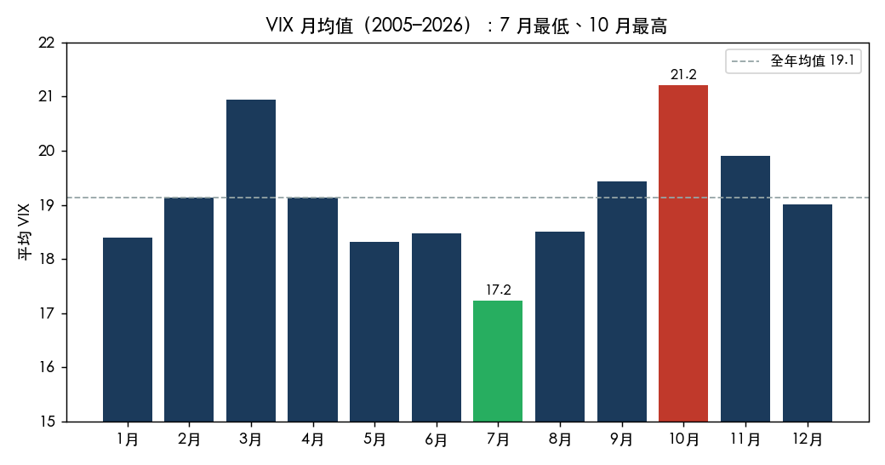
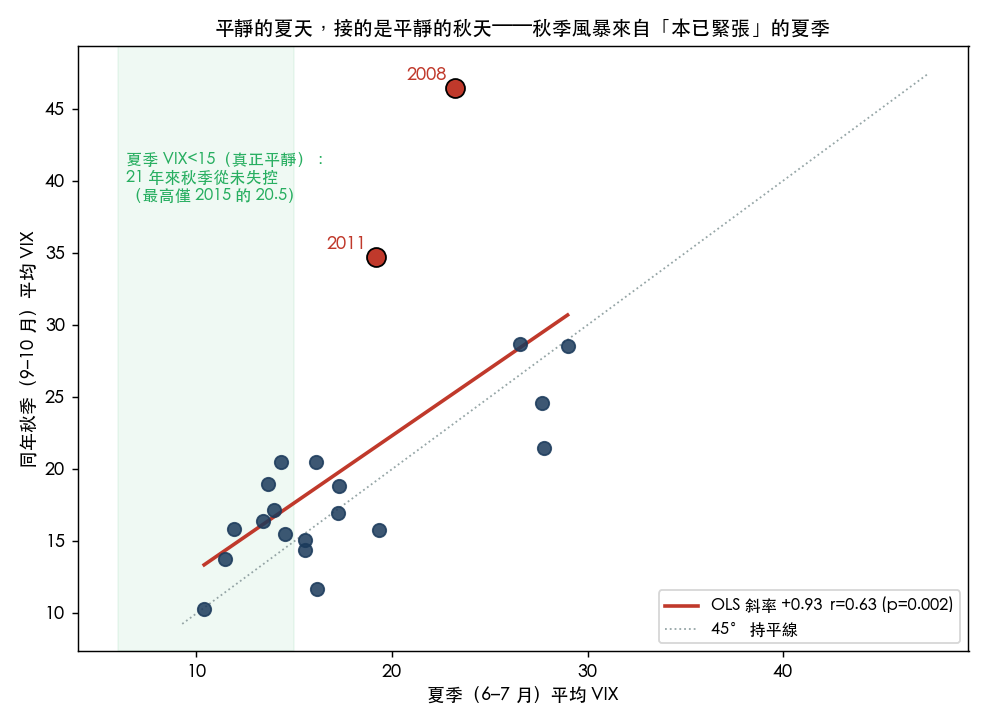
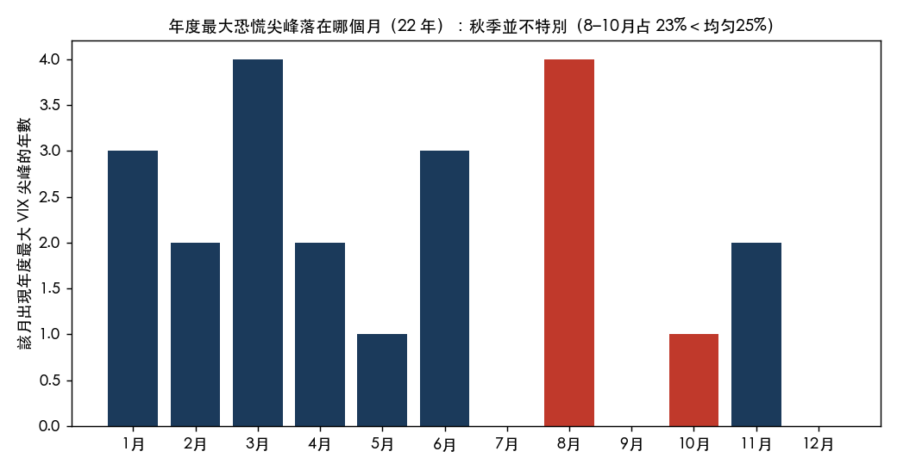

# 夏天太平靜，是暴風雨前的寧靜嗎？我用 21 年 VIX 數據查了這個直覺

現在是七月的第一週，美股放獨立紀念日長假，VIX 收在 15.81。盤面安靜到一種讓人不太踏實的程度。

每次市場這麼平靜，總會冒出同一個念頭：靜得反常，是不是在醞釀什麼。這個直覺有名有姓，叫「暴風雨前的寧靜」。而且大家心裡都存著一個活生生的畫面：2024 年 8 月 5 日，日圓套利交易一夕解開，VIX 從七月均值 14.47 直接飆到 38.57。那年七月，也是這樣安靜。

所以問題很具體：夏天越平靜，秋天真的越危險嗎？我把 2005 年以來的 VIX 和標普 500 已實現波動率全撈出來，算給你看。

## 先確認一件事：七月確實是全年最平靜的月份

這部分沒有懸念。把 21 年的 VIX 按月份平均，七月的 17.23 是十二個月裡最低的，最高的是十月的 21.20。

所以「夏天很安靜」不是錯覺，是統計事實。散戶最愛講的季節性裡，這一條站得住。真正要驗的是下一步：這份安靜，對後面幾個月有沒有預測力。

## 關鍵測試：平靜的夏天，接的是什麼樣的秋天

我把每一年的「夏季」定義成六到七月的 VIX 平均，「秋季」定義成同年九到十月的 VIX 平均，然後看兩者的關係。夏季完整落在秋季之前，沒有偷看未來的問題。

答案跟「暴風雨前的寧靜」正好相反。

兩者的相關係數是 +0.63（p=0.002），是正的，而且統計上顯著。翻成白話：平靜的夏天，接的是平靜的秋天；緊張的夏天，才接得到緊張的秋天。波動率的性格是「延續」，不是「反轉」。

具體看數字。把 21 年按夏季 VIX 高低切一半，夏季偏低那半邊，秋季 VIX 平均只有 16.22；夏季偏高那半邊，秋季平均衝到 24.77。差距很乾淨。

圖上右上角那兩個紅點，是唯二真正「夏平轉秋暴」的年份：2008 年（夏季 23.2、秋季 46.4）和 2011 年（夏季 19.2、秋季 34.7）。但請看它們的橫座標，兩年的夏季 VIX 本來就分別在 23 和 19，早就高於 17.2 的常態。市場那兩個夏天根本不平靜，只是還沒到最壞。它們算不上反例，反倒是「延續」最好的證據。

我再把標準收緊：只看夏季 VIX 真的低於 15、也就是「安靜到你會想避險」的那幾年。2005、2014、2017、2018、2019、2023、2024，一共七個。這七年裡，秋季 VIX 最高的一次是 2015 年的 20.5，其餘全落在 18 以下。過去 21 年，一個真正平靜的夏天，從來沒有換來一個失控的秋天。

## 那 2024 年 8 月 5 日算什麼

算一次尖峰，但不算一個秋天。

2024 那根長腳確實從安靜的七月裡冒出來，VIX 一天摸到 38.57。可是它退得跟來得一樣快，到九、十月，VIX 平均已經回到 18.94，重新落回那條延續的趨勢線上。它在我的散點圖裡一點都不離群。

這帶出一個更細的分別。把每一年 VIX 的年度最高點落在哪個月數一數：

年度最凶那根，八月確實不少（22 年裡有 4 年，跟三月並列最多）。但九月只有 0 次、十月只有 1 次。換句話說，秋天本身沒那麼可怕，反而是八月偶爾會咬人。而八月那幾口，多半像 2024 一樣，是急來急去的短暴，不會留成整季的高波動。把八到十月合起來看，占了 22.7% 的年度尖峰，還低於平均分配該有的 25%。

所以真相分兩層。整季的波動水準，會延續：平靜的夏天預告平靜的秋天。短暫的尾部尖峰，不挑季節：它可以從任何一個安靜的日子裡蹦出來，八月剛好是慣犯，但這跟「秋季風暴」是兩回事。

## 這對你的部位意味著什麼

先講不該做的。看到 VIX 只有十幾點就急著減碼、急著買一堆昂貴的避險，賭一場「季節性風暴」，數據不站在你這邊。平靜會延續，你多半是在跟趨勢對作，白付權利金。2015 到現在，靠「夏天太安靜所以要空」進場的人，大概都繳了不少學費。

但也別走到另一個極端，把「延續」當成保險。2024 年 8 月 5 日提醒得很清楚：延續是機率，不是保證，+0.63 的相關只解釋了四成的變異，剩下六成裡就住著那些閃崩。差別在於，尾部風險不是季節性的，你沒辦法挑在「九月前」才臨時抱佛腳。

比較務實的做法，是把便宜的尾部保護當成常設配置，而不是看月曆決定要不要買。真正該調整倉位的訊號，是夏季 VIX 本身有沒有偏高，而不是它有多低。今年夏天，VIX 15.81，落在那個「真正平靜」的區間裡。按 21 年的基準率，這樣的起點，接一個溫和的秋天是常態。前提是沒有下一隻黑天鵝先來報到。別忘了 2024，就是那六成裡的一次。

---

*數據來源：yfinance ^VIX（隱含波動率）與 ^GSPC（21 日年化已實現波動率），2005-01 至 2026-07-03，共 21 個完整年度。分析與圖表可複現於 `experiments/event_article_summer_vol_predictive_20260704/`。所有相關係數以 Pearson 計算，季節劃分為夏季 6-7 月、秋季 9-10 月，夏季完整早於秋季，無前視偏誤。*
