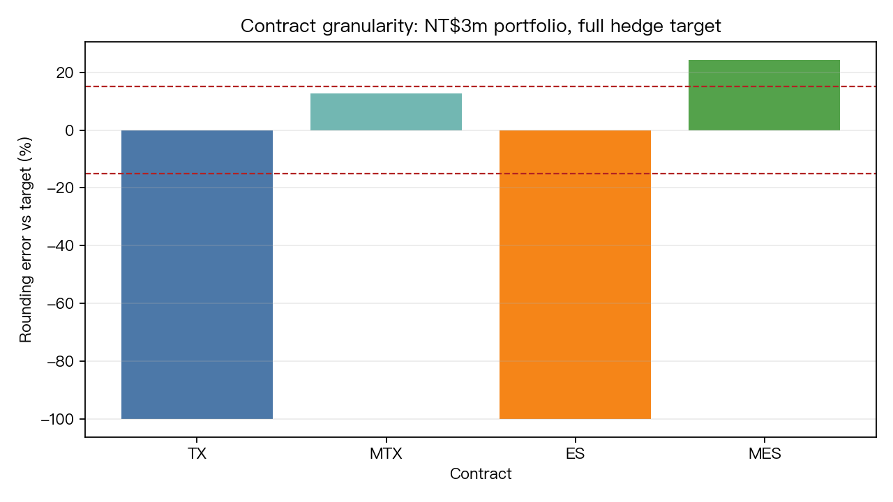
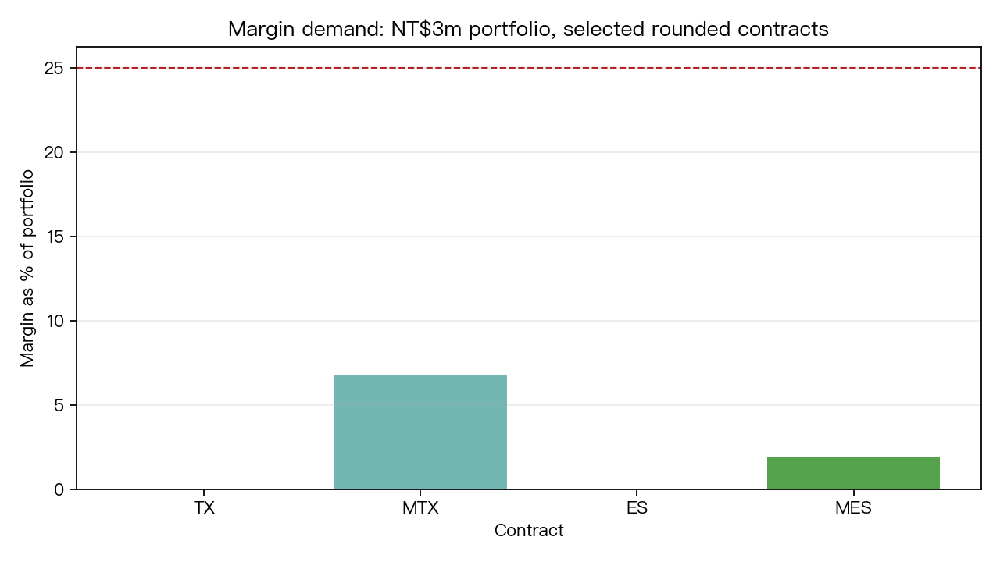

# I7 — Taiwan Investor Practical Cross-Border Futures Hedging

- Experiment ID: `I7_practical_cross_border_futures`
- Status: complete
- Created: 2026-06-13
- Task source: `gen_exp_I7_台灣投資人跨境避險實務_用台指期避台股_用_ES_mini_避美股`
- Classification: derived empirical + scenario analysis

## 研究問題

台灣投資人若要用期貨避險，實務上會碰到三個比模型本身更硬的限制：

1. 用 `TX/MTX` 避台股，合約顆數是否太粗？
2. 用 `ES/MES` 避美股部位，保證金與名目本金是否可承受？
3. 匯率避險與稅務情境會不會吃掉主要好處？

本實驗不是重新估計一組新的 OHR，而是把既有已完成實驗的估計結果轉成「可下單之前要看的約束表」。

## 文獻與既有研究前置

本題先對齊三條脈絡：

1. Ederington (1979) 的 hedging effectiveness 標準：避險應以 variance reduction / residual risk 評估，而不是拿避險組合跟投資策略比 Sharpe。
2. Lien and Tse (2002) 與後續 futures hedging 文獻：OHR 可以動態估計，但在高相關資產上，動態模型未必帶來足夠的實務增量。
3. Campbell, Serfaty-de Medeiros and Viceira (2010) 的 global currency hedging 脈絡：跨境投資要把本幣風險、避險成本與投資人稅制放在同一個框架看。

網路查核另補三類實務約束來源：

- CME E-mini S&P 500 contract spec page: ES 是 CME 的 S&P 500 index futures product，合約設計適合取得 S&P 500 exposure。
- IRS Form 6781 page: Section 1256 contracts under mark-to-market rules 需用 Form 6781 report gains/losses。
- 近年 hedging papers: Cotter and Hanly (2011) 強調 tail metrics；Wang, Di and Han (2023) 強調 hedging horizon；Ravagnani et al. (2026) 強調 forecast uncertainty and turnover。

## 與既有 K / I 的差異

- `K758v2`: 台灣投資人跨境資產配置與 FX hedge 成本。
- `I9`: 用 Ederington HE / VaR / ES / utility 評估 SPY-ES、GLD-GC 等 futures hedge。
- `I11`: 15 futures pairs 的 full panel，檢查 dynamic hedge 是否勝 naive / OLS。
- `I7_practical_cross_border_futures`: 不重估模型，而是把上述結果轉成台灣投資人的合約顆數、保證金、rounding error、交易稅與稅務敏感度。

## 資料來源

本實驗不下載新資料，只讀本地檔案：

- `experiments/k758v2/k758v2_tw_cross_border_hedge_results.json`
- `experiments/i9/i9_proper_hedging_results.json`
- `experiments/i6/i6_fixed_results.json`
- `experiments/i11/i11_full_panel_results.json`
- `storage/macro/yf_TWII.csv`
- `storage/macro/yf_TWDX.csv`
- `experiments/k1206/data/SPY.csv`

繼承樣本：

- `K758v2`: 2010-01-05 至 2026-03-27，`n=4003`
- `I9`: 2010-2025，OOS 2020-2025

本地價格快照：

| Series | Date | Close |
|---|---:|---:|
| TWII | 2026-03-17 | 33,836.57 |
| USD/TWD | 2026-03-17 | 31.9130 |
| SPY | 2026-04-16 | 701.66 |

ES/SPX 歷史沒有在本實驗下載；合約 sizing 使用 `SPY close × 10 = 7016.60` 當 S&P 500 index proxy。

## 方法

合約假設皆寫在腳本中，定位是 scenario assumptions，不是 broker quote：

| Contract | Multiplier | Currency | Assumed margin | Round-trip cost | Tax assumption |
|---|---:|---|---:|---:|---:|
| TX | 200 TWD / point | TWD | 6% | 4 bps | 0.002% per side |
| MTX | 50 TWD / point | TWD | 6% | 6 bps | 0.002% per side |
| ES | 50 USD / point | USD | 5% | 1 bp | scenario only |
| MES | 5 USD / point | USD | 5% | 2 bps | scenario only |

Portfolio grid:

- Portfolio size: NT$1m, 3m, 10m, 30m
- Taiwan hedge: 100% exposure weight
- US hedge: 30% US equity sleeve
- Target hedge ratios: 25%, 50%, 75%, 100%

Feasibility rule:

- rounded contracts > 0
- absolute rounding error <= 15%
- margin <= 25% of total portfolio

## 主要結果

### 1. 合約顆數是第一個瓶頸

用本地 2026-03/04 快照估算：

| Contract | Notional (TWD) | Assumed margin (TWD) |
|---|---:|---:|
| TX | 6,767,314 | 406,039 |
| MTX | 1,691,829 | 101,510 |
| ES | 11,196,037 | 559,802 |
| MES | 1,119,604 | 55,980 |

對 NT$3m portfolio：

- `TX` 一口已經是 portfolio 的 226%，無法做細緻 hedge。
- `MTX` 做 50% 或 100% 台股 hedge 時 rounding error 約 +12.8%，可接受但偏粗。
- `ES` 對 30% 美股 sleeve 完全太大。
- `MES` 對 NT$3m 的 30% 美股 sleeve 做 100% hedge 仍會超避約 +24.4%，低於 75% hedge 幾乎無法精準落點。

對 NT$30m portfolio：

- `TX` 100% 台股 hedge rounding error 約 -9.8%，開始可用。
- `MTX` 100% 台股 hedge rounding error 約 +1.5%，實務上更平滑。
- `ES` 對 30% 美股 sleeve 的 100% hedge 仍超避約 +24.4%。
- `MES` 對 30% 美股 sleeve 的 100% hedge rounding error 約 -0.48%，明顯更適合 retail sizing。

### 2. SPY/ES 的模型問題其實已經很小

繼承 `I9` / `I11` 結果：

- SPY-ES correlation: `0.9721`
- Static OLS HE: `0.9447`
- Naive HE: `0.9439`
- OLS average hedge ratio: `0.9556`
- 用 SPY USD vol `17.14%` 換算，OLS hedge residual vol 約 `4.03%`
- I11 中 expanding OLS vs naive 的 DM t 只有 `0.50`

結論：在 SPY-ES 這種高相關配對上，真正需要管理的是合約 size、保證金、FX 和稅，而不是再追求更複雜的 dynamic OHR。

### 3. FX hedge 成本仍是跨境投資最大約束

繼承 `K758v2`：

- SPY USD vol: `17.14%`
- SPY TWD vol: `19.73%`
- FX vol: `9.72%`
- FX accounts for `24.3%` of SPY(TWD) variance
- Full retail FX hedge cost: `4.86%/yr`
- Institutional full FX hedge cost: `1.86%/yr`
- K758v2 best grid: `40% 0050 + 30% SPY + 30% GLD` with `25%` FX hedge

這表示台灣 retail 投資人若用期貨把 equity beta hedge 得很乾淨，仍可能留下 FX layer。完全避掉 FX 在 retail 成本下太貴，25% partial hedge 比 full hedge 更接近 K758v2 的可行解。

### 4. 稅務不能用單一結論帶過

本實驗只做 tax sensitivity，不做法律判斷：

- 若 hedge profit 對 notional 為 2%、5%、10%，稅率 15%、20%、30% 會直接把正向 hedge PnL retention 降到 85%、80%、70%。
- 台灣居住者、海外券商帳戶、是否適用美國 Section 1256、是否有台灣基本所得稅或海外所得申報問題，都不是本實驗能從價格資料推導的事。
- 研究結論只應寫成「稅務情境是 decision variable」，不可宣稱所有台灣投資人有同一個稅後結果。

## Verdict

**CONDITIONAL_PASS**

理由：

1. 研究問題被轉成可驗證的實務約束表，而不是只重述 hedging theory。
2. 所有數字都來自本地 results JSON 或本地價格快照，且腳本可重跑。
3. 有明確承認 ES/SPX 用 SPY×10 proxy、margin/tax 為 scenario assumptions。
4. 沒有把避險效果拿去和投資策略 Sharpe 混比，符合 research_program 的 futures hedging 方法論。

最保守結論：

- 台股 hedge：NT$30m 以下優先 MTX，不要硬用 TX 做精細避險。
- 美股 hedge：台灣 retail 若美股 sleeve 是 30% 左右，MES 比 ES 更合理。
- SPY/ES hedge ratio 不需要過度模型化，static OLS / naive 已經接近充分。
- FX hedge 和稅務是實務決策核心，且高度 investor-specific。

## 限制

1. 本實驗沒有抓即時 TAIFEX / CME margin；margin 是明示情境假設。
2. ES sizing 使用 `SPY close × 10` 作為 SPX proxy，適合 sizing illustration，不是交易結算資料。
3. TX hedge 使用 TWII level proxy，沒有重建 continuous TX settlement series。
4. 稅務只做敏感度，不是稅務建議。
5. 結論繼承 K758v2 對 USDTWD 與 0050.TW 清理的假設。

## 三件套

- `README.md`
- `i7_practical_cross_border_futures.py`
- `i7_practical_cross_border_futures_results.json`

Additional outputs:

- `fig_contract_granularity.png`
- `fig_margin_fx_costs.png`
