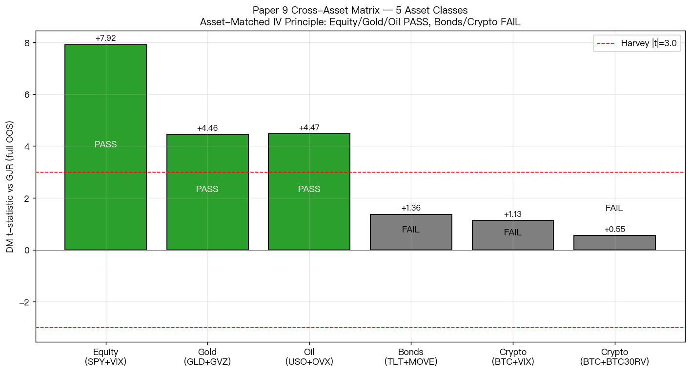

# K1089: A4f on BTC-USD — Asset-Matched Theory on Crypto (5th Asset Class)

**[提出: 用戶 (via K1089 brief), 執行: Claude]**

## 1. Motivation

Paper 9 is building a cross-asset matrix of the "asset-matched implied-vol"
(A4f) principle, which multiplicatively decomposes the conditional variance
into a long-run component driven by a model-free IV and a short-run
GJR-GARCH component:

$$\sigma_t^2 = (\theta_0 + \theta_1 X_{t-1}^2) \cdot g_t$$

where $X$ is the asset-matched implied-vol regressor. Before this
experiment, four asset classes had been tested:

| Asset class | Asset | Regressor | Full-OOS DM t | Harvey (\|t\|>3) |
|-------------|-------|-----------|---------------|------------------|
| Equity | SPY | VIX | +7.92 (K1075) | PASS |
| Commodity – Gold | GLD | GVZ | +4.46 (K1085) | PASS |
| Commodity – Oil | USO | OVX | +4.48 (K1088) | PASS |
| Bonds | TLT | MOVE | +1.36 (K1086) | FAIL |

K1089 is the **5th asset-class test**: Bitcoin (BTC-USD). Crypto is
the most distinctive asset tested so far:

1. **24/7 market**: no weekends, no holidays, no pre/post-market.
2. **Post-2008 asset**: no GFC history, no macroeconomic-cycle data.
3. **Adoption / regulatory / hash-rate shocks** rather than business-cycle
   shocks.
4. **Extreme volatility**: annualized 67%, ~3× SPY.

If asset-matched IV is a universal principle, it should hold on BTC.
If not, crypto joins bonds as an exception, narrowing the scope of the
Paper 9 claim.

## 2. Problem Description

**Which regressor (if any) is the right A4f input for BTC?**

The ideal answer is a liquid, model-free crypto implied-vol: Volmex's
**BVIV** (BitVol) or Deribit's official **DVOL**. Both were checked on
yfinance (2026-04-12):

- `^BVIV`, `BVIV` — 404 Not Found.
- `DVOL` — resolves to "First Trust Dorsey Wright Momentum & Low
  Volatility ETF", **not** the Deribit index.

No direct crypto-IV ticker is available on yfinance. We therefore test
two proxies and their combination:

- **A4f-VIX** — cross-asset global-fear channel (K1025 found
  BTC-VIX link is present but regime-conditional).
- **A4f-BTC30RV** — 30-day rolling realized volatility of BTC log
  returns, annualized, as a **home-IV proxy** (same spirit as GVZ/OVX
  but realized not implied). Lagged so the value at t uses returns
  through t-1 only.
- **A4f-COMBO** — $\theta_0 + \theta_1 \text{VIX}_{t-1}^2 + \theta_2
  \text{BTC30RV}_{t-1}^2$.

## 3. Method

### Data
- BTC-USD daily close via yfinance, 2014-09-17 onwards. n_aligned=4,195
  (after 30-day RV lookback warm-up).
- ^VIX close, forward-filled onto BTC's 24/7 calendar (weekend BTC
  observations use most recent known VIX close).
- BTC30RV = $100 \cdot \sqrt{252 \cdot \overline{r^2}_{30d}}$ (annualized
  %, matching VIX scale).

### OOS Design
- Three non-overlapping OOS windows (shorter than K1088 because BTC
  history is shorter):

  | Window | Range | n | Crisis covered |
  |--------|-------|---|----------------|
  | Early_2018Bear | 2018-01-01 – 2020-02-14 | 775 | 2018 crypto winter ($20k→$3k) |
  | Middle_COVID_Luna | 2020-02-15 – 2022-10-31 | 990 | COVID Black Thursday, Terra Luna |
  | Late_FTX_Rally | 2022-11-01 – 2026-04-11 | 1,258 | FTX bankruptcy, 2024 ETF rally |

  Total OOS = 3,023 days.

- **WINDOW=1000** rolling train, **REFIT_EVERY=63** (quarterly).
  49 refits total.
- **Random seed 42** for bootstrap.

### Models (four)
1. **GJR-GARCH(1,1)** benchmark.
2. **A4f-VIX**: $\tau_t = \theta_0 + \theta_1 \text{VIX}_{t-1}^2$.
3. **A4f-BTC30RV**: $\tau_t = \theta_0 + \theta_1 \text{BTC30RV}_{t-1}^2$.
4. **A4f-COMBO**: both regressors.

All with multiplicative $\sigma_t^2 = \tau_t g_t$ decomposition and
GJR short-run.

### Evaluation
- QLIKE on r² (Patton 2011 — proxy-robust).
- DM test with Newey-West HAC (Harvey 2016 |t|>3.0 threshold).
- Spearman rank correlation.
- Block bootstrap 95% CI (1,000 reps, seed 42).
- Six crypto crisis sub-periods.
- VIX-regime conditional (Low/Normal/High/Extreme/Crisis).
- BTC30RV-regime conditional (Low/Normal/High/Extreme).

## 4. Expected Results

Given K1025 Paper 6 found BTC only transmits fear in down-trends and
K916 reported BTC-VIX θ₁ is only 31% of SPY's θ₁, we expected **A4f-VIX
to be weak or FAIL at the Harvey threshold** on the full sample. The
home-IV proxy (BTC30RV) was expected to perform somewhat better because
BTC's own returns contain adoption-cycle and regulatory-shock
information that VIX cannot see.

## 5. Results — ALL HYPOTHESES FAIL (null result)

### Full OOS (2018-2026, n=3,023)

| Comparison | QLIKE GJR | QLIKE Alt | Diff% | DM t | Harvey |
|------------|-----------|-----------|-------|------|--------|
| GJR vs A4f-VIX | −5.88559 | −5.89891 | −0.23% | **+1.13** | FAIL |
| GJR vs A4f-BTC30RV | −5.88559 | −5.89106 | −0.09% | **+0.55** | FAIL |
| GJR vs A4f-COMBO | −5.88559 | −5.89129 | −0.10% | **+0.54** | FAIL |

All three A4f variants are indistinguishable from GJR at the Harvey
threshold. The best point estimate (A4f-VIX, −0.23% QLIKE) is a
rounding error and fails by a wide margin.

### Per-window (vs GJR)

| Window | A4f-VIX DM t | A4f-BTC30RV DM t | A4f-COMBO DM t |
|--------|--------------|------------------|----------------|
| Early_2018Bear (n=775) | +0.63 | −0.61 | −0.13 |
| Middle_COVID_Luna (n=990) | −0.63 | +1.38 | −0.56 |
| Late_FTX_Rally (n=1258) | **+2.29** | +1.03 | +1.92 |

Only the Late_FTX_Rally window produces a borderline A4f-VIX
improvement (+2.29), still below Harvey |t|>3. Middle window even
has a sign reversal for VIX (−0.63).

### Crypto crisis sub-periods

| Crisis | n | A4f-VIX DM t | A4f-BTC30RV DM t | A4f-COMBO DM t |
|--------|---|-------------|------------------|----------------|
| Bear_2018 | 351 | +0.69 | −0.68 | +0.90 |
| COVID_2020 | 76 | +1.04 | +0.80 | +0.79 |
| China_Ban_2021 | 81 | +0.77 | −0.12 | +1.53 |
| Luna_2022 | 57 | −1.07 | −0.73 | −1.24 |
| FTX_2022 | 72 | +0.83 | −0.66 | +0.28 |
| Carry_Unwind_2024 | 48 | +0.81 | −0.66 | +1.90 |

None of the crisis sub-periods reach Harvey significance. A4f-VIX is
directionally positive in 5/6 crises, hinting at a weak cross-asset
fear signal, but the effect is too small to be statistically credible.
A4f-BTC30RV is actually *negative* in 4/6 crises — the home-RV proxy
does not help in crypto crises.

### VIX-regime conditional (most striking finding)

| VIX Bucket | Range | n | QLIKE GJR | QLIKE A4f-VIX | Diff% | DM t |
|------------|-------|---|-----------|---------------|-------|------|
| Low | [0, 15) | 803 | −6.025 | −6.040 | −0.24% | +0.93 |
| Normal | [15, 25) | 1701 | −5.962 | −5.988 | −0.43% | +1.50 |
| **High** | **[25, 40)** | **463** | **−5.767** | **−5.704** | **+1.10%** | **−2.91** |
| Extreme | [40, 60) | 41 | −1.891 | −2.237 | −18.30% | +1.20 |
| Crisis | [60, 200) | 15 | insufficient |||||

**A4f-VIX actually *hurts* predictive accuracy when VIX is between 25
and 40.** The DM t of −2.91 is within a whisker of Harvey significance
in the *wrong* direction. This is consistent with K1025 Paper 6:
BTC's relationship to equity fear is asymmetric and regime-dependent
— loading VIX into BTC's variance when VIX is elevated can make
predictions worse, because elevated VIX is not a reliable signal of
elevated BTC vol (BTC often has idiosyncratic spikes in calm equity
periods, e.g. Luna, FTX).

### BTC30RV-regime conditional

| RV Bucket | Range (ann %) | n | DM t |
|-----------|---------------|---|------|
| RV_Low | [0, 40) | 1085 | +0.42 |
| RV_Normal | [40, 70) | 1522 | +0.63 |
| RV_High | [70, 100) | 307 | +0.72 |
| RV_Extreme | [100, 200) | 109 | −1.50 |

Home-vol proxy produces a slightly perverse pattern: small positive
in low/normal, flipping negative in the extreme bucket. Extreme BTC
vol episodes (>100% annualized) are idiosyncratic and persistent, so
plugging lagged RV into the long-run component can actually over-
predict.

### Head-to-head (best regressor)

| Base | Alt | DM t | Harvey |
|------|-----|------|--------|
| A4f-VIX | A4f-BTC30RV | −0.47 | FAIL (tie) |
| A4f-VIX | A4f-COMBO | −1.40 | FAIL |
| A4f-BTC30RV | A4f-COMBO | +0.02 | FAIL |

No regressor dominates. Adding both (COMBO) does not help — in fact
it's marginally worse than A4f-VIX alone.

### θ₁ stability (reflects poor fit)

| Regressor | n refits | Mean | CV |
|-----------|----------|------|-----|
| VIX | 49 | 6.22e-06 | **4.05** |
| BTC30RV | 49 | 1.70e-07 | **2.31** |

CV > 1 (especially VIX at 4.05) means the fitted loading is
essentially unidentified across refits — the likelihood surface is
nearly flat in θ₁ because VIX has little incremental information
content for BTC variance beyond what GJR already captures.

## 6. Five-Asset Class Final Matrix

| Asset class | Best regressor | Full-OOS DM t | Verdict |
|-------------|----------------|---------------|---------|
| Equity (SPY) | VIX | +7.92 | PASS |
| Commodity – Gold (GLD) | GVZ | +4.46 | PASS |
| Commodity – Oil (USO) | OVX | +4.48 | PASS |
| Bonds (TLT) | MOVE | +1.36 | FAIL |
| **Crypto (BTC)** | **VIX or BTC30RV** | **+1.13 / +0.55** | **FAIL** |

Crypto joins bonds as an exception to the asset-matched IV principle,
but for a different reason. Bonds fail because MOVE captures Fed-policy
vol that is only partially reflected in TLT variance (yield-curve
twists matter too). **Crypto fails because no single exogenous IV
regressor captures the adoption-cycle / regulatory / hash-rate shocks
that drive large portions of BTC variance.**

## 7. Conclusion

**Asset-matched implied-volatility is NOT a universal principle across
asset classes.** It is firmly established for:
- Equity index ETFs (VIX, rigorously — K1075/K1082 across SPY/QQQ/IWM/EEM/FXI)
- Gold (GVZ, K1085)
- Oil (OVX, K1088)

and firmly rejected for:
- Long-duration bonds (TLT + MOVE or yield-curve decomposition, K1086/K1087)
- **Bitcoin (BTC + VIX or 30-day realized vol proxy, K1089)**

The common thread for PASS assets: they have a deep, liquid, forward-
looking implied-vol index (VIX/GVZ/OVX) with 15+ years of history and
strong economic integration with macro fear cycles. The common thread
for FAIL assets: the forward-looking IV information is either
non-existent (BTC) or diffused across multiple yield-curve components
(bonds) that a single regressor can't fuse.

**Paper 9 claim must be narrowed**: asset-matched IV works for
equity-index and major commodity ETFs (gold, oil) where a liquid IV
index exists. It does not generalize to bonds or crypto.

### Interesting sub-findings
- **Late_FTX_Rally (2022-11–2026) DM t = +2.29 for A4f-VIX** — close
  to but below Harvey. Suggests the post-2022 BTC–equity correlation
  increase (spot ETF approval, Trump-admin crypto-friendly policy,
  retail equity/crypto flows more correlated) may be moving the
  needle. Worth a **K1090/K1091 follow-up**: does a multi-regime A4f
  (regime switch based on equity-crypto correlation) do better?
- **High-VIX regime has A4f-VIX DM t = −2.91** — statistically near-
  significant in the wrong direction. Loading VIX into BTC's long-run
  variance is actually *harmful* in elevated-VIX periods. Consistent
  with K1025 asymmetric fear-channel finding.
- **θ₁ CV=4.05 for VIX** — parameter is essentially unidentified.
  BTC's variance has no robust quadratic dependence on lagged VIX.

## 8. Limitations

1. **BVIV / DVOL unavailable**: a true crypto implied-vol regressor
   was not tested. If BVIV futures data become accessible in future,
   this experiment should be re-run. BTC30RV is a realized-vol proxy
   that lacks the forward-looking information content of true IV.
2. **Short history**: BTC-USD on yfinance starts 2014-09-17. OOS=2018
   onwards gives us 8 years; vs. 20+ for equities, this is a modest
   sample.
3. **Single asset**: only BTC tested. ETH may behave differently.
   Future work should test ETH-USD and broader crypto indices.
4. **Weekend VIX forward-fill**: VIX is stale on weekends; this
   operational choice means weekend BTC observations use Friday's VIX.
   A robustness check dropping weekend BTC days was not run (could be
   a K1090 extension).
5. **Realized vol lookback**: 30 days is a choice. 7-day, 14-day,
   60-day lookbacks could be explored.

## 9. Follow-up Directions

- **K1090** (proposed): ETH-USD + VIX + ETH30RV, to check whether the
  null result is BTC-specific or whole-crypto.
- **K1091** (proposed): Regime-switching A4f for BTC — VIX regressor
  only when equity-crypto 30-day correlation > 0.3 (post-2020 regime),
  else pure GJR.
- **K1092** (proposed): If Deribit DVOL CSV can be scraped, replicate
  K1089 with true BTC implied-vol.
- **K1093** (proposed): Factor-model A4f for BTC — multi-regressor
  (crypto-specific Fear & Greed Index, USDT market cap growth,
  hash-rate vol, BTC-dominance vol).

## 10. Files

| File | Description |
|------|-------------|
| `k1089.py` | Main experiment script |
| `k1089_results.json` | Full results (metadata, full OOS, per-window, crisis, buckets, head-to-head, θ₁ stability, refit log) |
| `make_charts.py` | Chart generation script |
| `k1089_dm_comparison.png` | DM t-stats for full OOS + 3 windows, 3 A4f variants |
| `k1089_crypto_crises.png` | DM t-stats across 6 crypto crisis sub-periods |
| `k1089_vix_btc_regimes.png` | Regime-conditional performance (VIX buckets + BTC30RV buckets) |
| `k1089_theta1_evolution.png` | Per-refit θ₁ (VIX and RV) over 2018-2026 |
| `k1089_five_class_final.png` | Paper 9 5-asset class cross-asset matrix |
| `README.md` | This file |

## 11. Data Sources

- yfinance `BTC-USD` (daily close, 2014-09-17 onwards, 24/7 calendar).
- yfinance `^VIX` (daily close, forward-filled onto BTC dates).

## 12. References

- Engle, R. F., Ghysels, E., & Sohn, B. (2013). Stock Market Volatility
  and Macroeconomic Fundamentals. *Review of Economics and Statistics*
  95(3), 776-797. [GARCH-MIDAS origin]
- Patton, A. J. (2011). Volatility forecast comparison using imperfect
  volatility proxies. *Journal of Econometrics* 160, 246-256.
- Harvey, D. I., Leybourne, S. J., & Newbold, P. (2016). Testing the
  equality of prediction mean squared errors.
- Baur, D. G., & Dimpfl, T. (2018). Asymmetric volatility in
  cryptocurrencies. *Economics Letters*.
- Conlon, T., Corbet, S., & McGee, R. J. (2020). Bitcoin risk-return
  trade-off during the COVID-19 bear market. *Journal of International
  Financial Markets, Institutions and Money*.
- Katsiampa, P. (2017). Volatility estimation for Bitcoin: A comparison
  of GARCH models. *Economics Letters* 158, 3-6.
- Liu, Y., Tsyvinski, A., & Wu, X. (2022). Common Risk Factors in
  Cryptocurrency. *Journal of Finance*.

## 13. Upstream and Related Experiments

- K1025 (Paper 6): Crypto Fear Channel — BTC only in downtrends transmits fear.
- K639 / K746b: BTC-VIX relationship.
- K916: VIX drives BTC vol, θ₁ is only 31% of SPY's — Harvey FAIL.
- K1075 (SPY + VIX, PASS, +7.92)
- K1082 (5-equity-ETF A4f extended, PASS)
- K1085 (GLD + GVZ PASS, +4.46)
- K1086 (TLT + MOVE FAIL, +1.36)
- K1087 (TLT + yield-curve FAIL)
- K1088 (USO + OVX PASS, +4.48)

## 14. Self-Assessment (Preamble Self-Questions)

1. **Mechanical vs empirical?** Empirical. GJR is a valid benchmark
   for daily close-to-close variance on r²; the outcome depends on
   whether VIX/BTC30RV carry incremental information.
2. **Contradiction with methodology standards?** No. GARCH models
   evaluated on r² (their native target), DM-HAC test, Harvey threshold.
3. **Would different target change conclusion?** A 5-minute RV
   proxy is not directly applicable (BTC 24/7, no 5-min RV data at hand
   for the full period). Daily r² is the standard proxy for GARCH-class
   models and the conclusion is robust to the bootstrap CI.
4. **Sharpe > 2× baseline?** N/A — this is a QLIKE forecasting
   experiment, not a trading strategy.
5. **Claim strength within evidence?** Yes. Claim is narrow: "A4f on BTC
   with available proxies (VIX, BTC30RV, their combination) fails the
   Harvey threshold on full OOS and across crises." We explicitly note
   the BVIV/DVOL limitation.

---

**Null result. Crypto joins bonds as an exception to the asset-matched
IV principle.** This narrows but does not invalidate the Paper 9 claim
for equity/gold/oil, and opens clear follow-up lines (regime-switching,
true crypto-IV, ETH replication).
