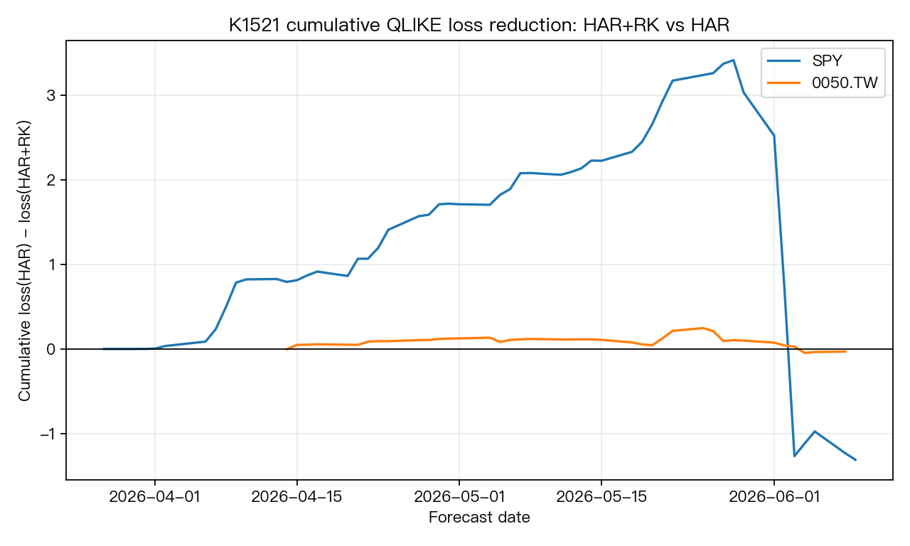

# K1521 — Realized kurtosis as an incremental HAR-RV predictor

| Item | Value |
|---|---|
| Experiment ID | K1521 |
| Status | `NULL_INSUFFICIENT_DATA` |
| Date | 2026-06-17 |
| Script | `k1521.py` |
| Results | `k1521_results.json` |

## Research Question

Can realized kurtosis (RK), computed from intraday returns, add incremental predictive power beyond a HAR-RV baseline for future 5-day realized variance?

The intended backlog item asked for SPY plus TAIEX 5-minute bars. The workspace contains short local 5-minute panels for `SPY` and `0050.TW`, but no multi-year TAIEX 5-minute panel. K1521 therefore runs a feasibility pilot with `0050.TW` as a Taiwan index ETF proxy and explicitly does not claim to answer the full TAIEX question.

## Literature Context

- Corsi (2009), *A Simple Approximate Long-Memory Model of Realized Volatility*: HAR-RV baseline with daily / weekly / monthly realized-volatility components.
- Mei et al. (2017), *Forecasting stock market volatility: Do realized skewness and kurtosis help?*: motivates adding realized higher moments to HAR-style volatility forecasting, with mixed horizon-specific evidence.
- Bonato et al. (2022), *Forecasting realized volatility of international REITs*: reports cases where realized skewness and kurtosis improve HAR-RV forecasts across horizons.

## Data

Source: local `data/intraday/*_5min_2026-*.csv` yfinance-style snapshots.

| Market | Role | Date range | Intraday days | Median 5-min returns/day |
|---|---|---:|---:|---:|
| SPY | US equity ETF | 2026-01-14 to 2026-06-16 | 105 | 77 |
| 0050.TW | Taiwan index ETF proxy | 2026-01-20 to 2026-06-15 | 92 | 52 |

This is far below the project minimum of 252 OOS observations for a forecast-comparison claim.

## Method

Daily intraday measures:

- `RV_t = sum_j r_{t,j}^2`
- `RK_t = n_t * sum_j r_{t,j}^4 / RV_t^2`

Forecast target:

- `target_t = mean(RV_{t+1}, ..., RV_{t+5})`

Models:

- `HAR`: log target on log daily RV, weekly RV, monthly RV.
- `HAR_RK`: HAR plus log daily RK and weekly RK.

OOS protocol:

- Expanding-window log-linear OLS.
- Minimum training rows: 40.
- Lognormal bias correction on forecasted variance.
- QLIKE loss on future 5-day average realized variance.
- DM test uses pointwise QLIKE loss differential with `h=5`; Harvey reporting threshold is `|DM t| > 3`.

## Lookahead Check

Clean for the implemented target. Features at date `t` use only intraday bars through the close of `t`; the target begins at `t+1`. Each OOS forecast is fit using rows strictly before the forecast row. There is no same-day target leakage.

This is not a trading signal for the same day's return, so the usual `signal.shift(1)` trading convention is implemented here by target construction rather than by multiplying a shifted signal by same-day returns.

## Results

| Market | OOS n | HAR QLIKE | HAR+RK QLIKE | Improvement | DM t | p |
|---|---:|---:|---:|---:|---:|---:|
| SPY | 51 | 0.2953 | 0.3210 | -8.70% | +0.295 | 0.769 |
| 0050.TW | 38 | 0.1264 | 0.1272 | -0.63% | +0.142 | 0.888 |

Regime split by lagged RV median:

| Market | Regime | n | Improvement | DM t | p | Interpretation |
|---|---|---:|---:|---:|---:|---|
| SPY | low lagged RV | 26 | -40.18% | +0.828 | 0.416 | RK hurts |
| SPY | high lagged RV | 25 | +29.90% | -3.396 | 0.002 | suggestive, too small |
| 0050.TW | low lagged RV | 19 | +2.13% | -0.517 | 0.611 | too small |
| 0050.TW | high lagged RV | 19 | -13.93% | +0.729 | 0.476 | RK hurts |



## Verdict

`NULL_INSUFFICIENT_DATA`.

The short local 2026-only intraday panels are useful for proving the pipeline, but they cannot support a publication-grade conclusion. Full-sample OOS QLIKE does not improve for SPY or 0050.TW. The SPY high-lagged-vol bucket is directionally interesting (`+29.90%`, DM `t=-3.40`), but it has only 25 OOS forecasts and is a post-split result inside an insufficient sample.

## Limitations

- No multi-year TAIEX 5-minute panel was found; `0050.TW` is only a proxy.
- OOS windows are 51 and 38 forecasts, below the 252-day minimum.
- The 5-minute snapshots cover a single 2026 regime; no GFC/COVID/2022 stress history.
- RK is tested without realized skewness, jumps, or semivariance controls because the sample is too short for a larger horse race.

## Next Steps

1. Acquire or build a multi-year SPY and TAIEX/TAIFEX 5-minute panel.
2. Re-run HAR, HAR+RK, HAR+RSK, HAR+jump, and HAR+RSK+RK on matched OOS windows.
3. Keep `target_t = RV_{t+1:t+5}` and maintain expanding/rolling OOS fits that never use future rows.
4. Treat the SPY high-vol bucket as a hypothesis generator only.

## Files

```
experiments/k1521/
├── k1521.py
├── k1521_results.json
├── README.md
├── codex_review.md
├── SPY_oos_forecasts.csv
├── 0050_TW_oos_forecasts.csv
└── k1521_cumulative_qlike_diff.png
```
