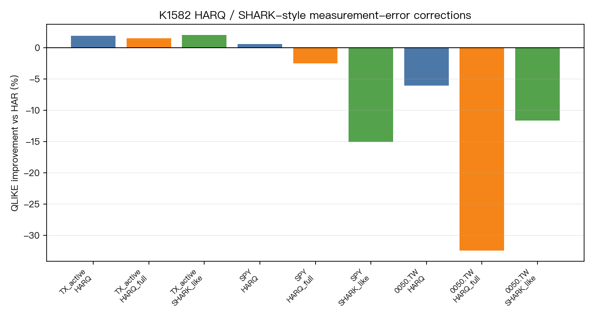

# K1582 - HARQ / SHARK-style measurement-error corrections for HAR-RV

| Item | Value |
|---|---|
| Experiment ID | K1582 |
| Status | `DIRECTIONAL_ONLY` |
| Date | 2026-06-30 |
| Script | `K1582.py` |
| Results | `K1582_results.json` |

## Research Question

Do realized-quarticity measurement-error corrections and signed intraday components improve one-step-ahead realized-variance forecasts beyond a plain HAR-RV baseline?

The backlog hypothesis was stronger: measurement-error corrections might matter more for Taiwan futures than SPY because Taiwan night/day microstructure creates noisier realized measures. This run is a constrained pilot. It uses a gateable long TAIFEX TX active-contract day-session sample and short local 2026 SPY / 0050.TW 5-minute snapshots. It does not claim to settle the full night-session hypothesis.

## Literature Context

- Corsi (2009), *A Simple Approximate Long-Memory Model of Realized Volatility*: HAR-RV baseline with daily / weekly / monthly components.
- Bollerslev, Patton and Quaedvlieg (2016), *Exploiting the errors*: motivates HARQ, where realized quarticity proxies realized-variance measurement error and lets HAR coefficients vary with measurement precision.
- Buccheri and Corsi (2021), SHARK-related realized-volatility forecasting work: motivates richer realized-measure corrections around HAR, including signed and higher-order intraday components.
- Patton and Zhang (2026), *Bespoke Realized Volatility*: motivates treating realized measures as design choices aligned to the forecast target and measurement-error problem.

## Data

| Market | Source | Raw days | OOS forecasts | Gateable? |
|---|---|---:|---:|---|
| TX_active | `~/Dropbox/TAIFEXDATA/TAIFEXDATA/python/Daily_*TX.csv`; active contract selected by day-session volume | 2,219 | 1,697 | yes |
| SPY | local `data/intraday/SPY_5min_2026-*.csv` | 113 | 51 | no |
| 0050.TW | local `data/intraday/0050_TW_5min_2026-*.csv` | 100 | 38 | no |

TX uses full `TX` files, not `TX1`, to avoid the known near-month roll-gap problem. For each trading date, the script filters day session 08:45-13:45, chooses the active contract month by day-session volume, builds 5-minute last-tick bars, and computes daily realized measures.

Daily measures:

- `RV_t = sum_j r_{t,j}^2`
- `RQ_t = n_t / 3 * sum_j r_{t,j}^4`
- `BPV_t = (pi/2) * n/(n-1) * sum_j |r_j| |r_{j-1}|`
- `raw_jump_t = max(RV_t - BPV_t, 0)`
- `signed_jump_t = raw_jump_t * sign(sum_j r_{t,j})`
- `RS+_t`, `RS-_t` from positive and negative intraday returns

## Method

Target:

- `RV_t` from same-day 5-minute returns.

Feature timing:

- All forecast features use `.shift(1)`.
- Daily feature at row `t` is `x_{t-1}`.
- Weekly feature is `mean(x_{t-5}, ..., x_{t-1})`.
- Monthly feature is `mean(x_{t-22}, ..., x_{t-1})`.
- Expanding OOS fit uses rows strictly before the forecast row.

Models:

| Model | Features |
|---|---|
| HAR | `log RV_d`, `log RV_w`, `log RV_m` |
| HARQ | HAR plus `log RV_d * sqrt(RQ_d) / RV_d` |
| HARQ_full | HAR plus daily / weekly / monthly RQ measurement-error interactions |
| SHARK_like | HARQ plus lagged semivariance shares and raw signed BNS jump-share controls |

`SHARK_like` is an implementable approximation for this pilot. It is not a byte-for-byte replication of Buccheri-Corsi's full estimator.

Evaluation:

- Primary loss: Patton QLIKE on `RV_t`.
- Pairwise test: `volpred.stats.model_evaluation.dm_test`, `h=1`.
- Harvey gate: candidate must have lower QLIKE and DM `t < -3`.
- MCS screen: `volpred.stats.mcs.model_confidence_set`, alpha `0.10`, `n_boot=1000`, seed `42`.

## Lookahead Check

Clean for the implemented target.

The script builds all predictors from lagged series after explicit `.shift(1)`. It never uses `RQ_t`, semivariance at `t`, or jump components at `t` to forecast `RV_t`. OOS rows are estimated with `features.iloc[:pos]` and forecast `features.iloc[[pos]]`, so the forecast row target is not in the training set.

This is a volatility-forecast experiment, not a trading strategy. The equivalent of the trading `signal.shift(1)` rule is the explicit lag of every realized-measure feature before predicting `RV_t`.

## Results

| Market | Best model | HAR QLIKE | HARQ improvement | HARQ DM t | SHARK-like improvement | SHARK-like DM t | MCS members | Verdict |
|---|---|---:|---:|---:|---:|---:|---|---|
| TX_active | SHARK_like | 0.1687 | +1.94% | -2.60 | +2.05% | -1.77 | HARQ, HARQ_full, SHARK_like | DIRECTIONAL_ONLY |
| SPY | HARQ | 0.3287 | +0.58% | -0.04 | -15.04% | +0.95 | all models | INSUFFICIENT_DATA |
| 0050.TW | HAR | 0.2318 | -6.04% | +2.39 | -11.61% | +1.01 | all models | INSUFFICIENT_DATA |



## Verdict

`DIRECTIONAL_ONLY`.

TX_active is the only gateable market. HARQ and SHARK-like variants are directionally better than HAR by QLIKE on TX, but neither passes the project Harvey `|DM| > 3` threshold. The best TX model is `SHARK_like`, with only a `+2.05%` QLIKE improvement and DM `t=-1.77`.

SPY and 0050.TW are explicitly non-gateable because they have only 51 and 38 OOS forecasts. They are useful only as pipeline checks. SPY shows a tiny HARQ improvement; 0050.TW favors plain HAR.

## Limitations

- TX uses day session only. The original hypothesis about Taiwan night-session measurement error is not fully tested here.
- SPY / 0050.TW local 5-minute panels are short 2026 snapshots, below the 252-OOS minimum.
- `SHARK_like` is a scoped approximation, not a complete SHARK replication.
- MCS uses `n_boot=1000` for runtime; stronger confirmation should use a larger bootstrap budget.
- No knowledge entry should be written until an independent Codex review passes at least `CONDITIONAL_PASS`.

## Files

```
experiments/k1582/
├── K1582.py
├── K1582_results.json
├── README.md
├── data/
│   ├── TX_active_oos_forecasts.csv
│   ├── SPY_oos_forecasts.csv
│   ├── 0050_TW_oos_forecasts.csv
│   └── tx_active_daily_measures_2017_2026.parquet
└── figures/
    └── k1582_qlike_improvement.png
```
