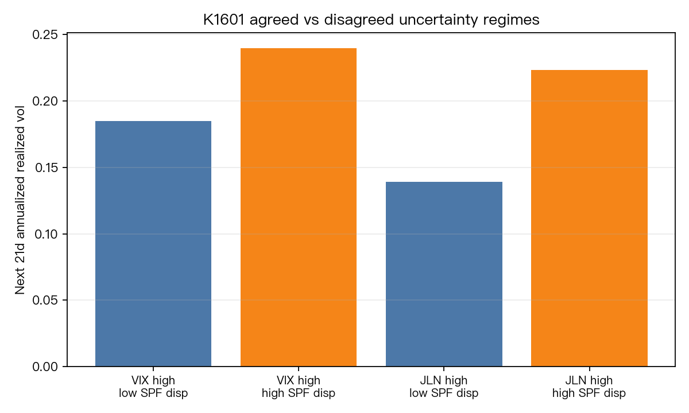
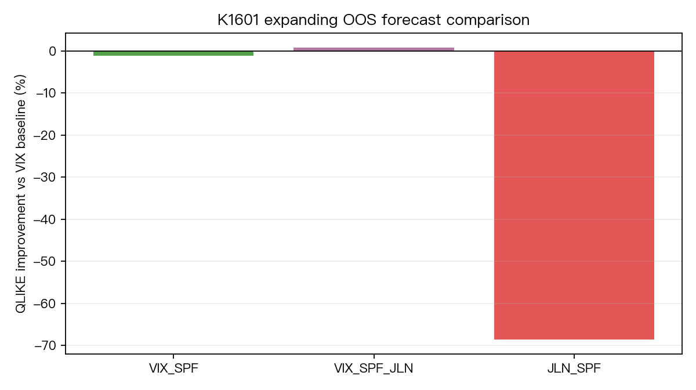

# K1601 - Agreed vs disagreed uncertainty regimes for SPY forward volatility

| Item | Value |
|---|---|
| Experiment ID | K1601 |
| Status | `DIRECTIONAL_ONLY` |
| Date | 2026-07-02 |
| Script | `K1601.py` |
| Results | `K1601_results.json` |

## Research Question

Does forecast-disagreement information help identify high-uncertainty regimes
that forecast SPY forward realized volatility or left-tail risk beyond VIX?

This experiment is a market-volatility adaptation of the agreed vs disagreed
uncertainty idea. It is not a byte-for-byte replication of the macro paper.

## Literature Context

- Gambetti, Korobilis, Tsoukalas and Zanetti (2023/2025), *Agreed and
  Disagreed Uncertainty*: motivates separating high-uncertainty/low-disagreement
  states from high-uncertainty/high-disagreement states.
- Jurado, Ludvigson and Ng (2015), *Measuring Uncertainty*: motivates the JLN
  macro uncertainty index used as a secondary uncertainty level proxy.
- Lahiri and Sheng (2010), *Measuring Forecast Uncertainty by Disagreement*:
  motivates forecast disagreement as an uncertainty-related but imperfect proxy.
- Federal Reserve Bank of Philadelphia SPF documentation: provides
  cross-sectional forecast dispersion data.

## Data

| Series | Source | Timing rule |
|---|---|---|
| SPY close | yfinance adjusted close | daily target source |
| VIX | FRED `VIXCLS` | daily-aligned, then `.shift(1)` |
| JLN uncertainty | FRED `JLNUM3M` | monthly, conservative two-month known-from lag, then `.shift(1)` |
| SPF disagreement | Philadelphia Fed `Dispersion_2.xlsx`, `RGDP_D2(T+1)` | quarterly, known from next-quarter start, then `.shift(1)` |

Final panel: 8,137 daily rows, 1994-01-28 to 2026-05-29.

Target at row `t`:

- `target_rv_21 = sum(r_{t+1}^2, ..., r_{t+21}^2)`
- `target_vol_ann_21 = sqrt(target_rv_21 / 21 * 252)`
- `target_tail_loss_21 = max(0, -min(r_{t+1}, ..., r_{t+21}))`

## Method

Regime labels are formed with ex-ante rolling thresholds:

- High uncertainty: lagged VIX or JLN above its trailing 756-trading-day 75th percentile.
- High disagreement: lagged SPF dispersion above its trailing 756-trading-day median.
- Agreed high uncertainty: high uncertainty and low SPF disagreement.
- Disagreed high uncertainty: high uncertainty and high SPF disagreement.

Forecasting gate:

- Expanding OOS log-OLS forecasts of 21-day realized variance.
- Baseline: `VIX`.
- Candidates: `VIX_SPF`, `VIX_SPF_JLN`, `JLN_SPF`.
- OOS train rows must satisfy `target_end_pos < forecast_pos`, so no forward target used for training overlaps the forecast origin.
- Loss: Patton QLIKE on 21-day realized variance.
- Pairwise DM: `volpred.stats.model_evaluation.dm_test`, `h=21`.
- Harvey gate: candidate must have lower QLIKE and DM `t < -3`.
- MCS: `volpred.stats.mcs.model_confidence_set`, alpha `0.10`, `n_boot=1000`, seed `42`.

## Results

### Regime Diagnostics

Within high-VIX regimes:

- Agreed high-uncertainty forward vol: 18.50%.
- Disagreed high-uncertainty forward vol: 23.96%.
- Agreed minus disagreed: -5.45 vol points, HAC t = -2.97.
- Tail loss shows the same direction: -0.70 percentage point, HAC t = -2.83.

Within high-JLN regimes:

- Agreed high-uncertainty forward vol: 13.89%.
- Disagreed high-uncertainty forward vol: 22.33%.
- Agreed minus disagreed: -8.44 vol points, HAC t = -4.71.
- Tail loss shows the same direction: -1.16 percentage points, HAC t = -4.90.

The sign is opposite to a naive "agreed uncertainty is worse for markets" story:
in this market-volatility adaptation, high uncertainty plus high SPF disagreement
is the higher-volatility state.

### OOS Forecast Gate

| Model | QLIKE | Improvement vs VIX | DM t vs VIX | MCS member? |
|---|---:|---:|---:|---|
| VIX | 0.3168 | baseline | baseline | yes |
| VIX_SPF | 0.3206 | -1.19% | +0.72 | yes |
| VIX_SPF_JLN | 0.3142 | +0.84% | -0.38 | yes |
| JLN_SPF | 0.5341 | -68.57% | +4.76 | no |

OOS forecasts: 7,116, from 1998-02-13 to 2026-05-29.





## Verdict

`DIRECTIONAL_ONLY`.

SPF disagreement has descriptive regime information, but it does not pass the
forecasting gate beyond VIX. The best augmented model, `VIX_SPF_JLN`, improves
QLIKE by only +0.84% and has DM `t=-0.38`, far below the Harvey threshold.

This supports a conservative conclusion: SPF disagreement may describe which
high-uncertainty states are more volatile, but this pilot does not show
statistically defensible incremental forecasting power beyond VIX.

## Limitations

- SPF RGDP dispersion is quarterly and macro-focused, not the consumer
  disagreement measure in Gambetti et al.
- JLN values are revision-corrected FRED values, not ALFRED vintage data.
- The target uses overlapping 21-day forward windows, so HAC and strict OOS
  target cutoff are necessary and power remains limited.
- SPY only. This does not settle disagreement effects across assets.

## Files

```
experiments/k1601/
├── K1601.py
├── K1601_results.json
├── README.md
├── data/
│   ├── fred_JLNUM3M.csv
│   ├── fred_VIXCLS.csv
│   ├── k1601_oos_forecasts.csv
│   ├── k1601_panel.csv
│   ├── spf_Dispersion_2.xlsx
│   ├── spf_rgdp_d2_t1_parsed.csv
│   └── spy_close_yfinance.csv
└── figures/
    ├── k1601_oos_qlike_improvement.png
    └── k1601_regime_forward_vol.png
```
