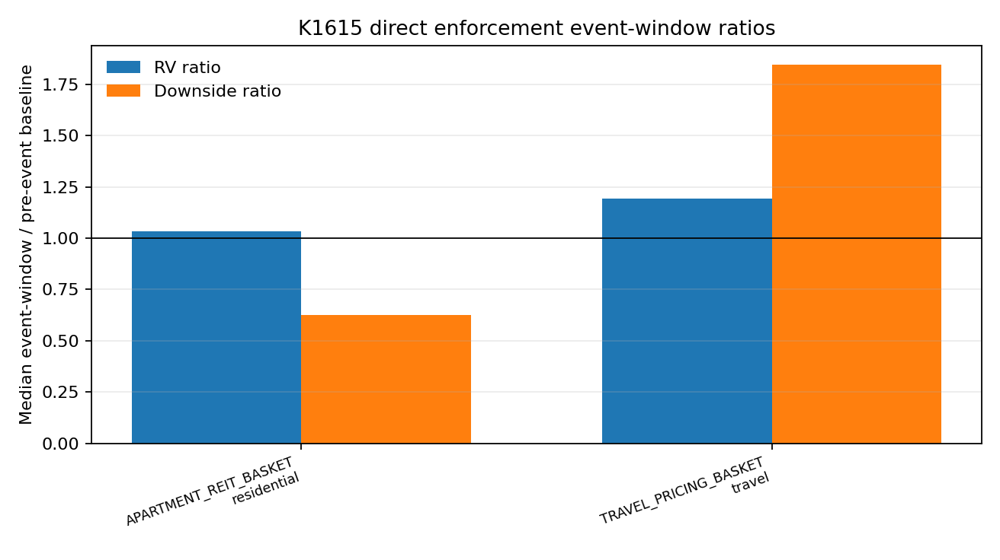
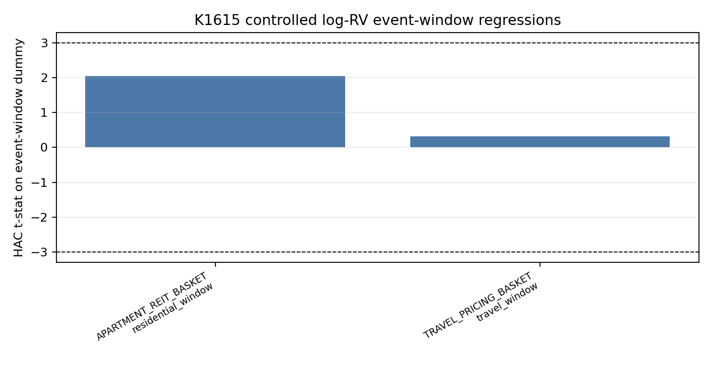

# K1615 - Algorithmic-pricing antitrust enforcement event windows

| Item | Value |
|---|---|
| Experiment ID | K1615 |
| Status | `DIRECTIONAL_ONLY` |
| Date | 2026-07-03 |
| Script | `K1615.py` |
| Results | `K1615_results.json` |

## Research Question

Do public DOJ/FTC algorithmic-pricing antitrust enforcement milestones around RealPage-style rental pricing and hotel pricing algorithms coincide with higher realized volatility, downside variance, or market-adjusted returns for public apartment REIT and travel-pricing equity proxies?

This is a public-proxy event-window diagnostic. It does not observe property-level RealPage adoption, private landlord exposure, hotel revenue-management software contracts, or legal discovery material. The result should not be read as causal RealPage exposure.

## Literature And Source Context

- Calvano, Calzolari, Denicolo and Pastorello (2020), *American Economic Review*, motivates the possibility that pricing algorithms can sustain supracompetitive outcomes.
- Assad, Clark, Ershov and Xu (2024), *Journal of Political Economy*, provides empirical evidence that algorithmic-pricing adoption can alter competitive outcomes in gasoline markets.
- Calder-Wang and Kim (2026), *Algorithmic Pricing in Multifamily Rentals*, provides the closest multifamily-rental context for RealPage-style pricing software.
- DOJ / FTC public documents provide event dates: RealPage complaint, landlord amended complaint, Greystar and RealPage proposed settlements, and the hotel-room algorithmic price-fixing statement of interest.

## Data

| Component | Detail |
|---|---|
| Price source | `yfinance`, adjusted close, `auto_adjust=True` |
| Price range | 2022-01-03 to 2026-07-03 |
| Trading days | 1,130 |
| Apartment REIT basket | `AVB`, `EQR`, `UDR`, `ESS`, `CPT`, `MAA` |
| Travel pricing basket | `JETS`, `MAR`, `HLT`, `H`, `ABNB`, `BKNG`, `EXPE` |
| Controls | `SPY`, `VNQ`, `XLY`, `^VIX` |
| Event window | `t-1` through `t+10` trading days |
| Baseline window | `t-63` through `t-11` trading days |

Official events used:

| Date | Type | Event |
|---|---|---|
| 2023-11-15 | residential | DOJ statement of interest in RealPage rental-software MDL |
| 2024-03-01 | residential | DOJ statement of interest in Duffy v. Yardi algorithmic rent case |
| 2024-03-28 | travel | FTC/DOJ statement of interest in hotel room algorithmic price-fixing case |
| 2024-08-23 | residential | DOJ sues RealPage |
| 2025-01-07 | residential | DOJ amended complaint adds six large landlords; Cortland proposed decree |
| 2025-08-08 | residential | DOJ proposed Greystar settlement |
| 2025-11-24 | residential | DOJ proposed RealPage settlement |
| 2025-12-23 | residential | DOJ case docket posts LivCor proposed final judgment |
| 2026-03-02 | residential | DOJ case docket posts Greystar final judgment |

## Method

Daily realized variance proxy:

```text
RV_t = daily log return_t^2
downside_t = min(daily log return_t, 0)^2
```

Basket returns are equal-weight averages of available constituent log returns.

Primary formal tests:

```text
log(RV_basket,t) = alpha + beta * event_window_t + controls_t + error_t
```

Controls include market RV, absolute market return, market return, sector RV (`VNQ` for apartment REITs, `XLY` for travel), and VIX return when available. Standard errors use Newey-West HAC with `maxlags=10`, matching the event-window length. The formal gate is:

- direct basket test only;
- positive event-window coefficient;
- `|t| >= 3`;
- Holm p-value `< 0.05` over the two direct basket tests;
- at least 30 event-window days.

The experiment is not a forecasting model, so there is no signal/target lag claim. The timing defense is that events are fixed ex ante from official public announcement dates, and outcomes are measured after those dates without selecting events from market moves.

## Results

| Direct test | Event days | Coef on log RV | HAC t | Raw p | Holm p | Gate |
|---|---:|---:|---:|---:|---:|---|
| Apartment REIT basket on residential windows | 96 | +0.3655 | +2.05 | 0.0399 | 0.0799 | fail |
| Travel pricing basket on hotel/travel window | 12 | +0.0806 | +0.31 | 0.7549 | 0.7549 | fail |

Event-window ratio diagnostics:

| Basket / Event type | Events | Median RV ratio | Mean RV ratio | Median downside ratio | Mean SPY-adjusted event return |
|---|---:|---:|---:|---:|---:|
| Apartment REIT / residential | 8 | 1.03x | 1.00x | 0.62x | -0.34% |
| Travel pricing / travel | 1 | 1.19x | 1.19x | 1.85x | -2.19% |





## Verdict

`DIRECTIONAL_ONLY`.

The apartment REIT basket has a positive controlled log-RV coefficient around residential algorithmic-pricing enforcement windows, but it fails the project gate: `t=2.05`, Holm p=`0.0799`, below the `|t|>=3` standard. The raw p-value should not be described as a publishable significant effect. The travel/hotel proxy has only one official event and is non-gateable.

## Limitations

- Public tickers are sector proxies, not direct RealPage adoption exposure.
- Most named defendants are private or subsidiaries, so public-market mapping is weak.
- Residential event count is small; travel event count is one.
- Daily close-to-close RV is coarse relative to intraday realized volatility.
- Legal events can coincide with rates, earnings, sector news, or broad market risk even after controls.

## Files

```text
experiments/k1615/
├── K1615.py
├── K1615_results.json
├── README.md
├── data/
│   ├── analysis_panel.csv
│   ├── event_calendar.csv
│   └── yfinance_adjusted_close.csv
└── figures/
    ├── k1615_event_regression_tstats.png
    └── k1615_event_window_ratios.png
```
