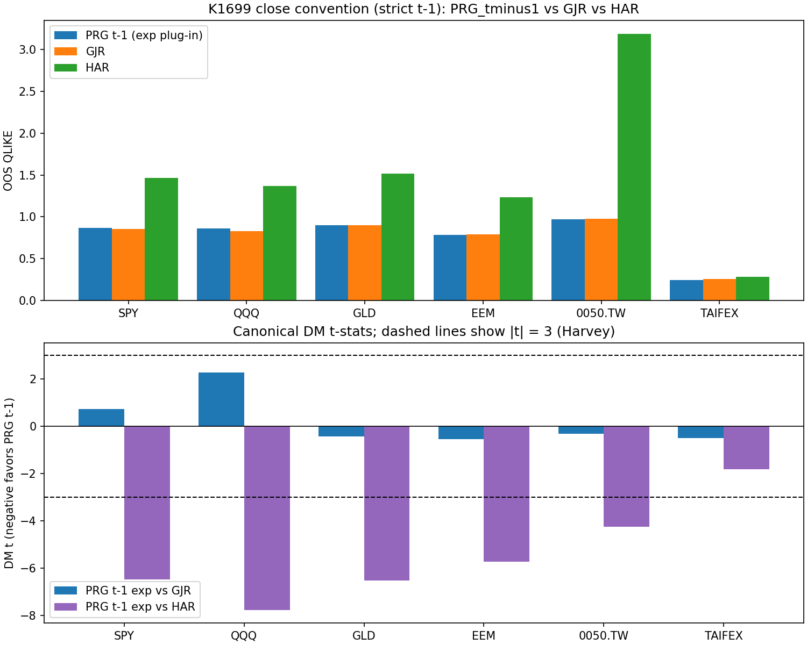

# 六個市場的波動率賽馬：一個「大勝五分」的新模型，為什麼其實只是平手

假設你在管一筆錢，每天收盤後得決定明天願意承受多少風險。你需要一個能預估「明天波動會多大」的模型。市面上有老將，也有新秀。新秀在論文裡的成績單漂亮得嚇人，準度狠甩老將一大截。你該換嗎？

我們把這個問題拿到六個市場實測了一輪：美股的標普 500（SPY）、那斯達克（QQQ）、黃金（GLD）、新興市場股票（EEM），加上台灣的 0050 ETF 和台指期（TAIFEX）。三個模型同場競技，六個市場合計約九千多個樣本外交易日的資料。結果和成績單上寫的不一樣。

## 賽道規則：一場乾淨的賽馬

參賽的三個模型：

- **老將 GJR-GARCH**：業界用了快三十年的標準波動率模型，只看每天的收盤價漲跌。
- **新秀 PRG**：一個把交易日拆成「隔夜跳空」和「盤中時段」兩段、分開建模的週期型模型。理論上，它對那些「開盤前就先動一大段」的市場應該特別拿手。
- **熱門選手 HAR**：用過去一天、一週、一個月的波動平均值往前外推，是實務界很流行的做法。

比準度用的是 QLIKE（一種預測誤差分數，數字越低，代表模型把每天的波動抓得越貼）。判斷「誰真的比較準」則靠 DM 檢定（一種統計方法，用來區分準度差距是真本事還是運氣）。研究界常用的 Harvey 標準很嚴格，要跨過它才算真的贏。

## 第一個意外：新秀的「大勝」，原來是計時器動了手腳

先前只在標普 500 一個市場測過的版本，新秀 PRG 的準度大勝老將 +5 以上（來自先前的 K880 招牌數字）。看起來是壓倒性勝利。

問題出在「什麼時候做預測」。那個漂亮的版本在預測「今天一整天的波動」時，偷偷用到了今天早上「已經發生」的隔夜跳空。好比你在中午預報今天會不會下雨，可是你早上已經淋過雨了。當然神準。

我們把規則改乾淨：所有預測都必須在「前一天收盤」就發出，只能用當下看得到的資訊，不准偷看明天。這才是真正管錢的人每天面對的處境。一改成公平計時，新秀的優勢立刻蒸發。在標普上，混合計時曾給新秀超過 +5 的大勝 t 值；公平計時後不只歸零，方向還輕輕翻向老將（t = +0.74 <!-- results.json: markets.SPY.dm_tests.PRG_tminus1_exp_vs_GJR.t_stat -->，正號代表老將略前，離門檻遠得很）。同一個模型、同一批資料，只因為「你幾點按下預測鍵」，成績就從大勝變平手。

## 第二個意外：最該讓新模型發光的市場，它也沒贏

新秀的賣點是「會處理隔夜跳空」。照理說，隔夜波動占比越高的市場，它越該大顯身手。台指期有 61% <!-- results.json: markets.TAIFEX.metadata.overnight_variance_share_pct --> 的每日波動發生在隔夜，黃金 53%、新興市場 53%，全是它的主場。

結果六個市場，新秀零勝。台指期的準度差距只有 −0.49 <!-- results.json: markets.TAIFEX.dm_tests.PRG_tminus1_exp_vs_GJR.t_stat -->，黃金 −0.44 <!-- results.json: markets.GLD.dm_tests.PRG_tminus1_exp_vs_GJR.t_stat -->，方向上偏新秀一點點，但離「統計上真的贏」差了十萬八千里。那斯達克甚至反過來，老將略勝（+2.28 <!-- results.json: markets.QQQ.dm_tests.PRG_tminus1_exp_vs_GJR.t_stat -->，但同樣沒跨過嚴格門檻）。隔夜波動大，不代表複雜模型就贏得了。

| 市場 | 隔夜波動占比 | 新模型贏過老模型？ |
|---|---:|---|
| 台指期 TAIFEX | 61% | 沒有（平手） |
| 黃金 GLD | 53% | 沒有（平手） |
| 新興市場 EEM | 53% | 沒有（平手） |
| 台灣 0050 | 46% | 沒有（平手） |
| 標普 SPY | 34% | 沒有（平手） |
| 那斯達克 QQQ | 28% | 沒有（老將略勝） |

## 第三個發現：流行的 HAR，這一題全面落敗

熱門選手 HAR 就沒這麼客氣了。六個市場裡有五個，老將 GJR 用嚴格門檻明確打敗 HAR（標普上準度差距 −6.88 <!-- results.json: markets.SPY.dm_tests.GJR_vs_HAR.t_stat -->）。這不代表 HAR 是壞模型。它的意思是：拿 HAR 來預測「一整天的變異數」這個特定目標，GARCH 家族就是更對味。工具再流行，也要看用在哪一題。

## 那到底哪個市場的波動比較好抓？

如果只看準度分數的絕對高低，台指期的 QLIKE 最低（0.24 <!-- results.json: markets.TAIFEX.qlike.PRG_tminus1_exp -->），美股和黃金落在 0.85 上下（標普老將 0.85 <!-- results.json: markets.SPY.qlike.GJR -->），台灣 0050 最高（約 0.97）。分數低，代表模型對那個市場的波動追得比較緊。

這裡得誠實打個折。跨市場比這個分數，不能直接讀成「台指期的波動天生最好預測」。各市場衡量「真實波動」用的尺不一樣（台指期用逐筆盤中資料、美股用每日收盤價），取樣期間也不同，都會左右分數高低。所以這份研究站得最穩的結論，不是「哪個市場最好預測」，而是「不管哪個市場，你該挑哪個模型」。

## 一句話帶走

如果你是那種在前一晚就要定好明天風險額度的人，一個無聊的標準 GARCH 模型，在這六個市場全都夠用，多付錢買複雜度換不到準度。可是時機會改變答案：另一份研究（K1544）發現，只要你能等到開盤、看見隔夜跳空之後再預測，那個會拆時段的新秀就在六個市場中的四個真的贏了。「最好的波動率模型」從來不是一個固定答案，它取決於你幾點鐘要做決定。

**Take-away：想換模型之前，先問一句：它宣稱的「大勝」，是真本事，還是計時器被動了手腳？**

*上圖：六市場 QLIKE（越低越準）與 DM t 值對照；虛線為 Harvey 顯著門檻 |t|=3。*

*本文基於實驗 K1699（腳本：experiments/k1699/k1699.py，結果：experiments/k1699/k1699_results.json）。資料來源：yfinance（美股與黃金）、TAIFEX 逐筆 tick（台指期）；OOS 期間約 2018–2026，橫跨 COVID 崩盤與 2022 空頭，六市場合計約九千多個樣本外交易日。準度用 QLIKE，統計檢定用 DM（Newey-West HAC），Harvey 門檻 |t|>3.0。*

## 延伸閱讀（相關研究）

- **K1544**：同一批六市場，改在「開盤時點」比較，新秀 PRG 反而 4/6 勝。這是本文「時機決定答案」的另一半證據。
- **K880 / K880v2**：新秀 PRG 招牌「大勝五分」的來源，以及把「偷看隔夜」拿掉後準度崩到 −0.57 的第一手證據（單一市場 SPY）。
- **K188**：HAR 天花板測試。HAR 在日頻資料上到底打不打得贏 GARCH？和本文 HAR 全面落敗互相呼應。
- **K886**：新秀 PRG 在台灣 0050 的單市場版本（隔夜占比 46%）。
- **K451**：隔夜與盤中波動的結構拆解，幫你理解「隔夜占比」這個概念的來龍去脈。

---

**AI 味自查（anti-ai-style 9 地雷，正文本體實測）**：
1. 地雷 1（假對立句式）與其變體：正文 0 個（標題與各段標題一併查過）；地雷 3/4/5/6/8（標籤情緒、爆米花昇華、生硬戲劇轉折、稻草人、吊書袋空詞）：0 個。
2. 地雷 9（長破折號）：正文 0 個，連接改用句號、逗號與冒號；正文中的長橫線只出現在減號（負 t 值）與年份區間，非補充停頓。
3. 地雷 7（翻譯腔「這」字）密度每 200 字約 1.4 個（≤3 達標）；配額轉折詞（然/事/真/但系列）正文 0 個；比喻（下雨、賽馬、計時器）皆具畫面感且服務論點。
