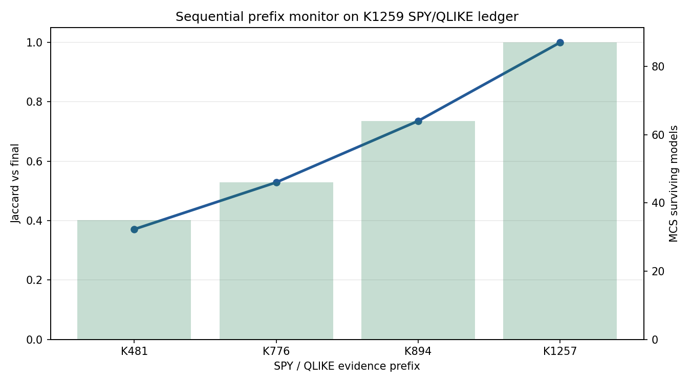

# research_conditional_sequential_mcs

**Task**: `research_conditional_sequential_mcs_jrss_b_2025_qkag066_a`  
**Date**: 2026-07-01  
**Status**: completed pilot, coverage-limited  
**Input evidence**: `experiments/k1259/dm_ledger.json` and K1259's ledger-only MCS implementation.

## Motivation

K1259 already built a ledger-only Model Confidence Set (MCS) meta-analysis from 2,718 pairwise DM rows across 236 K experiments. The open backlog asks whether that evidence base can be upgraded in two directions:

1. **Conditional MCS**: which models are superior in particular regimes, such as stress / normal / recession states?
2. **Sequential MCS**: does the superior set drift as new evidence accumulates?

This experiment is the first honest pilot. It does not fabricate missing per-day loss series or regime labels.

## Literature Checked

- Hansen, Lunde & Nason (2011), *The Model Confidence Set*, Econometrica. Baseline MCS framing.
- Arnold, Gavrilopoulos, Schulz & Ziegel (2026), *Sequential model confidence sets*, JRSS-B qkag066. Sequential monitoring motivation.
- Bauer & Kazak (2025), *Conditional Method Confidence Set*, arXiv:2505.21278. Regime-conditional MCS motivation.
- Li, Liao & Quaedvlieg (2020), *Conditional Superior Predictive Ability*. Caution that true conditional evaluation needs loss series by state.

## Method

The script reads `experiments/k1259/dm_ledger.json`, imports K1259's canonical model-name normalization and ledger-only `mcs_test`, and then runs two modules:

1. **Regime-label conditional proxy**
   - Uses only explicit existing labels in `period` / `source_field_path`.
   - `stress_proxy`: `crisis_subperiods`, COVID, bear, GFC, Ukraine, oil/gold crash, stress, or `by_regime:High`.
   - `normal_proxy`: `dm_tests_by_regime.calm`, `dm_tests_by_regime.normal`, or `by_regime:Low`.
   - Keeps multi-asset rows as `multi_asset`; it does **not** reassign them to SPY or any single ticker.

2. **Sequential prefix monitor**
   - Uses K1259-cleaned `SPY / QLIKE` rows.
   - Sorts evidence by K number and runs MCS at 25%, 50%, 75%, and 100% prefixes.
   - Reports Jaccard similarity of each prefix's superior set against the final superior set.

All bootstrap procedures use `seed=42`, `B=1000`, `alpha=0.10`.

## Results

### Conditional proxy coverage

| Condition | Clean rows | Asset scope | Top K contributors |
|---|---:|---|---|
| stress_proxy | 59 | 100% multi-asset | K1089, K1088, K1085 |
| normal_proxy | 6 | 100% multi-asset | K1116 |

This is the central result: the existing ledger has regime-labeled evidence, but it is too sparse and mostly multi-asset. It cannot yet support a strong "which single model wins in which regime" claim.

### Conditional MCS

| Condition | Models input | Models survived | Stopping p | Result |
|---|---:|---:|---:|---|
| stress_proxy | 9 | 9 | 0.246753 | no elimination |
| normal_proxy | 4 | 4 | 0.216783 | no elimination |

Interpretation: no model is eliminated at `alpha=0.10` in either condition. This is a NULL result for conditional selection, not evidence that all models are equally good in a strong sense.

### Sequential SPY/QLIKE monitor

| Prefix | Rows | Models | Survived | Jaccard vs final |
|---|---:|---:|---:|---:|
| K481 | 133 | 37 | 35 | 0.370787 |
| K776 | 218 | 53 | 46 | 0.528736 |
| K894 | 274 | 73 | 64 | 0.735632 |
| K1257 | 325 | 99 | 87 | 1.000000 |

Interpretation: the SPY/QLIKE superior set is not stable in early evidence prefixes. The Jaccard similarity rises as more K evidence enters, so sequential monitoring is useful as a diagnostic even before implementing the full JRSS-B e-process framework.



## Main Findings

1. **Conditional MCS is not ready from K1259 ledger alone.** The available regime labels are sparse and multi-asset; `normal_proxy` has only 6 usable rows.
2. **Stress-proxy MCS gives a NULL result.** 9/9 models survived; stopping p = 0.246753.
3. **Normal-proxy MCS gives a NULL result.** 4/4 models survived; stopping p = 0.216783.
4. **Sequential diagnostics are promising.** SPY/QLIKE MCS set stability improves materially as the ledger accumulates evidence: Jaccard 0.370787 → 0.528736 → 0.735632 → 1.000000.

## Limitations

- This is not a full Conditional Method Confidence Set implementation.
- This is not a time-uniform sequential MCS implementation.
- K1259 stores pairwise DM statistics, not per-day loss differentials, so true stationary-block bootstrap by regime cannot be run here.
- FRED recession conditioning cannot be implemented honestly from this ledger without dated loss series.
- Multi-asset rows are kept as multi-asset evidence and are not reassigned to a single ticker.

## Reproduction

```bash
cd /Users/yhlai0911/Desktop/volpred-research
python experiments/research_conditional_sequential_mcs/research_conditional_sequential_mcs.py
```

Outputs:

- `experiments/research_conditional_sequential_mcs/research_conditional_sequential_mcs_results.json`
- `experiments/research_conditional_sequential_mcs/research_conditional_sequential_mcs_sequential_jaccard.png`

