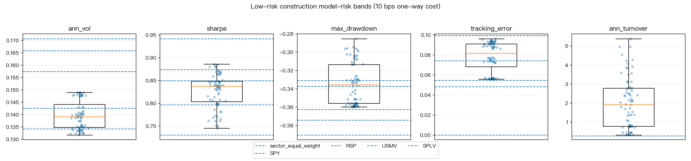
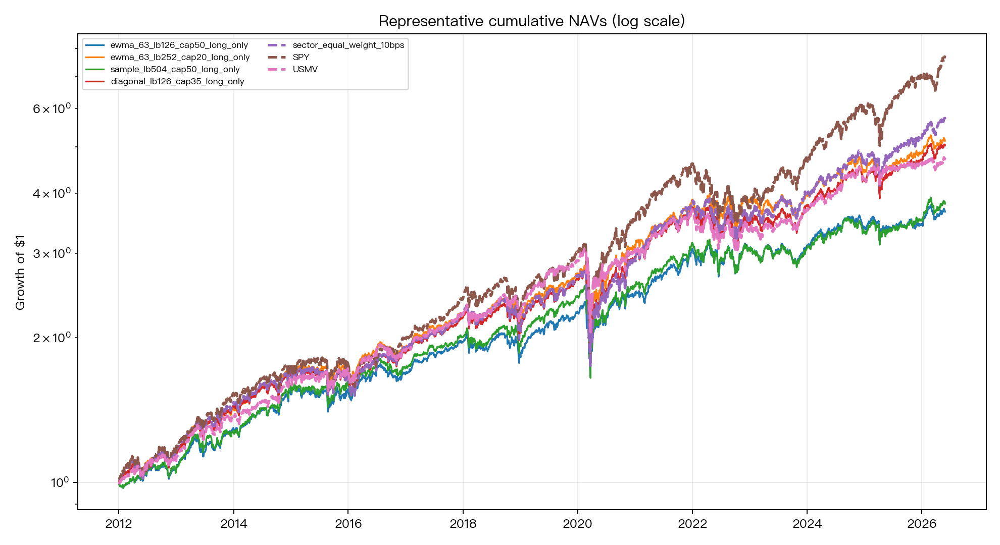

# Ex-ante model-risk band for low-risk portfolio construction

| Item | Value |
|---|---|
| Experiment ID | `research_ex_ante_model_risk_band` |
| Status | `MODEL_RISK_BAND_MODEST` |
| Date | 2026-06-24 |
| Script | `research_ex_ante_model_risk_band.py` |
| Results | `research_ex_ante_model_risk_band_results.json` |
| Review | `codex_review.md` |

## Question

Do low-risk / minimum-variance portfolio construction choices create a large
ex-ante model-risk band in realized volatility, tracking error, drawdown, and
net Sharpe?

This is not a test of the low-volatility factor's alpha.  It asks whether the
same low-risk construction family becomes materially unstable when covariance
estimator, lookback, weight cap, shorting constraint, and turnover cost are
varied.

## Literature context

- Cirulli, De Nard, Traut, and Walker (2026), "Low Risk, High Variability:
  Practical Guide for Portfolio Construction," Journal of Portfolio
  Management 52(6), motivates the implementation-choice question.
  Source: <https://www.researchgate.net/publication/400839653_Low_Risk_High_Variability_Practical_Guide_for_Portfolio_Construction>
- DeMiguel, Garlappi, Nogales, and Uppal (2009), "A Generalized Approach to
  Portfolio Optimization," frames estimation error and portfolio-norm
  constraints in out-of-sample allocation.
  Source: <https://ideas.repec.org/a/inm/ormnsc/v55y2009i5p798-812.html>
- Frazzini and Pedersen (2014), "Betting Against Beta," is the low-beta /
  leverage-constraint background, but this experiment does not construct BAB.
  Source: <https://www.aqr.com/Insights/Datasets/Betting-Against-Beta-Equity-Factors-Monthly>
- MSCI (2016), "Constructing Low Volatility Strategies," summarizes low-vol
  implementation references including Clarke-de Silva-Thorley, Haugen-Baker,
  Jagannathan-Ma, and Frazzini-Pedersen.
  Source: <https://www.msci.com/documents/10199/95bba81c-4ab0-4698-8ea1-ab4f515afc38>

## Data

Source: yfinance adjusted close (`auto_adjust=True`), cached in
`data/prices.csv`.

Universe: 10 liquid U.S. equity sector / real-estate ETFs:
`XLB`, `XLE`, `XLF`, `XLI`, `XLK`, `XLP`, `XLU`, `XLV`, `XLY`, `IYR`.

Benchmarks: `SPY`, `RSP`, `USMV`, `SPLV`.

Sample:

| Field | Value |
|---|---:|
| Full universe return span | 2003-01-03 to 2026-06-23 |
| OOS evaluation span | 2012-01-03 to 2026-05-29 |
| OOS daily observations | 3,622 |
| Monthly holding periods | 173 |

The current partial month is excluded.  The final OOS month is May 2026.

## Method

Each strategy estimates weights at month-end `t` using returns observed through
`t`, then applies those weights only to daily returns from `t+1` through the
next month-end.

Specification grid:

| Dimension | Values |
|---|---|
| Covariance estimator | sample, Ledoit-Wolf, diagonal, EWMA half-life 63d |
| Lookback | 126, 252, 504 trading days |
| Weight cap | 20%, 35%, 50% |
| Shorting | long-only; limited-short lower bound -5%, gross <= 1.20 |
| Cost grid | 0, 10, 25 bps one-way turnover cost |

This creates 72 low-risk construction specs.  Turnover cost is deducted on the
first trading day after each rebalance.  Formal tests use:

- DM/HAC tests on daily squared returns vs `sector_equal_weight_10bps` and
  `SPY`; negative `t` means lower realized variance.
- DM/HAC tests on negative daily returns; negative `t` means higher average
  return.
- Stationary bootstrap (`B=1000`, block length 21 trading days, seed
  `20260624`) for model-risk band uncertainty.

## Results at 10 bps cost

### Model-risk band across 72 specs

| Metric | Min | Median | Max | Range | P90-P10 |
|---|---:|---:|---:|---:|---:|
| Annualized vol | 13.17% | 13.91% | 14.89% | 1.72 pp | 1.47 pp |
| Sharpe | 0.745 | 0.837 | 0.886 | 0.141 | 0.102 |
| Max drawdown | -35.98% | -33.55% | -28.52% | 7.47 pp | 5.69 pp |
| Tracking error vs SPY | 5.56% | 8.17% | 9.62% | 4.06 pp | 3.70 pp |
| Annual turnover | 0.32x | 1.92x | 5.39x | 5.06x | 3.46x |

Bootstrap median model-risk ranges:

| Band statistic | Bootstrap median | 5%-95% interval |
|---|---:|---:|
| Annualized vol range | 1.70 pp | 1.29 to 2.22 pp |
| Sharpe range | 0.33 | 0.20 to 0.56 |
| Max-drawdown range | 12.09 pp | 6.23 to 22.93 pp |

The bootstrap Sharpe / drawdown range is wider than the realized full-sample
range because resampled crisis blocks change which specs look best.  The
volatility band remains modest.

### Baselines

| Strategy | Cost | Ann. vol | Sharpe | Max drawdown | Tracking error vs SPY |
|---|---:|---:|---:|---:|---:|
| Sector equal weight | 10 bps | 15.74% | 0.850 | -37.42% | 4.82% |
| SPY | 0 bps | 16.59% | 0.942 | -33.72% | 0.00% |
| RSP | 0 bps | 17.07% | 0.796 | -39.04% | 5.47% |
| USMV | 0 bps | 13.42% | 0.874 | -33.10% | 7.42% |
| SPLV | 0 bps | 14.25% | 0.730 | -36.26% | 9.93% |

The median construction spec reduces annualized volatility by 1.83 pp versus
sector equal weight and 2.68 pp versus SPY.  It does not beat SPY on Sharpe.

### Formal tests

| Baseline | Variance tests | Harvey pass lower variance | Harvey pass higher return |
|---|---:|---:|---:|
| Sector equal weight 10 bps | 72 | 72 | 0 |
| SPY | 72 | 72 | 0 |

Interpretation: the low-risk construction family robustly lowers realized
variance, but there is no Harvey-strength evidence of higher average return.





## Verdict

`MODEL_RISK_BAND_MODEST`.

For this ETF-sector implementation, low-risk construction choices do create a
visible band, especially in turnover, tracking error, and drawdown, but the
core realized-volatility band is only about 1.7 pp annualized.  The robust
finding is variance reduction, not return alpha.  The practical takeaway is
that low-risk products should disclose implementation choices and expected
tracking-error / turnover bands, but this sample does not support the stronger
claim that parameter choices dominate the low-risk outcome.

## Limitations

- This is an investable ETF-sector proxy, not a stock-level S&P 500 constituent
  minimum-variance replication.  It may understate model risk from security
  selection, missing data, liquidity screens, and industry-neutral constraints.
- yfinance data are public adjusted-close data, not an institutional total
  return database.
- Limited-short specs have 141 optimizer fallbacks across all monthly/spec
  solves.  Long-only specs have zero failures and show the same modest-band
  conclusion, so this is a caveat rather than a blocker.
- No tax lots, bid-ask spreads, borrow costs, capacity, or market-impact model
  is included.  Turnover cost is a simple linear one-way bps charge.
- The universe is sector ETFs, so the result should not be cited as evidence
  about stock-level low-vol alpha.

## Files

```
experiments/research_ex_ante_model_risk_band/
├── README.md
├── codex_review.md
├── research_ex_ante_model_risk_band.py
├── research_ex_ante_model_risk_band_results.json
├── data/
│   ├── baseline_metrics.csv
│   ├── benchmark_daily_returns.csv
│   ├── formal_tests_10bps.csv
│   ├── monthly_weights.csv
│   ├── prices.csv
│   ├── spec_gross_daily_returns.csv
│   ├── spec_metrics.csv
│   ├── spec_net_daily_returns_0bps.csv
│   ├── spec_net_daily_returns_10bps.csv
│   ├── spec_net_daily_returns_25bps.csv
│   └── universe_daily_returns.csv
└── figures/
    ├── model_risk_bands_10bps.png
    └── representative_navs_10bps.png
```
