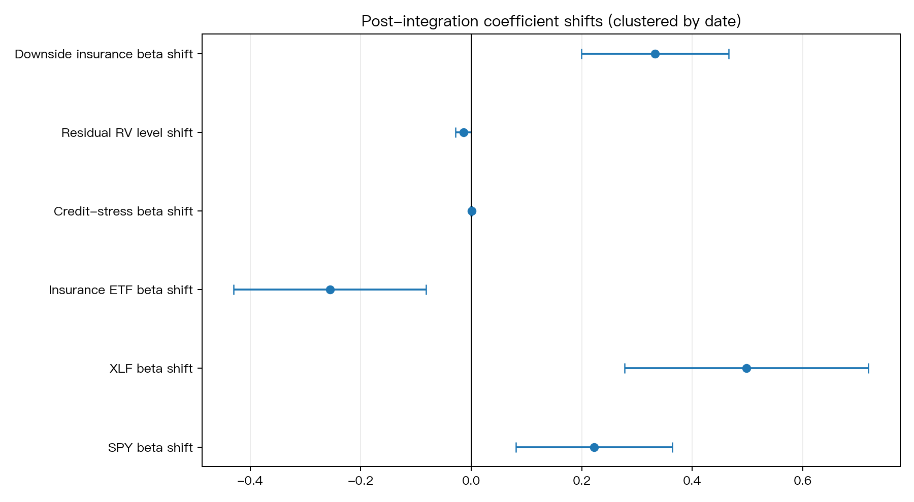
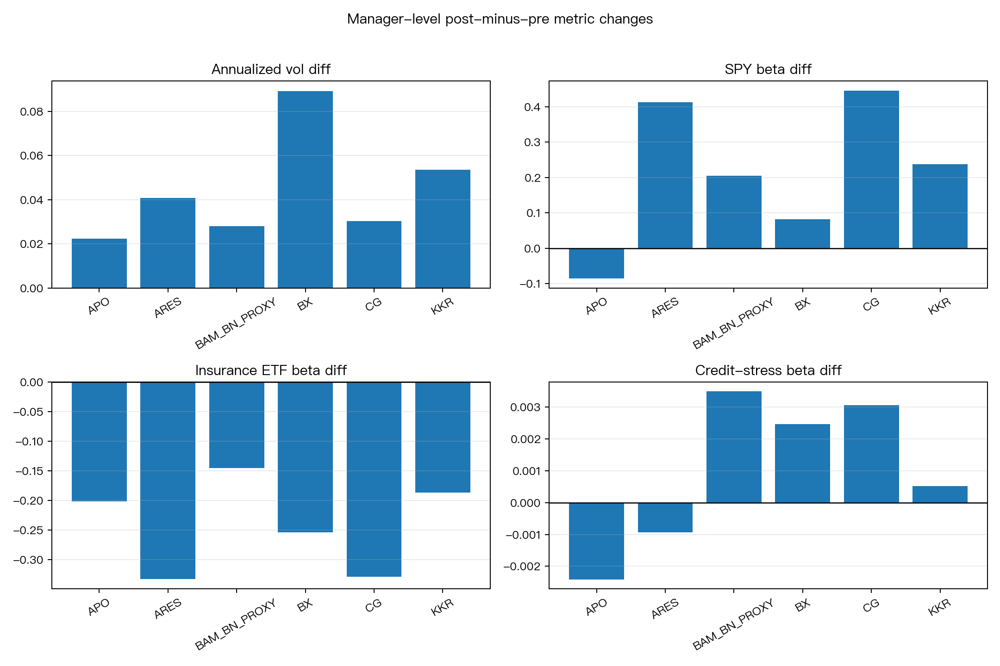

# Permanent-capital insurance platform integration and alternative-manager vol beta

| Item | Value |
|---|---|
| Experiment ID | `research_permanent_capital_insurance_platform_integration` |
| Status | `BETA_COMPOSITION_SHIFT_NO_RV_CREDIT_PASS` |
| Date | 2026-06-24 |
| Script | `research_permanent_capital_insurance_platform_integration.py` |
| Results | `research_permanent_capital_insurance_platform_integration_results.json` |
| Review | `codex_review.md` |

## Question

Does insurance-platform integration change listed alternative asset managers'
volatility beta, credit-spread sensitivity, and downside insurer correlation?

This experiment tests public-market behavior around major insurance-platform
transactions for `BX`, `KKR`, `APO`, `ARES`, `BN` as a Brookfield/BAM long-history
proxy, and `CG`.  It is an observational regime-shift test, not a causal
deal-quality test.

## Literature and event context

- Cheema-Fox, Czasonis, Kontu, and Serafeim (2026), "Permanent Capital Meets
  Private Markets," motivates the hypothesis that insurance platform
  integration changes AAM business models and financial profiles.
  Source: <https://www.hbs.edu/faculty/Pages/item.aspx?num=67824>
- Apollo-Athene merger completion, 2022-01-03.
  Source: <https://www.apollo.com/insights-news/pressreleases/2022/01/apollo-completes-merger-with-athene-and-finalizes-key-governance-enhancements-120051006>
- KKR-Global Atlantic majority acquisition close, 2021-02-01.
  Source: <https://www.globalatlantic.com/news/kkr-closes-acquisition-global-atlantic-financial-group-limited>
- Blackstone-Allstate Life close, 2021-11-01.
  Source: <https://www.allstatenewsroom.com/news/allstate-completes-sale-of-life-and-annuity-businesses/>
- Ares/Aspida insurance-platform close, 2021-07-15.
  Source: <https://www.businesswire.com/news/home/20210715005357/en/Aspida-Completes-Acquisition-of-U.S.-Based-Insurance-Platform>
- Brookfield Reinsurance-AEL close, 2024-05-02.
  Source: <https://bnt.brookfield.com/sites/brookfield-bnt/files/Brookfield-BNT/Press-Releases/2024/bnre-press-release-brookfield-reinsurance-completes-acquisition-ael-f.pdf>
- Carlyle/Fortitude Re majority acquisition close, 2020-06-03.
  Source: <https://www.carlyle.com/media-room/news-release-archive/carlyle-group-and-td-holdings-complete-acquisition-majority>

## Data

Price source: yfinance adjusted close (`auto_adjust=True`), cached in
`data/prices.csv`.

Credit-stress source: attempted FRED `BAMLH0A0HYM2`; the accessible FRED CSV in
this environment only covered 2023-06 onward, so the experiment uses the
tradable proxy `LQD_return - HYG_return` for the full panel.  This is a credit
stress proxy, not a true option-adjusted spread.

| Field | Value |
|---|---:|
| Price span | 2014-01-02 to 2026-06-23 |
| Panel span | 2014-05-05 to 2026-06-23 |
| Panel observations | 18,312 manager-days |
| Managers | BX, KKR, APO, ARES, BAM/BN proxy, CG |

## Method

For each manager, `post=1` begins at the transaction close / integration date.
Announcement windows are retained separately in `data/event_windows.csv`.

Primary panel regressions use manager fixed effects and calendar-year fixed
effects, with standard errors clustered by date:

1. Return beta shift:
   `ret ~ manager FE + year FE + SPY + XLF + KIE + credit_z + post interactions`
2. Realized-volatility level shift:
   `r^2 * 252 ~ manager FE + year FE + abs(SPY/XLF/KIE/credit) + post`
3. Downside insurer beta shift:
   same return model on days where `SPY < 0`, focusing on `KIE:post`.

Harvey-style reporting threshold: `|t| > 3.0`.

## Primary results

| Test | Coef | t-stat | Harvey pass | Interpretation |
|---|---:|---:|---|---|
| `SPY:post` | +0.222 | +3.08 | Yes | market beta rises after integration |
| `XLF:post` | +0.498 | +4.42 | Yes | financial-sector beta rises strongly |
| `KIE:post` | -0.256 | -2.88 | No | unconditional insurer beta declines, but not Harvey-strength |
| `credit_z:post` | +0.0007 | +0.83 | No | no robust credit-stress sensitivity shift |
| `RV post` | -0.014 | -1.94 | No | no robust residual RV level increase after year FE |
| downside `KIE:post` | +0.332 | +4.88 | Yes | controlled downside insurer beta rises |

Manager-level post-minus-pre averages:

| Metric | Mean diff | Cross-manager t | Harvey pass |
|---|---:|---:|---|
| Annualized vol | +4.41 pp | +4.36 | Yes |
| SPY beta | +0.217 | +2.64 | No |
| KIE beta | -0.241 | -7.65 | Yes |
| Credit-stress beta | +0.0010 | +1.06 | No |
| Downside KIE correlation | -0.138 | -6.72 | Yes |

Event-window medians:

| Window type | Median post/pre vol ratio |
|---|---:|
| Announcement date, 20d post vs 20d pre | 1.19 |
| Integration close, 20d post vs 20d pre | 1.13 |





## Verdict

`BETA_COMPOSITION_SHIFT_NO_RV_CREDIT_PASS`.

The public-market signal is not "insurance integration simply raises realized
volatility."  After manager and calendar-year fixed effects, residual RV level
does not pass the Harvey threshold, and the credit-stress proxy interaction is
not significant.  The robust result is a beta-composition shift: post-integration
manager returns load more on broad market / financial-sector moves, and on
downside days the controlled insurance-sector beta increases.

This supports tracking insurance-platform integration as a risk-profile change,
but not as a standalone credit-spread or residual-RV timing signal.

## Limitations

- This is observational.  Integration dates are not randomly assigned and
  overlap with COVID, 2022 rates, private-credit growth, and index-inclusion
  changes.  Year fixed effects reduce but do not eliminate this confounding.
- `BN` is used as a longer-history Brookfield/BAM proxy because current `BAM`
  begins only after the 2022 spinoff.
- FRED HY OAS full history was not accessible through the CSV endpoint in this
  environment, so credit stress is proxied by `LQD-HYG` returns.
- Six managers is a small cross-section; cross-manager t-statistics are
  supporting evidence, not publication-grade cross-sectional inference.
- Athene, Global Atlantic, Allstate Life, AEL, Aspida, and Fortitude Re are not
  all continuously public, so partner-level equity reactions cannot be measured
  directly.

## Files

```
experiments/research_permanent_capital_insurance_platform_integration/
├── README.md
├── codex_review.md
├── research_permanent_capital_insurance_platform_integration.py
├── research_permanent_capital_insurance_platform_integration_results.json
├── data/
│   ├── credit_stress.csv
│   ├── daily_returns.csv
│   ├── event_windows.csv
│   ├── fred_BAMLH0A0HYM2.csv
│   ├── insurance_events.csv
│   ├── manager_post_pre_diffs.csv
│   ├── manager_pre_post_metrics.csv
│   ├── panel.csv
│   ├── panel_regressions.csv
│   └── prices.csv
└── figures/
    ├── manager_post_pre_diffs.png
    └── panel_coefficient_shifts.png
```
