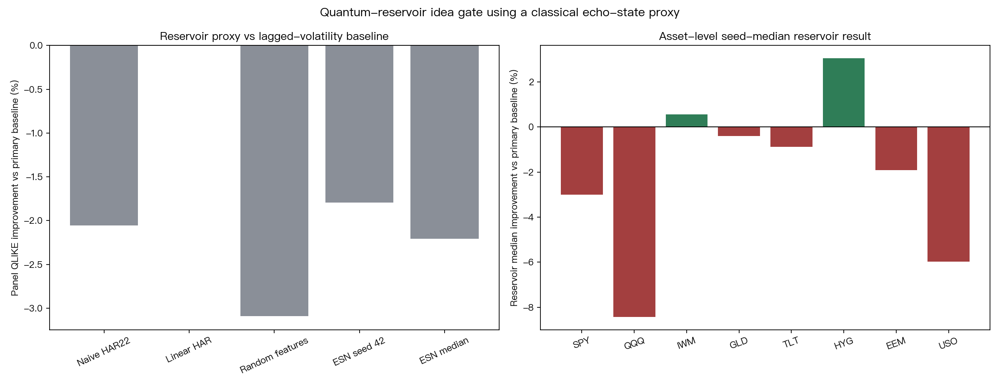

# research_quantum_reservoir_computing_for_realized_volatil

**Task**: `research_quantum_reservoir_computing_for_realized_volatil`  
**Date**: 2026-07-01  
**Status**: completed reproducibility gate  
**Verdict**: `NULL_VS_PRIMARY_BASELINE`

## Motivation

Li, Mukhopadhyay, Bayat, and Habibnia propose quantum reservoir computing (QRC)
for realized-volatility forecasting. The project backlog question is not
whether we can reproduce quantum hardware. The immediate gate is narrower:

> If the quantum reservoir is replaced by a transparent fixed classical
> echo-state reservoir, does the reservoir mechanism itself beat strong
> lagged-volatility baselines on public daily data?

This is a reproducibility screen. A null result here does not refute the QRC
paper, because the experiment uses no quantum Hamiltonian, no qubit simulation,
and no high-frequency realized-volatility panel.

## Literature Checked

- Li, Mukhopadhyay, Bayat, and Habibnia (2025/2026), *Quantum Reservoir Computing for Realized Volatility Forecasting*, arXiv:2505.13933.
- Corsi (2009), *A simple approximate long-memory model of realized volatility*, Journal of Financial Econometrics.
- Jaeger and Haas (2004), *Harnessing nonlinearity: predicting chaotic systems and saving energy in wireless communication*, Science.
- Zhang, Zhang, Cucuringu, and Qian (2022/2024), *Volatility forecasting with machine learning and intraday commonality*, arXiv:2202.08962.

## Data

- Source: yfinance adjusted daily close, `auto_adjust=True`.
- Download window: 2010-01-01 to 2026-07-02 exclusive.
- Assets: SPY, QQQ, IWM, GLD, TLT, HYG, EEM, USO.
- Price coverage: 2010-01-04 to 2026-07-01 for all 8 assets, 4,148 prices each.
- Model rows per asset: 2,241 train rows and 1,884 OOS rows after lag construction.
- OOS period: 2019-01-02 to 2026-07-01.
- Cache: `experiments/research_quantum_reservoir_computing_for_realized_volatil/data/adjusted_close_yfinance.csv`.

## Method

The target is same-day close-to-close squared log return `r_t^2`. This is a
daily public-data proxy, not a five-minute realized-volatility target.

All predictors are lagged:

- `log_rv_lag1 = log(signal.shift(1))`
- `log_rv_lag5 = log(signal.rolling(5).mean().shift(1))`
- `log_rv_lag22 = log(signal.rolling(22).mean().shift(1))`
- lagged absolute, negative, and signed returns

Models:

- `naive_har22`: 22-day lagged rolling mean variance.
- `linear_har`: Ridge on lagged daily/weekly/monthly log variance.
- `linear_harx`: Ridge on HAR lags plus lagged return/asymmetry features.
- `random_features`: fixed tanh random features plus Ridge readout.
- `reservoir_seed42`: fixed sparse echo-state reservoir plus Ridge readout.
- `reservoir_seed_median`: pointwise median forecast across 8 fixed reservoir seeds.

Every model receives train-only scalar calibration for QLIKE on variance
forecasts. The primary gate baseline is the strongest calibrated traditional
benchmark among `naive_har22`, `linear_har`, and `linear_harx`; in this run it is
`linear_har`.

Inference:

- Patton QLIKE on `r^2`.
- Pairwise DM-HAC from `volpred.stats.model_evaluation.dm_test`.
- Asset-level bootstrap for mean QLIKE difference, B=1000, seed=42.

## Results

Panel mean QLIKE, lower is better:

| Model | Mean QLIKE |
|---|---:|
| linear_har | 1.463210 |
| linear_harx | 1.493159 |
| naive_har22 | 1.493313 |
| reservoir_seed42 | 1.489460 |
| reservoir_seed_median | 1.495517 |
| random_features | 1.508468 |

Primary comparison vs `linear_har`:

| Model | Mean QLIKE diff | Asset wins | Bootstrap 95% CI |
|---|---:|---:|---|
| reservoir_seed42 | +0.026250 | 1/8 | [-0.002063, +0.059227] |
| reservoir_seed_median | +0.032306 | 2/8 | [-0.000588, +0.070557] |
| random_features | +0.045258 | 0/8 | [+0.031521, +0.058252] |

Positive differences mean the model is worse than `linear_har`. The seed-median
reservoir proxy loses on panel mean QLIKE and wins only 2 of 8 assets. The best
single reservoir seed, seed 42, is slightly better than naive HAR22 but still
worse than the stronger calibrated linear HAR baseline.



## Main Findings

1. **Null vs strongest traditional baseline**: the classical echo-state
   reservoir proxy does not beat calibrated linear HAR on this daily proxy.
2. **The result is seed-sensitive but not enough to pass**: reservoir seed means
   range from 1.489460 to 1.518940; none supports a robust win over the primary
   baseline.
3. **Calibration matters**: before train-only scalar calibration, all log-model
   forecasts were badly miscalibrated under QLIKE. The final result compares
   calibrated forecasts only.
4. **No lookahead detected**: features are explicitly lagged, training ends
   before 2019-01-02, and OOS target labels are not used in fitting or
   calibration.

## Limitations

- No quantum Hamiltonian, qubit simulation, measurement noise, or NISQ hardware
  constraint is modeled.
- Daily squared returns are noisy volatility proxies and do not match the
  high-frequency realized-volatility target in the QRC paper.
- Reservoir hyperparameters are fixed ex ante and not tuned.
- The asset universe is 8 liquid ETFs, not the QRC paper's S&P 500 realized
  volatility and macro/microstructure feature design.
- This is a gate against a cheap ESN-style approximation, not evidence against
  quantum reservoir computing itself.

## Reproduction

```bash
cd /Users/yhlai0911/volpred-research
uv run python experiments/research_quantum_reservoir_computing_for_realized_volatil/research_quantum_reservoir_computing_for_realized_volatil.py
```

Outputs:

- `experiments/research_quantum_reservoir_computing_for_realized_volatil/research_quantum_reservoir_computing_for_realized_volatil_results.json`
- `experiments/research_quantum_reservoir_computing_for_realized_volatil/research_quantum_reservoir_computing_for_realized_volatil_qlike_improvement.png`
- `experiments/research_quantum_reservoir_computing_for_realized_volatil/data/adjusted_close_yfinance.csv`
