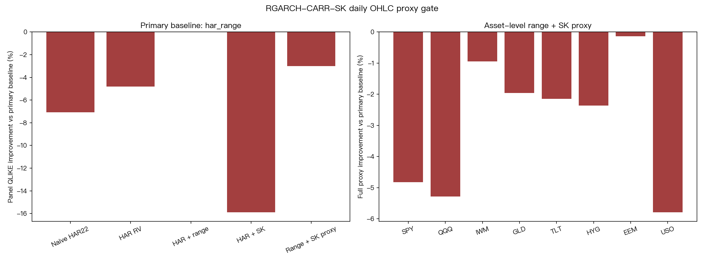

# research_rgarch_carr_sk_realized_garch_carr_2025

**Task**: `research_rgarch_carr_sk_realized_garch_carr_2025`  
**Date**: 2026-07-02  
**Status**: completed daily proxy gate  
**Verdict**: `NULL_VS_PRIMARY_BASELINE`

## Motivation

The 2025 RGARCH-CARR-SK paper combines Realized GARCH, a CARR/range channel,
and dynamic higher moments. A full replication needs high-frequency realized
variance, realized skewness, and realized kurtosis. This hourly task tests a
cheaper prerequisite:

> Do lagged daily range proxies and rolling daily skew/kurtosis add OOS QLIKE
> value beyond calibrated HAR-style baselines on public yfinance OHLC?

This is a gate, not a full replication. A null result means the daily free-data
proxy does not justify immediate full implementation. It does not refute the
high-frequency paper.

## Literature Checked

- Liu, Zhou, and Chen (2025), *A RGARCH-CARR-SK model: A new high-frequency volatility forecasting and risk measurement model based on dynamic higher moments and generalized realized measures*, The North American Journal of Economics and Finance.
- Hansen, Huang, and Shek (2012), *Realized GARCH: a joint model for returns and realized measures of volatility*, Journal of Applied Econometrics.
- Xu and Wu (2025), *Real-time GARCH@CARR: A joint model of returns, realized measure of volatility and current intraday information*, The North American Journal of Economics and Finance.
- Corsi (2009), *A simple approximate long-memory model of realized volatility*, Journal of Financial Econometrics.

## Data

- Source: yfinance adjusted daily OHLC, `auto_adjust=True`.
- Download window: 2010-01-01 to 2026-07-02 exclusive.
- Assets: SPY, QQQ, IWM, GLD, TLT, HYG, EEM, USO.
- Coverage: 2010-01-04 to 2026-07-01 for all assets.
- Model rows per asset after lag construction: 2,200 train rows and 1,884 OOS rows.
- OOS period: 2019-01-02 to 2026-07-01.
- Cache: `experiments/research_rgarch_carr_sk_realized_garch_carr_2025/data/ohlc_yfinance.csv`.

## Method

Target:

- Same-day close-to-close squared log return `r_t^2`.
- This is a daily proxy, not high-frequency realized volatility.

Lagged feature groups:

- HAR RV: daily, weekly, monthly lagged log `r^2`.
- CARR-lite range channel: lagged Parkinson and Yang-Zhang-style
  overnight-adjusted range variance at 1/5/22-day scales.
- SK channel: lagged rolling 22d/63d daily-return skewness and excess kurtosis.
- Downside/upside semivariance and lagged asymmetry controls.

All predictors use `shift(1)` or `rolling(...).shift(1)`. Training and scalar
calibration use only rows before 2019-01-02.

Models:

- `naive_har22`: 22-day lagged rolling mean variance.
- `har_rv`: Ridge HAR on lagged `r^2`.
- `har_rv_asym`: HAR plus lagged return/asymmetry.
- `har_range`: HAR plus range proxies, the CARR-lite channel.
- `har_sk`: HAR plus daily skew/kurtosis and semivariance.
- `rgarch_carr_sk_proxy`: range + SK + asymmetry full proxy.

Every model receives train-only scalar QLIKE calibration. Each Ridge model
selects alpha from `[0.1, 1, 5, 20, 100, 500]` using the last 20% of the training
window as chronological validation.

Primary gate baseline is the best calibrated traditional model among
`naive_har22`, `har_rv`, `har_rv_asym`, `har_range`, and `har_sk`. In this run,
the primary baseline is `har_range`.

## Results

Panel mean QLIKE, lower is better:

| Model | Mean QLIKE |
|---|---:|
| har_range | 1.394679 |
| rgarch_carr_sk_proxy | 1.436466 |
| har_rv | 1.461925 |
| har_rv_asym | 1.488564 |
| naive_har22 | 1.493350 |
| har_sk | 1.616336 |

Primary comparison vs `har_range`:

| Model | Mean QLIKE diff | Asset wins | Bootstrap 95% CI |
|---|---:|---:|---|
| rgarch_carr_sk_proxy | +0.041787 | 0/8 | [+0.022818, +0.062734] |
| har_rv | +0.067246 | 0/8 | [+0.042722, +0.095571] |
| har_sk | +0.221657 | 0/8 | [+0.082072, +0.466078] |

Positive differences mean worse than `har_range`. The full range+SK proxy loses
to range-only on all 8 assets. The SK increment over HAR+range is also worse:
mean diff `+0.041787`, wins `0/8`, bootstrap CI `[+0.022818, +0.062734]`.



## Main Findings

1. **Range helps**: the daily CARR-lite range channel is the strongest baseline,
   beating HAR RV and naive HAR22 on panel QLIKE.
2. **Daily SK does not help**: adding daily rolling skew/kurtosis to the range
   model worsens QLIKE on all 8 assets.
3. **No immediate full implementation gate**: the daily free-data proxy does not
   justify implementing full RGARCH-CARR-SK before a longer high-frequency panel
   exists.
4. **Not a refutation of the paper**: the paper's SK channel uses high-frequency
   realized higher moments; this experiment only tests weak daily-return proxies.

## Limitations

- No five-minute realized variance, realized skewness, or realized kurtosis is
  used.
- The CARR component is represented by lagged range proxies, not a full CARR
  likelihood.
- The SK component uses rolling daily-return moments, which are noisy and weaker
  than realized higher moments.
- VaR/ES risk measurement is not tested here; this is a volatility forecast gate.

## Reproduction

```bash
cd /Users/yhlai0911/volpred-research
uv run python experiments/research_rgarch_carr_sk_realized_garch_carr_2025/research_rgarch_carr_sk_realized_garch_carr_2025.py
```

Outputs:

- `experiments/research_rgarch_carr_sk_realized_garch_carr_2025/research_rgarch_carr_sk_realized_garch_carr_2025_results.json`
- `experiments/research_rgarch_carr_sk_realized_garch_carr_2025/research_rgarch_carr_sk_realized_garch_carr_2025_qlike_diff.png`
- `experiments/research_rgarch_carr_sk_realized_garch_carr_2025/data/ohlc_yfinance.csv`
