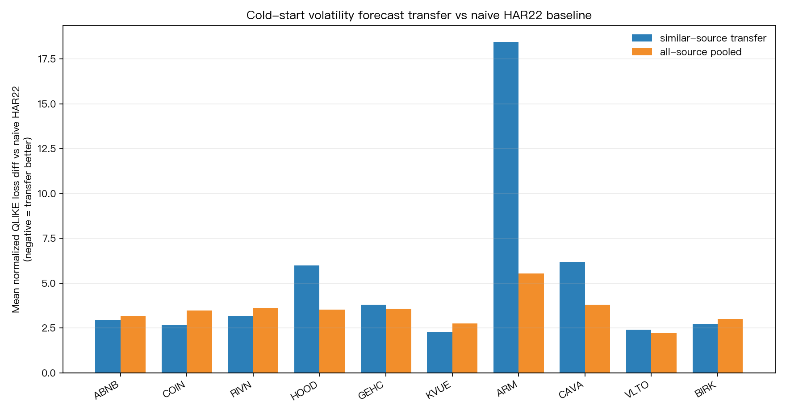

# research_transfer_learning_for_new_issues_vol

**Task**: `research_transfer_learning_for_new_issues_vol`  
**Date**: 2026-07-01  
**Status**: completed pilot, NULL vs naive baseline  
**Verdict**: `NULL_VS_NAIVE_BASELINE`

## Motivation

Recent work on transfer learning for realized-volatility forecasting argues that
new issues and spin-offs have too little own-history for standard realized-vol
models, so source assets with longer histories may help. This experiment tests a
smaller public-data proxy: can source-similar cross-asset daily history improve
one-day-ahead close-to-close variance forecasts for recent listings after only
60 trading days of own data?

## Literature Checked

- Teller, Pigorsch, and Pigorsch (2025), *Realized Volatility Forecasting for New Issues and Spin-Offs using Multi-Source Transfer Learning*, arXiv:2503.12648. Direct motivation for sparse target history and source-similar transfer.
- Liu, Tran, Wang, Gerlach, and Kohn (2023), *Data Scaling Effect of Deep Learning in Financial Time Series Forecasting*, arXiv:2309.02072. Motivation for global training across many stock-volatility series.
- Christensen, Siggaard, and Veliyev (2026), *A machine learning approach to volatility forecasting*, arXiv:2601.13014. ML/HAR volatility-forecasting comparison frame.
- Corsi (2009), *A simple approximate long-memory model of realized volatility*, Journal of Financial Econometrics. Motivation for daily/weekly/monthly HAR lag structure.

## Data

- Source: yfinance adjusted daily close, `auto_adjust=True`.
- Download window: 2015-01-01 to 2026-07-02 exclusive.
- Target assets: ABNB, COIN, RIVN, HOOD, GEHC, KVUE, ARM, CAVA, VLTO, BIRK.
- Source assets: SPY, QQQ, IWM, DIA, XLK, XLF, XLY, XLI, XLV, XLE, XLP, XLU, SMH, HYG, TLT, GLD, USO, UUP, EEM, EFA.
- Cache: `experiments/research_transfer_learning_for_new_issues_vol/data/adjusted_close_yfinance.csv`.
- Completed target-day predictions: 4,900 rows, 10/10 target tickers.

## Method

The target is daily close-to-close squared log return on date `t`. All model
features are lagged by one trading day:

- `log_rv_lag1`
- `log_rv_lag5`
- `log_rv_lag22`
- `abs_ret_lag1`
- `neg_ret_lag1`

The code explicitly uses `signal.shift(1)` and `rolling(...).mean().shift(1)`.
Training uses only the first 60 target trading days. Evaluation starts after day
60 and stops at day 550. No evaluation-period target labels enter training.

Models:

- `naive_har22`: lagged 22-day mean variance. This is the primary baseline.
- `target_only_ridge`: Ridge on first 60 target trading days only.
- `all_source_transfer`: Ridge on all eligible source rows before target eval start plus target train rows.
- `similar_source_transfer`: Ridge on top 12 source windows selected by z-scored log-RV sequence distance plus target train rows.

Loss: normalized QLIKE, `y / h - log(y / h) - 1`.

Inference:

- Newey-West t-stat on pooled target-day loss differentials, lag 5.
- Exact target-level sign test.
- Target-level bootstrap over mean loss differentials, B=1000, seed=42.

## Results

Panel mean normalized QLIKE:

| Model | Mean QLIKE |
|---|---:|
| naive_har22 | 1.823727 |
| target_only_ridge | 461006.112596 |
| all_source_transfer | 5.297468 |
| similar_source_transfer | 6.894395 |

Primary comparison vs naive HAR22:

| Model | Mean loss diff vs naive | NW t | Target wins | Bootstrap 95% CI |
|---|---:|---:|---:|---|
| all_source_transfer | +3.473741 | +12.58 | 0/10 | [+3.022607, +3.992539] |
| similar_source_transfer | +5.070668 | +4.53 | 0/10 | [+3.007949, +8.267918] |

Positive loss differences mean the transfer model is worse. Both transfer
models lose to the simple naive HAR22 baseline on all 10 target assets.

Secondary diagnostic vs target-only Ridge:

- `target_only_ridge` is numerically unstable with only 60 target days; ARM and BIRK produce very large QLIKE losses.
- Transfer models strongly reduce that instability versus target-only Ridge.
- This is not sufficient evidence for transfer learning value, because the
  simple lagged rolling-volatility baseline remains much better.



## Main Findings

1. **Null vs honest baseline**: source-similar transfer does not beat naive HAR22 in this daily close-to-close proxy.
2. **Cold-start Ridge is too unstable**: target-only Ridge with roughly 38 valid training rows after lags can explode under QLIKE.
3. **Transfer is a stabilizer, not a winner here**: adding source rows regularizes the unstable target-only linear model but still produces worse forecasts than a simple rolling-volatility rule.
4. **No lookahead detected**: all predictors are lagged, selection happens before evaluation start, and training labels stop before the evaluation window.

## Limitations

- Daily close-to-close squared returns are a noisy proxy, not 5-minute realized variance.
- The target universe is a public yfinance sample of recent listings/spin-offs, not the exact sample in Teller, Pigorsch, and Pigorsch (2025).
- Source selection uses simple z-scored Euclidean sequence distance, not full DTW.
- Pooled Newey-West inference ignores cross-sectional dependence; target-level bootstrap and sign tests are reported separately.
- This experiment does not refute transfer learning for true high-frequency realized volatility. It only says this simple public-data implementation is not enough.

## Reproduction

```bash
cd /Users/yhlai0911/Desktop/volpred-research
uv run python experiments/research_transfer_learning_for_new_issues_vol/research_transfer_learning_for_new_issues_vol.py
```

Outputs:

- `experiments/research_transfer_learning_for_new_issues_vol/research_transfer_learning_for_new_issues_vol_results.json`
- `experiments/research_transfer_learning_for_new_issues_vol/research_transfer_learning_for_new_issues_vol_qlike_improvement.png`
- `experiments/research_transfer_learning_for_new_issues_vol/data/adjusted_close_yfinance.csv`
