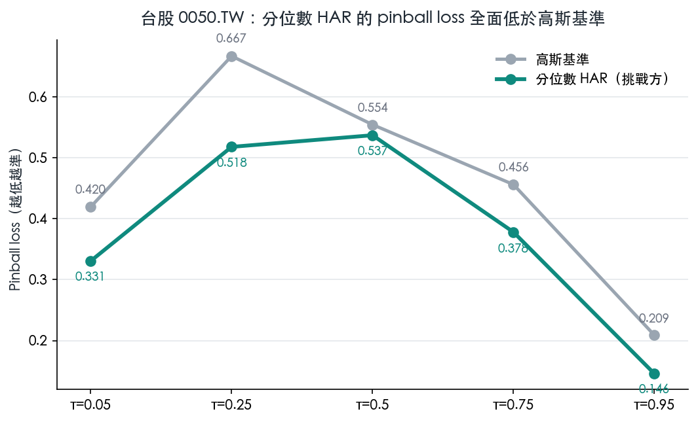

我一直想試一件事：把明天的波動畫成一整排分位數，而不是只丟一個點估計。

這次趁手上有資料，把它落成一個很小的離線實驗，代號 K1419。先講結論：這是一次偵察性質的先跑，結果大半是空的，只有一個角落亮了燈。

## 這個實驗在問什麼

平常大家預測波動，多半給一個數字：明天大概這麼抖。

我想問得更貪心一點：能不能直接畫出明天波動的一整排刻度？從很低（τ=0.05）到很高（τ=0.95），每個水位都給一條線。這種畫法叫分位數預測。

對手是一個又老又省事的假設：假定波動的預測誤差服從高斯分佈（也就是常態鐘形），照這個形狀補出各個分位數。這是基準。

挑戰方有兩個。一個拿歷史殘差的實際分佈去補（經驗法），一個直接用分位數迴歸把每條線學出來（qHAR）。

評分用 pinball loss，越低越準。要算贏，還得過一道 Harvey 修正後的檢定關卡（|t|>3）才算數，免得把運氣當本事。

## 先把資料的醜話講在前面

這輪最大的軟肋在資料。

真正該用的是 5 分鐘級的日內已實現波動，但本機的歷史太短：SPY 只有 99 筆有效的每日 RV，QQQ 是 0 筆，0050 也只有 72 筆。

樣本這麼薄，硬跑正規版只會自欺。所以三檔統一改用一個替代指標：Parkinson 高低價區間換算的波動 proxy。

所以 K1419 是一個產生線索的先導實驗，離定論還遠。OOS 從 2025-01-02 起，每 21 個交易日重配一次參數，全程只吃落後資訊，沒有偷看未來。

## 美股這邊：笨方法完勝

SPY 跑完（609 個建模樣本、357 個 OOS 交易日），五個分位數全部是高斯基準最低。花招版一個都沒贏。

QQQ 也一樣的味道。qHAR 在中間幾個分位數的 pinball 偶爾低那麼一點點，但沒有任何一格過得了 Harvey 關卡。分不出高下。

講白了，對美股這兩檔大型 ETF，想在波動分位數上贏過一個常態鐘形，很難。

## 台股 0050：唯一亮燈的角落

意外在 0050。它是三檔裡唯一過 Harvey 關卡的資產，而且亮點集中在低分位、也就是尾部那一側。

τ=0.05 這一格，qHAR 的 pinball 是 **0.331**，高斯基準是 **0.420**，低了大約 **21%**。DM 檢定 **t=−4.84**（p≈2e-6），乾脆過關。這裡的負號要講白：負的 t 代表挑戰方的損失更低，就是挑戰方贏。

τ=0.25 更誇張。qHAR 的 pinball **0.518** 壓過高斯的 **0.667**，DM **t=−7.31**；同一格的經驗法也贏，**t=−7.47**。

偏高的那一頭也有一點戲。τ=0.75 的經驗法 pinball **0.408** 對 **0.456**，**t=−3.10**（p=0.002），同樣過關。

以下的表和圖，數字都取自這輪的結果檔。

| 資產 | 本地每日 RV 有效樣本 | 分位數方法過 Harvey 關卡 |
|---|---:|:--|
| 美股 SPY | 99 筆 | 無 |
| 美股 QQQ | 0 筆 | 無 |
| 台股 0050 | 72 筆 | 有（低分位最明顯） |

看圖更直接：綠線整條貼在灰線下面，低分位那一頭拉得最開。

## 我怎麼看這個結果

先收野心。一檔資產、又是 proxy 資料，撐不起任何大結論。

能講的很窄：美股大型 ETF 的波動分位數，常態鐘形是個硬對手；台股 0050 在低尾這塊，分位數 HAR 真的把它壓了下去，還過了統計關卡。

這條線索值得往下追——追法是補齊 5 分鐘 RV、拉長樣本，重跑一次正規版，看它站不站得住。

三檔資產只有一檔亮燈（Harvey 過關資產只有 0050 這一個）。把這一盞燈當成整片天，是這種先導實驗最容易犯的錯。所以我把它記成一條待驗證的線索，不記成答案。
