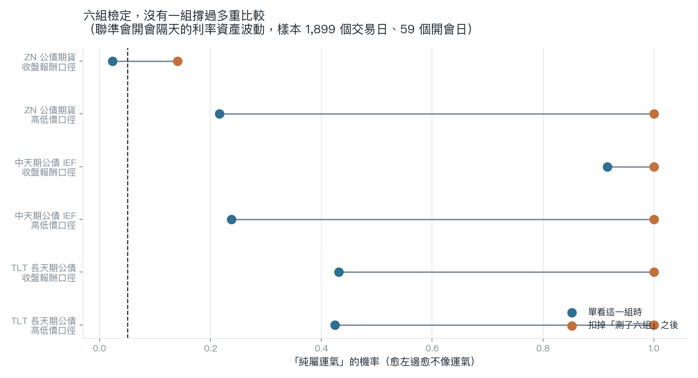

# 我想拆開聯準會那半小時，結果卡在一個很笨的地方：資料只有 60 天

聯準會決議日的下午，其實有兩發子彈。

第一發是美東時間 14:00，聲明稿出來，白紙黑字，利率決定跟措辭一次公布。第二發是 14:30，主席站上台開記者會，開始回答問題——而市場常常是在這半小時裡才真的改變想法。

我想量的就是這件事：這兩發子彈，哪一發把債券市場打得比較晃？

這個問題有實際用途。如果晃動主要來自聲明稿，那 14:00 一過風險就釋放完了；如果主要來自記者會，那真正該閃的是 14:30 之後那段。

## 我沒能回答這個問題

先說結果，因為這才是重點。

要拆開 14:00 跟 14:30，就得有分鐘級的價格資料。免費資料源給的分鐘級 K 線，只保留最近 60 個交易日。

聯準會一年開 8 次會。

60 個交易日大約三個月。三個月裡面，能撞上幾次決議日？

| 標的 | 分鐘級資料涵蓋期間 | 交易日數 | 窗口內可用的決議日 |
|---|---|---|---|
| TLT 長天期公債 | 2026-04-29 ~ 2026-07-24 | 60 | **2 場**（4/29、6/17） |
| IEF 中天期公債 | 2026-04-29 ~ 2026-07-24 | 60 | **2 場**（4/29、6/17） |
| ZN 公債期貨 | 2026-05-14 ~ 2026-07-24 | 58 | **1 場**（6/17） |

兩場。

拿兩場去比較「聲明稿衝擊」跟「記者會衝擊」哪個大，得到的數字沒有任何意義。兩場之間的差異，可以完全來自那兩天各自的新聞、部位、流動性。

要把這兩段分開到能講話的程度，需要至少一年半到四年的完整分鐘級歷史。那是付費資料的範圍。

所以這篇的主結論是：**這個問題用免費資料回答不了。** 不是「答案是零」，是「量不出來」。

這兩件事差很多，而且很容易被混在一起講。

## 那退一步，還能量什麼

分鐘級做不到，日資料還有。

日資料能問一個比較粗的版本：聯準會開會的**隔天**，利率資產的波動有沒有比較高？這個問題把兩發子彈合在一起算，分不出誰是誰，但至少樣本夠——日資料從 2019-01-01 拉到 2026-07-24，約 1,900 個交易日，其中 59 個是決議日的隔天。

三個標的（TLT、IEF、ZN 公債期貨），每個用兩種波動口徑（一種看當天高低價，一種看收盤報酬），一共六組檢定。

## 六組裡有一組看起來中了

ZN 公債期貨、收盤報酬口徑那一組：開會隔天的變異數比平常高出 80.1%，訊號強度 2.27，單獨看的話「純屬運氣」的機率是 0.023——低於一般用的 0.05 門檻。

如果只報這一組，這會是一則不錯的發現。

問題是我測了六組。

測六組，就算六組其實都沒東西，光靠運氣也很容易有一組看起來會中。把這件事扣掉之後，那個 0.023 變成 0.141，退到門檻外面。

其餘五組本來就不靠近：TLT 兩種口徑的機率是 0.425 跟 0.431，IEF 是 0.237 跟 0.916，ZN 高低價口徑是 0.216。扣完之後全部都是 1.000。

六組，零組存活。

值得一提的是 IEF 高低價口徑那組的方向是**負的**（變異數低 13.6%）。如果聯準會真的會把債市攪動，不該出現這種符號。

## 這篇到底講了什麼

兩件事。

第一件比較無聊但比較重要：免費資料有邊界，而那個邊界不是均勻的。

一般會以為資料少一點，就是誤差大一點。這裡的狀況更硬：這一類問題整個做不了。

分鐘級只留 60 天這個限制，會直接砍掉所有需要跨年比較盤中事件的題目。決議日、非農、CPI，一年就那幾次，全都撞在同一堵牆上。

第二件是：在日資料這個粗糙的口徑下，聯準會開會的隔天，這三個利率資產的波動沒有可靠地變高。

第二件事不能拿去否定第一件事想問的問題。盤中那半小時可能真的有東西，只是這份資料看不到。

我把這個寫出來，是因為「量不出來」也是一種結果。把它包裝成「沒有效果」，或是只挑那個 80.1% 出來講，兩種都是在騙人。

---

*資料來源：yfinance 5 分鐘 K 線（period=60d 為資料源硬上限）與日 OHLC，聯準會行事曆取自 federalreserve.gov（2024-2026 於 2026-07-27 直接查核，2019-2023 對照利率決議紀錄）。日資料樣本 2019-01-01 至 2026-07-24，亂數種子 42。所有數字由 `experiments/k1658/K1658_results.json` 程式化讀出，圖表由 `assets/k1658_general_figs.py` 重跑即可重現。*
