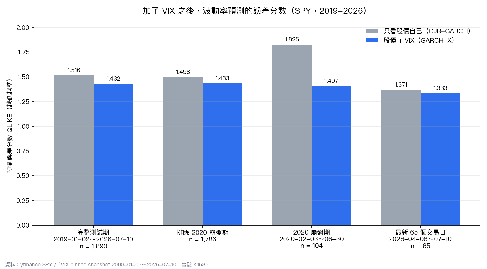
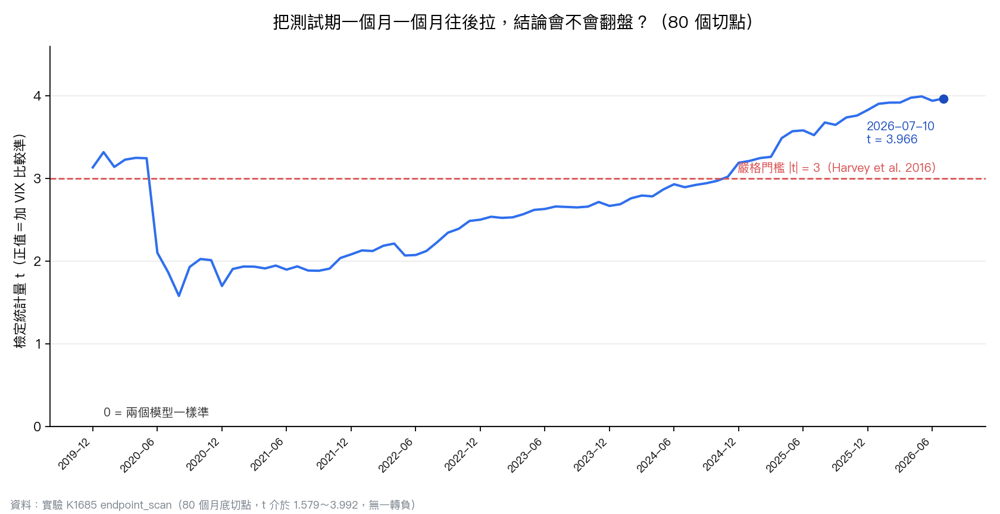
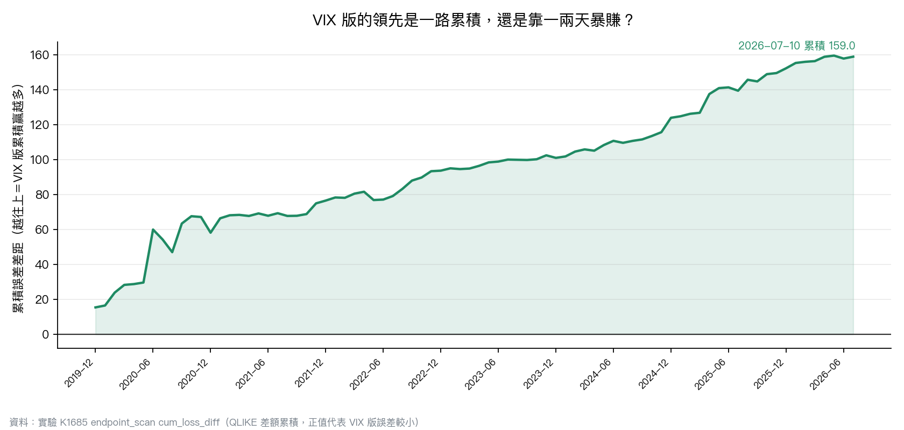

# 把恐慌指數餵給波動率模型，七年半後的成績單

預測明天的波動有多大，最省事的做法是只看股價自己：昨天跳得凶，今天大概也不會太安分。這就是課本裡 GARCH 家族在做的事，它只吃一種原料，就是報酬率的歷史。

問題來了。芝加哥交易所每天都在公布 VIX，那是選擇權市場對未來 30 天波動的定價，是一群真金白銀的人押出來的看法。既然這個數字擺在螢幕上免費看，模型為什麼不拿來用？

VolPred 的實驗 K1685 就把這件事跑到底：從 2019 年初到 2026 年 7 月 10 日，總共 1,890 個交易日，讓兩個模型天天出題、天天對答案。

## 兩個模型，同一份考卷

第一個模型叫 GJR-GARCH，只讀 SPY 自己的報酬率，另外多做一件事：對下跌給比上漲更大的權重（股市跌的時候波動放大得比較快，這是老早就寫進教科書的槓桿效應）。

第二個模型多加一根外部訊號，把前一天收盤的 VIX 平方放進波動方程式裡，我們內部叫它 A4f。除了多吃 VIX，其他設定跟第一個一模一樣。

兩邊都用滾動視窗估計：每次只用最近 2,000 個交易日的資料訓練，每隔 63 天重新估一次參數，只預測「下一天」。預測的時候只讀得到昨天的報酬與昨天的 VIX，今天的答案要等收盤才會揭曉。

評分用的是 QLIKE，波動率預測研究裡的標準分數。它懲罰「該報警卻沒報警」比懲罰「亂報警」更重，數字越低代表預測越準。

## 成績單：誤差低 5.55%

| 樣本 | 交易日 | 只看股價（GJR） | 加了 VIX（A4f） | 誤差降低 |
|---|---:|---:|---:|---:|
| 完整測試期 2019-01-02～2026-07-10 | 1,890 | 1.516 | 1.432 | 5.55% |
| 排除 2020 崩盤期 | 1,786 | 1.498 | 1.433 | 4.32% |
| 2020 崩盤期（02-03～06-30） | 104 | 1.825 | 1.407 | 22.91% |
| 最新 65 個交易日（04-08～07-10） | 65 | 1.371 | 1.333 | 2.73% |

完整測試期的統計檢定（Diebold-Mariano，HAC lag 13）給出 t = 3.966、p = 0.000076。這個門檻不是隨便挑的：Harvey、Liu 與 Zhu 在 2016 年提醒，金融學界試過的模型太多，光看 t 值大於 2 會撈出一堆假發現，所以他們建議把門檻拉到 3。加了 VIX 的版本過得去。

## 崩盤那幾個月，差距最大

上表最跳的一格在 2020 年 2 月到 6 月。GJR 的誤差衝到 1.825，加了 VIX 的版本只有 1.407，差距是全期平均的四倍以上。

直覺很好懂。只看股價的模型要等波動先發生，才有東西可學；VIX 卻在恐慌真正砸下來之前就已經被選擇權買家推上去。市場靜的時候這點差別無關痛癢，市場裂開的時候，早一天知道就是一天。

只是話得說清楚：這 104 天的檢定 t 只有 1.633、p = 0.106。方向對，強度不夠。104 個交易日撐不起一個嚴格的結論，把「崩盤期特別有用」講成已證實的事，會超出證據能負擔的範圍。

同樣的克制也適用在最後那 65 天：VIX 版仍然領先，但 t = 0.912、p = 0.365，等於什麼都沒證明。短窗口本來就吵。

## 把終點一個月一個月往後拉

單一個結果最容易騙人的地方，是你剛好停在對自己有利的那天。K1685 的做法是把測試期的終點從 2019 年底開始，一個月一個月往後挪，重算 80 次。

80 個切點裡，t 值介於 1.579 到 3.992，沒有任何一個翻成負的（負值代表只看股價的模型比較準）。其中 27 個高於 3 的嚴格門檻，這些都出現在樣本累積夠長的後半段。

2020 年中那個深谷值得看一眼。崩盤剛過的時候 t 掉到 1.58，之後六年靠一天一天的小勝慢慢爬回來。優勢不是一次爆發，是複利。

累積誤差差距的圖說得更白：從頭到尾單調往上，2026 年 7 月累積到 159.0。VIX 版的領先沒有靠某幾天大賺，它是一整片穩定的小幅贏面。

## 這篇沒有說的事

第一件，也是最重要的一件：**這裡沒有任何一個數字是交易報酬**。QLIKE 衡量的是波動率預測誤差，不是損益。預測準一點，離「這套模型能賺錢」還隔著手續費、滑價、部位大小與時機選擇，那些都沒有在這個實驗裡被測試過。誰把 5.55% 讀成 5.55% 的報酬，是誤讀。

第二件，這個優勢有它脆弱的一面，我們也照實登記在實驗紀錄裡。最佳化演算法要從某個起始點出發找參數，如果對兩個模型都對稱地多丟 9 組隨機起始點，完整測試期的 t 從 3.966 掉到 3.010，剛好卡在門檻線上。把 HAC 落後期從 13 改成 10，t 是 2.990，落到門檻下面。

換句話說，「加 VIX 比較準」在點估計與預先講好的檢定設定下站得住，但它不是那種怎麼捏都不會變形的鐵結論。研究誠實的做法是把這個敏感度講出來，而不是挑最好看的那個 t 值去講故事。

第三件，實驗途中還挖到一個資料問題：舊的論文用 CSV 裡有 10 個日期重複出現（2026-05-04 到 05-15，每天兩列）。用一般的排序加位移讀法，這些重複會造出假的零報酬日，並讓隔天的報酬翻倍。K1685 因此改用重新抓取、雜湊鎖定的 SPY / VIX 快照，並且把修正責任推回資料收集程式，不去手改歷史檔案。這種事不寫出來，就沒人知道。

## 一句話帶走

用前一天的 VIX 幫波動率模型多長一隻眼睛，在 SPY 這七年半的 1,890 個交易日上把預測誤差壓低了 5.55%，通過嚴格門檻，且在 80 個切點上沒有一次翻盤；崩盤期的幫助看起來最大，但樣本太短還不能算數。這是預測準度的結論，不是報酬率的承諾。

**資料來源**：yfinance SPY 調整後收盤價與 ^VIX 收盤價，pinned snapshot 2000-01-03 至 2026-07-10（6,669 列，SHA256 `eee7f9c6...`）。完整方法、參數與所有檢定數字見實驗 K1685（`experiments/k1685/`）。統計方法參考 Patton (2011) 的 proxy-robust 損失函數、Diebold-Mariano (1995) 預測比較，以及 Harvey, Liu & Zhu (2016) 的多重檢定門檻。
