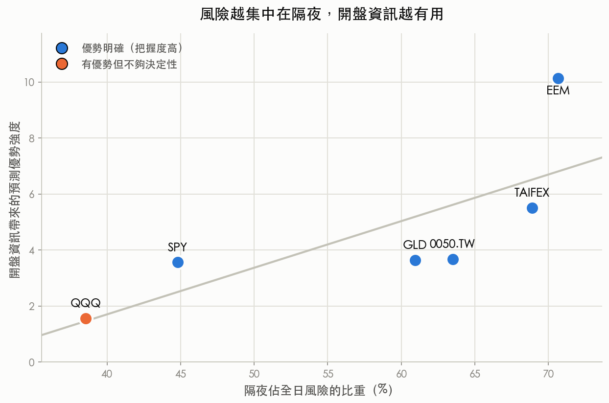

早上九點半，你打開手機。昨晚美股收盤到今早開盤之間，價格已經先跳了一段。這一段「隔夜跳動」你看得到，問題是：它能不能提前告訴你，接下來一整個交易日會有多顛簸？

這聽起來像廢話。價格已經動了，當然代表市場不平靜。但真正要問的更刁鑽一點：如果有一套很強的風險預測模型，它本來就會把隔夜那一段算進去，那你「在開盤當下就把隔夜漲跌看進眼裡」這件事，還能再多擠出一點預測力嗎？

我們拿六個市場的真實資料，做了一場公平的對照，答案是：可以，而且在多數市場擠得出來的量還不小。

## 一場刻意公平的比賽

先講清楚比賽規則，因為關鍵就在「公平」兩個字。

參賽的是兩套風險預測方法，都在同一個時間點、也就是當天開盤，交出對「今天整日波動有多大」的預測。兩套方法都看得到隔夜那段已經發生的跳動，沒有一方偷藏資訊。差別只在一件事：其中一套會把「開盤這一刻已知的隔夜幅度」直接、明確地用進當天的預測裡；另一套則是用比較傳統的方式消化同一份資訊。

換句話講，這不是拿先知去比路人。兩邊資訊對等，就看誰把手上這張牌打得更聰明。我們稱前者叫「開盤法」，後者叫「對照基準」。

評分方式也很直白：預測完，等收盤，看誰猜得離真實波動更近。誤差越低越好。

## 六個市場，全數落在同一邊

實測用的是場外資料，涵蓋美股大盤、科技股、黃金、新興市場，加上台灣的 0050 與台指期，共六個市場。各市場的測試期不太一樣，最早從 2019 年初起算，一路測到 2025 年底至 2026 年 4 月，光是美股大盤那條就累積了 1,823 個交易日,樣本一點都不迷你。

結果乾淨得意外。六個市場,開盤法全部贏過對照基準,無一例外。而且其中五個市場,贏的幅度大到可以排除「只是手氣好」的可能;唯一一個差距沒拉開到能拍板的,是科技股 QQQ。

下面這張表把六個市場攤開來看。誤差欄位越低越好,但要提醒一句:誤差的絕對數字只能在同一列裡橫著比(開盤法 vs 基準),不能跨市場直著比,因為每個市場波動的量級本來就不同。

| 市場 | 隔夜佔全日風險 | 實測天數 | 開盤法平均誤差 | 基準法平均誤差 | 判定 |
|---|---|---|---|---|---|
| 科技股 QQQ | 39% | 1,981 | 0.710 | 0.742 | 有優勢，但差距還不夠決定性 |
| 美股大盤 SPY | 45% | 1,823 | 0.670 | 0.727 | 優勢明確 |
| 黃金 GLD | 61% | 1,613 | 0.554 | 0.587 | 優勢明確 |
| 台灣 0050 | 63% | 1,251 | 0.568 | 0.626 | 優勢明確 |
| 台指期 TAIFEX | 69% | 843 | 0.039 | 0.059 | 優勢明確 |
| 新興市場 EEM | 71% | 1,734 | 0.439 | 0.527 | 優勢明確 |

## 為什麼有的市場贏很多，有的只贏一點？

把表格排一下順序，會冒出一條很漂亮的規律。

我把每個市場「有多少風險發生在隔夜」放橫軸，把「開盤法贏得多有把握」放縱軸，六個點畫出來，走勢往右上方爬。

隔夜佔全日風險的比重，越高的市場，開盤法的優勢就越大。新興市場 EEM 有七成一的風險發生在隔夜，它的優勢也最猛，遙遙領先。台指期六成九，優勢第二強。反過來看左下角那顆橘色的點，正是科技股 QQQ：它只有三成九的風險落在隔夜，六個市場裡最低，而它也剛好是唯一一個優勢沒能拉開到能拍板的市場。

這條規律講的是一個很直覺的道理。開盤法的本事，是把「隔夜這段資訊」榨得更乾。那麼一個市場如果本來就很多風險藏在隔夜，這套本事自然大有用武之地；反過來，一個市場的風浪主要在盤中翻攪，開盤前那一段資訊本來就沒多少料，再會榨也榨不出東西。

QQQ 就是後者的代表。科技股的劇烈波動，很多發生在美股盤中，像是財報、法說、盤中的多空拉鋸。開盤那一刻能掌握的隔夜訊息，占它整日風險的比例最小，所以同一套方法用在它身上，優勢最不明顯。這不算方法失靈，問題出在這個市場的風險，剛好長在方法幫不上忙的地方。

## 一個更簡單版本的旁證

如果把對照組換成一套更陽春、連隔夜資訊都消化得比較粗糙的傳統模型，開盤這條週期性資訊帶來的領先會更誇張：六個市場全部大幅勝出，沒有一個例外。

這條旁證的意思是，前面那場「刻意公平」的比賽，其實是在最嚴苛的條件下打的。連對手都已經看過隔夜資訊了，開盤法還是能再贏一手。門檻放低，優勢只會更明顯。

## 這代表什麼，又不代表什麼

先說它代表的。一個訊號有沒有用，會跟著市場的體質走。同一套把隔夜資訊算進去的做法，用在風險集中於隔夜的市場（新興市場、台指期）能撈到最多好處，用在風險主要在盤中的市場（科技股）就相對雞肋。六個市場排出來的順序並不隨機，它跟著一條說得通的經濟邏輯走。

再說它不代表的。這場比較量的是「預測今天整日波動的準度」，不是明天漲還是跌。波動預測準，對想控制部位風險、抓對沖比例、避免在最顛簸的日子把槓桿開滿的人才有直接價值；它不會告訴你該追高還是該砍倉。

還有一點要老實講：表裡那些誤差數字，只能在同一列橫著比。台指期那列看起來特別小，純粹是它波動的量級不同，跟它預測特別準沒有關係。跨市場直著比誤差大小，會得到錯的結論。

資料全部來自公開行情：六個市場的日線與日內資料經 yfinance 與台指期行情取得，樣本從 2000 年起累積，測試段落在 2019 年到 2026 年之間，各市場有各自的起訖。這些數字都能回到原始檔逐筆核對。

所以回到九點半那個畫面。你盯著那段隔夜跳動，它確實先替今天的風浪報了個信。信號的清晰度，取決於你手上這個市場，究竟有多少故事是在你睡覺時發生的。
