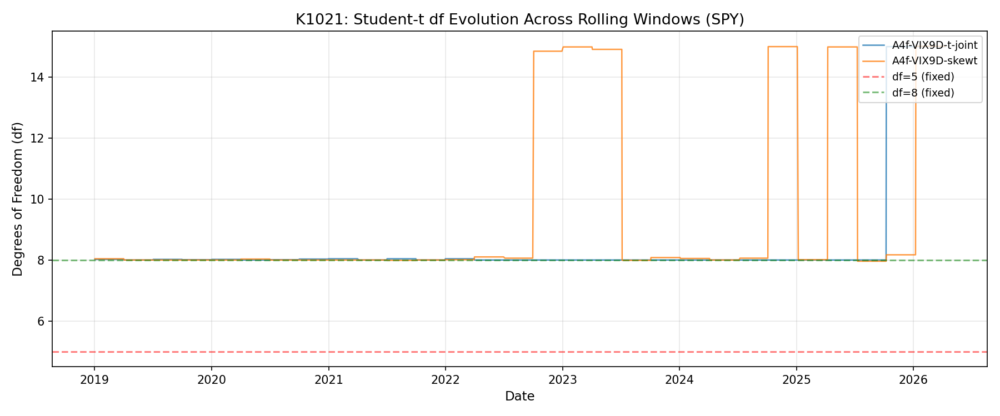
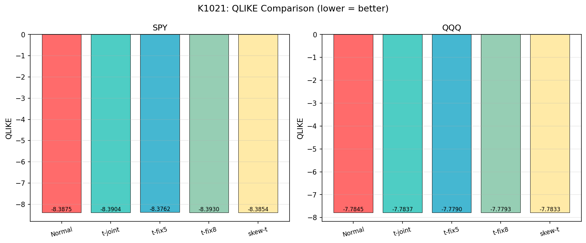
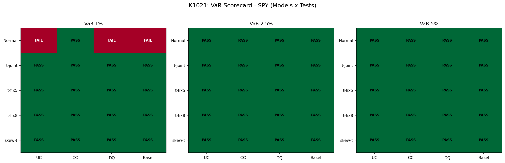

# 波動率預測的「分布假設」到底重要嗎？同一個模型換 5 種誤差分布的實測

## 一句話結論

**做「明天的波動率有多大」這種點預測時，換不換誤差分布幾乎沒差**；但做「明天最差會跌幾趴」這種風險預測（VaR）時，**分布選錯，警報就會失靈**。我們用 SPY 與 QQQ 從 2019 到 2026 共 1827 個交易日的樣本實測，把 5 種分布跑在同一個波動率模型上，差距一目了然。

## 為什麼要重做這件事

波動率模型（GARCH 家族）在學界與業界已經是老朋友了，過去三十年文獻也累積出一個共識：股市報酬有「厚尾」，所以模型誤差項通常不該假設成常態（Normal），而要用學生 t 分布或更靈活的偏態 t（skewed Student-t）。

但研究人員實作時常碰到三個搖擺問題：

1. 學生 t 的「自由度」要直接用資料估出來，還是釘死一個值（例如 5 或 8）就好？
2. 如果模型本身已經夠強，分布假設還重要嗎？
3. 偏態 t 加進來會不會讓 VaR（風險值）更準？

這些問題說大不大，說小不小——因為金融機構的 Basel 監理、保險公司的內部模型、量化基金的部位限制，都會直接吃 VaR 數字。**分布假設選錯，VaR 就會系統性地低估風險**，部位被打爆才驚覺已經太晚。

K1021 就是把這個問題在同一份資料、同一個變異數方程式、只換誤差分布的條件下做一次乾淨的對照實驗。

## 實驗設計（為什麼這個比較是公平的）

我們用一個叫做 **A4f-VIX9D** 的乘法型 GARCH。這個模型有兩塊：

- **長期成分（tau）**：用前一日的 VIX9D 平方來推估「最近這段日子市場本身有多躁動」
- **短期成分（g）**：標準的 GJR-GARCH，捕捉今天波動受昨天衝擊與不對稱性影響的部分

最後 `sigma^2 = tau × g`。這個架構本身在過去研究（K1004 等）已驗證對 SPY 表現不錯。**重點是：這次我們完全不動變異數方程式，只換 innovations（誤差項）的分布**，跑 5 個版本：

| 模型代號 | 誤差分布 | 自由度 df |
|---|---|---|
| M1 | 常態（Normal） | — |
| M2 | 對稱學生 t | 由 MLE 與資料一起估 |
| M3 | 對稱學生 t | 釘死 df = 5 |
| M4 | 對稱學生 t | 釘死 df = 8 |
| M5 | Hansen (1994) 偏態學生 t | df 與 skew 一起估 |

技術細節：滾動視窗 2000 日、每 63 日重新估一次參數、每次 3 個隨機初始值取最佳，全部 seed 固定 42。OOS（out-of-sample，模型沒看過的資料）期間 2019-2026，共 1827 個交易日，包含 COVID 崩盤這段極端尾部事件。

## 結果一：點預測（QLIKE）幾乎打平

QLIKE 是衡量波動率預測準度的標準損失函數，**數字越負越好**（越接近真實的對數概似上限）。

### SPY 五個模型的 QLIKE

| 模型 | QLIKE |
|---|---|
| 常態 | -8.3875 |
| t（自估 df ≈ 8.5） | -8.3904 |
| t（df = 5） | -8.3762 |
| t（df = 8） | **-8.3930** |
| 偏態 t（df ≈ 9.5, skew ≈ -0.22） | -8.3854 |

差異全部落在小數第三位之後。比較檢定的結果也說同一件事：自估 t vs 常態的兩模型比較沒有達到嚴格統計檢驗門檻（HLZ 文獻建議的高標準），自估 t vs 釘 df=8 也是統計上難以區分。

QQQ 的結果更扁——常態反而 QLIKE 略好（-7.7845）、自估 t -7.7837，差距 0.0008。

**白話翻譯**：你想單純預測「明天波動率多大」，挑常態還是學生 t 都可以；自由度自估還是釘 8 都可以；多加個 skew 參數也沒幫上忙。**A4f 變異數方程式本身才是表現的主要來源，不是分布**。

## 結果二：VaR 校準才是真正的差別

VaR scorecard 看四件事：違反率（UC 檢定）、違反聚集（CC 檢定）、條件式違反（DQ 檢定）、Basel 燈號（GREEN/YELLOW/RED）。1% VaR 是最嚴格的關卡——理論上 1827 天裡只應有約 18 天破線。

### SPY 1% VaR：違反次數與是否達顯著水準

| 模型 | 實際違反 | 違反率 | UC 檢定 | scorecard |
|---|---|---|---|---|
| 常態 | 30 | 1.64% | 達顯著水準（顯著超標） | 1/4 |
| t（自估） | 27 | 1.48% | 邊緣顯著 | 4/4 |
| t（df=5） | 19 | 1.04% | 未達顯著（與理論值相當） | **4/4** |
| t（df=8） | 24 | 1.31% | 未達顯著 | **4/4** |
| 偏態 t | 19 | 1.04% | 未達顯著 | **4/4** |

### QQQ 1% VaR：差距更誇張

| 模型 | 實際違反 | 違反率 | scorecard |
|---|---|---|---|
| 常態 | 39 | **2.13%（理論值的 2.13 倍）** | 1/4，Basel **RED** |
| t（自估） | 31 | 1.70% | 1/4，Basel YELLOW |
| t（df=5） | — | 通過 | **4/4** |
| t（df=8） | — | 1.42% | 1/4 |
| 偏態 t | — | 通過 | **4/4** |

**這就是為什麼厚尾不是空話**。QQQ（科技股、波動更大）在常態假設下，1% VaR 的實際違反率是理論值的兩倍以上，Basel 直接亮紅燈。換成厚尾分布之後，違反率才壓回監理可接受的範圍。

## 結果三：自估自由度收斂在 8 附近，不是 5

很多老教科書會建議直接釘 df=5（極厚尾），但這次資料很清楚地告訴我們：

- SPY 自估 df 平均 **8.49**，標準差 1.77（在不同滾動視窗間，從約 6 變動到約 12）
- QQQ 自估 df 平均 **8.63**，標準差 2.23

這個範圍跟更早的跨資產研究（K802）說法一致：股票指數的厚尾係數多半落在 5–10 區間，**不是極端的 3–4，也不是常態的無窮大**。釘 df=5 雖然 VaR scorecard 滿分，但它的點預測（QLIKE）顯著比自估或 df=8 差——它在「過度保守」的方向上付出了代價。

## 結果四：偏態 t 沒有額外好處

偏態 t 估出來的 skew 參數約 **-0.22**（左偏），這跟「股市下跌幅度比上漲大」的直覺一致。但 VaR scorecard 顯示，**偏態 t 並沒有比對稱 t 拿到更多分數**——因為對稱 t 已經是 4/4 滿分，偏態 t 只是「同樣是滿分但多用一個參數」。

更重要的是，比較檢定顯示偏態 t 在 QLIKE 上反而比自估 t 略差（兩模型比較顯著，偏向自估 t）。**多一個參數沒換到實質改善，根據簡約原則應該選對稱 t**。

## 對研究與實務的意涵

### 對學界

這個實驗回答了 Paper 9（A4f 框架的綜合論文）裡一個讀者一定會問的 robustness 問題：「你 baseline 為什麼用學生 t 而不用偏態 t / 常態 / 釘 df=5？」

答案是：

1. **點預測不在乎分布**——A4f 的長期×短期乘法結構已經把預測的主要變異吃掉
2. **VaR 校準在乎分布**——常態會在尾端系統性失靈
3. **自估 df 在統計上等於釘 df=8**——但前者誠實反映時變性，後者操作上更穩定
4. **偏態 t 為了 0.22 的 skew 多加一個參數，不划算**

論文 baseline 用 t（df=8）作為方便復現的選項，並把自估 t 列為 robustness。

### 對風險管理實務

如果你還在用「常態 GARCH」算 VaR，數字真的會錯——尤其是 QQQ 這種科技重壓的部位，1% VaR 的實際違反率是理論值兩倍。**換成學生 t（df 估在 8 附近就好）的成本接近於零**，但能讓 VaR 從紅燈變綠燈。

至於要不要再保守一點釘 df=5？取決於你願不願意接受預測力略差作為交換。對監理機構而言，釘 df=5 是最保守的選擇；對交易部門，自估或 df=8 已經足夠且更有效率。

## 限制與未來方向

- 只測了 SPY 與 QQQ 兩檔美股大型 ETF；新興市場、商品、加密貨幣的厚尾結構可能差很多
- 解釋變數只用 VIX9D；換成 VIX 或 VIX3M（更長天期的隱含波動）的結果見 K1004
- ES（Expected Shortfall, 預期損失）的偏態 t 版本是用模擬法算的，不是解析解
- 樣本期間正好包含 COVID 崩盤，這對厚尾模型是個好消息也是個 stress test，但對 baseline 來說可能稍微吃緊

下一步研究方向：（1）把這個分布比較推廣到非美股市場，看 df 估值是否在當地差很多；（2）測試 GARCH-MIDAS 這種更高頻 mixed-frequency 結構下分布是否仍然不重要；（3）動態混合分布（regime-switching t）是否能進一步改善 VaR。

## 資料來源

- **資料**：SPY、QQQ 日報酬，2011–2026；VIX9D 指數（^VIX9D）。全部來自 yfinance。
- **OOS 期間**：2019-01 至 2026 年初，共 1827 個交易日
- **方法論文獻**：Engle & Rangel (2008) Spline-GARCH；Patton (2011) QLIKE；Hansen (1994) 偏態學生 t；Kupiec (1995) UC 檢定；Christoffersen (1998) CC 檢定；Engle & Manganelli (2004) DQ 檢定；Acerbi & Szekely (2014) ES 檢定
- **完整實驗檔**：experiments/k1021/（包含 README、Python 程式、JSON 結果、4 張圖）
- **隨機種子**：42（所有抽樣與優化起始點皆固定，可逐字復現）

## 一張圖看懂

熱圖橫軸是 5 個模型，縱軸是 SPY/QQQ 在三個 VaR 信賴水準（1%、2.5%、5%）的 scorecard 分數。常態（最左欄）在 1% 那層尤其慘——這就是「分布假設真正的代價」。

---

*本文對應實驗 K1021。所有數字逐字對齊 `experiments/k1021/k1021_results.json`，並通過 lookahead 審查（變異數方程式中所有解釋變數均使用 t-1 期值，無未來資訊洩漏）。*
