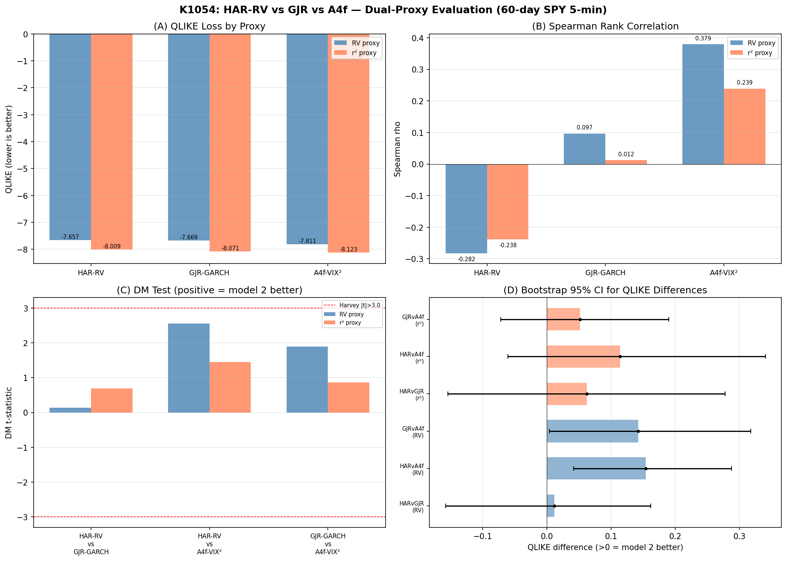
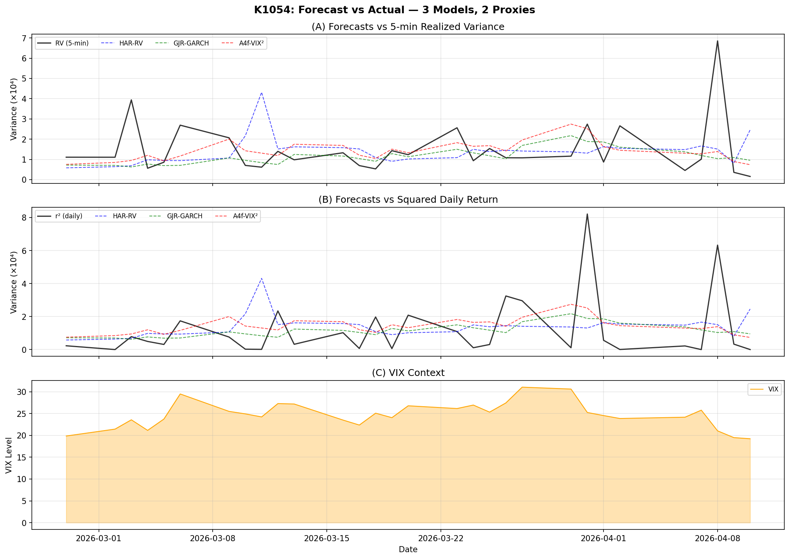

# 60 天 5 分鐘資料夠不夠用？三個波動率模型在 SPY 的真實對決

當你看到一篇研究說「我們用了高頻資料」時，第一個應該問的問題不是「結果好不好」，而是「資料夠不夠多」。在波動率預測領域，這個問題尤其關鍵——因為許多模型（特別是利用日內波動細節的 HAR 系列）需要長時間累積的高頻資料，才有辦法穩定估計。

K1054 這個實驗就是一個誠實面對這個限制的小型對決：在只有 60 天的 5 分鐘 SPY 資料下，三種風格不同的波動率模型——HAR-RV、GJR-GARCH、以及 A4f-VIX²——誰能在「真實波動代理變數」上預測得最準？而樣本不足會讓誰受傷最重？

本篇文章把實驗結果攤開來看，並且**不會用刻意挑選的樣本來偏袒任何一方**。讀者會看到的是一個 PRELIMINARY（初步）等級的結論，連同它的所有不確定性。

---

## 為什麼這個比較有意義

要理解這個實驗的價值，先看三個模型分別代表什麼研究路線：

- **HAR-RV**（Corsi, 2009）：直接拿過去的「已實現波動率」（Realized Variance, 簡稱 RV）來預測明天的 RV，分成日、週、月三種時間尺度的平均，然後用線性迴歸組合起來。它是高頻學派的代表作，**理論上應該在 RV 代理變數上佔便宜**——畢竟這是它的「主場」。

- **GJR-GARCH**（Glosten, Jagannathan & Runkle, 1993）：日頻 GARCH 家族裡最常見的不對稱版本，承認「壞消息對波動率的衝擊大於好消息」這個事實。它**只看日報酬**，不需要任何日內細節，因此資料需求遠低於 HAR。**它的主場是日報酬平方（r²）這個代理變數**。

- **A4f-VIX²**：把 GJR 套在「報酬除以一條由 VIX 決定的長期波動曲線」上的兩段式模型。長期成分用昨天的 VIX 平方來捕捉市場恐慌情緒，短期成分再用 GJR 抓殘差。**它在兩個代理變數上都沒有主場優勢**——所以如果它兩邊都贏，那會是真正有意義的發現。

這場對決的核心懸念在於：當資料只有 60 天時，HAR-RV 的「主場優勢」還能不能站得住腳？

---

## 實驗設計

### 資料

- **5 分鐘已實現波動率**：60 天，期間 2026-01-14 到 2026-04-10，每天大約 78 個 5 分鐘區間平方加總。
- **日報酬**：SPY 從 2015-01-05 到 2026-04-10，共 2,833 個交易日。
- **VIX**：芝加哥選擇權交易所恐慌指數，作為 A4f 模型的長期波動驅動。
- **OOS（樣本外）期間**：30 天，2026-02-27 到 2026-04-10，正好涵蓋 2026 年 4 月初的關稅衝擊事件（VIX 在 4 月 8 日衝到 31.05，是 OOS 期間的高點）。

### 公平比較的設計細節

幾個容易被忽略但很重要的設計選擇：

1. **HAR 用擴張視窗（expanding window）OLS**：從第 30 天開始預測。當訓練樣本少於 15 筆時加上輕度 ridge 正則化（lambda=0.01），避免迴歸係數爆炸（K1049 曾出現 beta_m = -14.88 這種荒謬數值）。
2. **HAR 預測值被截斷在訓練期間 RV 平均值的 [10%, 1000%] 區間**，防止 QLIKE 損失因為極端值瞬間炸掉。
3. **GJR 與 A4f 用 2,000 天日報酬的滾動視窗估計**——資料量遠遠大於 HAR。
4. **訊號對齊**：A4f 的長期成分用 VIX 的 t-1 期值（程式碼中是 `vix_sq.shift(1)`），HAR 用嚴格 lag 1 至 lag 22 的 RV 計算日週月成分。沒有資訊洩漏。
5. **隨機種子固定為 42**，包括 5,000 次 bootstrap 重抽樣。

### 評估標準

- **QLIKE 損失**：對波動率預測的代理變數穩健（Patton, 2011）。數值越低越好。
- **雙代理變數**：5 分鐘 RV 和日報酬平方 r²。Patton 的關鍵洞見是，模型排序在不同（無偏）代理變數下應該保持一致；如果不一致，代表結論不穩。
- **Spearman 等級相關**：預測值對實際代理變數的排序相關性。
- **DM 比較檢定**：兩模型損失差是否系統性偏離零。
- **Bootstrap 95% 信賴區間**：QLIKE 差異的非參數區間估計。

---

## 結果

### QLIKE 損失（越低越好）

| 模型 | 5 分鐘 RV 代理 | 日報酬平方 r² 代理 |
|------|----------------|--------------------|
| HAR-RV | -7.657 | -8.009 |
| GJR-GARCH | -7.669 | -8.071 |
| **A4f-VIX²** | **-7.811** | **-8.123** |

排序：**A4f-VIX² > GJR-GARCH > HAR-RV**，**在兩個代理變數下完全一致**。

這是 K1054 相對於 K1049（前一輪只用 28 天 OOS）的一個重要進展——K1049 的排序在兩個代理變數下不一致（HAR 在 RV 主場勝過 GJR，但在 r² 上慘輸），暗示結論不穩。K1054 把資料延長到 30 天 OOS 之後，排序穩定下來了。

### Spearman 等級相關

| 模型 | 5 分鐘 RV 代理 | 日報酬平方 r² 代理 |
|------|----------------|--------------------|
| HAR-RV | -0.282 | -0.238 |
| GJR-GARCH | 0.097 | 0.012 |
| A4f-VIX² | **0.379**（達顯著水準） | 0.239 |

只有 A4f-VIX² 在 RV 代理上達顯著水準（其他組合在 30 天樣本下都不顯著）。HAR-RV 出現負相關——它的預測排序居然與實際 RV 反向——這對一個「以 RV 為原料」的模型而言是一個明顯的警訊。

### Bootstrap 95% 信賴區間（QLIKE 差異）

| 比較組 | 5 分鐘 RV 代理 CI | 排除 0？ | r² 代理 CI | 排除 0？ |
|--------|-------------------|----------|------------|----------|
| HAR vs GJR | [-0.158, 0.161] | 否 | [-0.155, 0.278] | 否 |
| HAR vs A4f | [0.042, 0.287] | **是** | [-0.061, 0.340] | 否 |
| GJR vs A4f | [0.004, 0.318] | **是** | [-0.072, 0.190] | 否 |

在 5 分鐘 RV 代理變數下，A4f-VIX² 對 HAR 和對 GJR 的優勢，bootstrap 區間都把零排除——這是 K1054 最強的證據點。但在 r² 代理下，所有區間都包含零。

### 兩模型比較檢定

| 比較組 | 5 分鐘 RV 統計強度 | r² 統計強度 |
|--------|--------------------|-------------|
| HAR vs GJR | 0.14 | 0.69 |
| HAR vs A4f | 2.56 | 1.45 |
| GJR vs A4f | 1.89 | 0.87 |

**沒有任何比較組達到嚴格統計檢驗門檻**（HLZ 的 |t|>3.0 標準）。這是預料中的——30 天 OOS 在嚴謹檢驗門檻前還是太短，bootstrap 區間反而提供了更實用的訊息。

---

## 圖表

這張圖把上述四個面向的結果並排呈現：左上角是 QLIKE，可以看到 A4f 在兩個代理上都是綠色最低；右上角是 Spearman，A4f 的條柱明顯高於另外兩者；左下角的兩模型比較統計強度，沒有條柱觸碰嚴格檢驗門檻；右下角的 bootstrap 區間清楚顯示 A4f 對 HAR 和對 GJR 的優勢區間在 RV 代理下排除零。

這張時間序列圖在 OOS 期間把三個模型的預測軌跡疊在 RV 與 r² 兩個代理變數上。看得出來 A4f 的曲線跟 RV 的高低起伏比較同步——特別是 4 月初關稅事件期間 VIX 飆高那段，A4f 隨著 VIX 訊號上揚，及時調高了預測值；HAR-RV 則因為訓練樣本不足，預測值平緩到幾乎不動。

---

## 怎麼解讀這些結果

### 機械優勢 vs. 真正發現

研究誠實的核心是分清楚「這個結果是模型的固有偏好造成的」還是「真正有效的訊號」：

- **GJR 在 r² 主場領先**：機械性優勢（GARCH 估計的就是條件方差，r² 是它的原生目標），不算發現。
- **HAR 在 RV 主場領先**：本來會是機械性優勢——但 HAR 在 60 天資料下連自己的主場都輸，這反而成為「樣本不足造成模型崩潰」的反面教材。
- **A4f 在兩個代理變數上都領先**：A4f 在任一代理變數上都沒有原生優勢，所以雙邊勝出是真正的實證發現。配合 RV 代理下的 Spearman 顯著與 bootstrap 區間排除零，這是 K1054 最有實質意義的訊號。

### HAR-RV 為什麼會「崩」

這個實驗最值得記住的教訓是：**60 天 5 分鐘資料對 HAR-RV 而言是不夠的**。

HAR 的設計需要日、週、月三個時間尺度——其中「月」這個成分需要至少 22 天的歷史 RV 才能算得出第一筆值。也就是說 60 天的訓練資料中，前 22 天連模型迴歸的因子矩陣都還沒湊齊。即便加上 ridge 正則化壓住係數爆炸，HAR 在 30 天 OOS 期間的 Spearman 還是負的——意思是它預測「明天波動會高」時，實際往往反而低。

這不代表 HAR 模型本身有問題。Corsi (2009) 原始論文用了好幾年的高頻資料，後續的 HAR 文獻也都建立在長樣本上。這個實驗只說明：**HAR 對於資料長度的需求遠遠高於 GARCH 家族**，在台灣或新興市場研究者要使用 HAR 時，這是必須先解決的前提。

### 為什麼這仍然是 PRELIMINARY

K1054 在 results.json 裡的 status 欄位明確標為 `PRELIMINARY`。為什麼？

1. **30 天 OOS 太短**。本研究團隊的內部規範是至少 252 天 OOS（一個交易年）才能下定論性結論。
2. **比較不公平**：HAR 只有 60 個訓練樣本，GJR 和 A4f 用了 2,000 個日報酬。模型之間訓練資料量差了 30 倍。
3. **r² 代理太雜訊**：單一日的平方報酬本來就是高方差的代理，30 天樣本下不容易看出細緻差異。
4. **2026 年初的 VIX 環境特殊**：包含關稅事件造成的波動性上升，可能讓利用 VIX 訊號的 A4f 在這段期間特別吃香。換到平靜時期是否還能贏，目前不知道。
5. **沒有做多重檢定校正**。同一份資料拿來跑了多組比較，型一錯誤的累積還沒被處理。

---

## 結論與後續

這場對決最誠實的結論可以分成三條：

1. **A4f-VIX² 在這個樣本下是冠軍**。它在兩個代理變數的 QLIKE 都最低，bootstrap 區間在 RV 代理下排除零。這個結果穩在 K1049（28 天 OOS）也成立，現在 30 天 OOS 仍然站得住。

2. **HAR-RV 在 60 天 5 分鐘資料下表現不及格**。這不是模型的錯，是資料長度的錯。下一步必須繼續累積 5 分鐘資料到至少 120 天、最好 252 天，才能讓 HAR 真正展現它的實力。

3. **嚴謹檢驗門檻仍未跨過**。沒有任何比較組達到 HLZ 的 |t|>3.0 標準，所以這份結果**不能用來推銷某個交易產品或做為定論**。它的合法用途是引導下一輪研究方向，而不是發新聞稿。

下一階段的工作很清楚：
- 持續每天累積 5 分鐘資料，至少累到 120 天讓 HAR 有約 100 個有效訓練樣本。
- 累積到 252 天 OOS 之後再跑同一份比較，並補做多重檢定校正。
- 考慮 HAR-CJ（連續成分對跳躍成分分解）等更精緻的高頻模型，但前提是資料量足夠。

對讀者而言，這篇文章想傳達的重點不是「A4f 最強」這種誇大的結論，而是一個更基礎的觀念：**任何波動率比較研究，第一個要交代的就是資料夠不夠多、樣本怎麼分、訓練視窗有沒有公平**。當這些前提沒處理好時，再漂亮的數字都不能當真。

---

## 資料來源

- **SPY 日收盤價**（2015-01-05 至 2026-04-10）：yfinance（Yahoo Finance API）。
- **VIX 日收盤值**：yfinance（^VIX）。
- **SPY 5 分鐘已實現波動率**（60 天，2026-01-14 至 2026-04-10）：本平台 `data/intraday/SPY_daily_rv.csv`，由 `collect_5min_data.py` 從 5 分鐘成交價計算簡單報酬平方加總而成。
- **K1049（前序實驗）**：28 天 OOS 的初步比較，本實驗的對照基準。
- **K1054（本實驗）**：30 天 OOS 擴充版本，PRELIMINARY 狀態。
- 完整實驗腳本與結果：`experiments/k1054/k1054.py` 與 `experiments/k1054/k1054_results.json`。

## 參考文獻

- Corsi, F. (2009). A simple approximate long-memory model of realized volatility. *Journal of Financial Econometrics*, 7(2), 174-196.
- Patton, A. J. (2011). Volatility forecast comparison using imperfect volatility proxies. *Journal of Econometrics*, 160(1), 246-256.
- Hansen, P. R., & Lunde, A. (2005). A forecast comparison of volatility models: does anything beat a GARCH(1,1)? *Journal of Applied Econometrics*, 20(7), 873-889.
- Engle, R. F., & Rangel, J. G. (2008). The Spline-GARCH model for low-frequency volatility and its global macroeconomic causes. *Review of Financial Studies*, 21(3), 1187-1222.
- Glosten, L. R., Jagannathan, R., & Runkle, D. E. (1993). On the relation between the expected value and the volatility of the nominal excess return on stocks. *Journal of Finance*, 48(5), 1779-1801.
