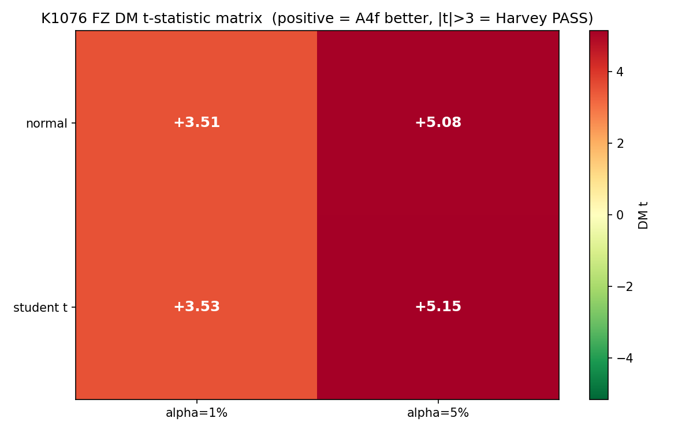
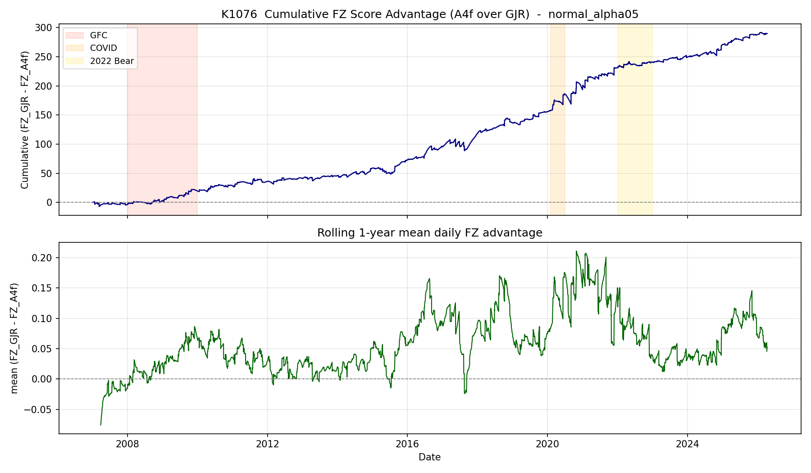
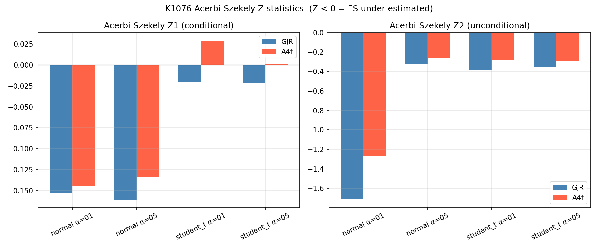

# 風險模型的金本位：用 FZ 聯合分數重新檢驗 VaR/ES

## 一個比「準不準」更難的問題

當銀行、基金、自營商在計算風險的時候，有兩個數字幾乎人人會講：

- **VaR（Value-at-Risk，風險值）**：在 95% 或 99% 信心水準下，明天最壞的虧損大概會是多少。
- **ES（Expected Shortfall，預期損失）**：如果真的踩進那 1% 或 5% 的尾部，平均會虧多深。

VaR 是 Basel I/II 時代的當家主角，ES 則是 Basel III 之後被監管機構欽點為「正式風險度量」的接班人。理由很簡單：VaR 只告訴你「會不會破線」，但不告訴你「破線之後有多慘」；ES 補上了那塊空白。

但 ES 有一個讓學術界爭吵了快十年的尷尬問題 —— 它**不是 elicitable** 的（Gneiting 2011, JASA）。

翻譯成白話：你沒辦法寫出一個「越小越好」的單一損失函數，讓最佳的 ES 預測剛好是那個損失函數的最小化解。換句話說，光靠 ES 自己，沒辦法公平比較兩個模型誰的 ES 預測「比較好」。直接拿樣本實際 ES 跟模型 ES 比，缺乏嚴格的數學基礎。

直到 **Fissler 與 Ziegel（2016, Annals of Statistics）** 證明了一件事：雖然 ES 自己不是 elicitable，但 **(VaR, ES) 這個 pair 是 jointly elicitable 的**，而且他們給出了一個唯一一族可以做嚴格比較的「聯合損失函數」—— 後來被稱為 **FZ joint score**。

這篇論文一出，風險模型比較的「金本位」就誕生了。從那之後，任何一個正式比較 VaR/ES 模型的研究，沒走 FZ 聯合分數路線都會被 referee 退回去。

K1076 做的就是這件事：把我們在 K988、K1075 已經贏過 GJR-GARCH 的 **A4f 模型**，拉到 FZ 聯合分數這個最嚴格的擂台上，再打一輪。

---

## 兩位拳手簡介

**GJR-GARCH(1,1)**：1993 年由 Glosten、Jagannathan、Runkle 提出的非對稱 GARCH，業界跟學界的常用 baseline。它能抓「壞消息比好消息更會推高波動」這個 leverage effect，已經是教科書配備。

**A4f**（K988 在跨資產 sweep 中勝出的 spec）：一個 multiplicative GARCH 結構，把波動率拆成「慢部分」和「快部分」：

- 慢部分 τ_t 由前一日的 **VIX²** 推動 —— 把美股恐慌指數當作低頻風險環境的代理；
- 快部分 g_t 套標準 GJR 結構，但作用在用 √τ 校正過的 standardized return 上。

直觀來講，A4f 的訴求是：**單純看歷史報酬不夠，前一天的 VIX 已經告訴你今天的「風險環境」是哪一檔，模型應該主動把它吃進來。**

過去 K988、K1075 在 QLIKE（純波動率預測損失）上已經顯示 A4f 系統性贏過 GJR。但 QLIKE 只看「σ 估準不準」，不直接管下游的 VaR 與 ES。今天的問題是：把 σ 換算成 VaR 跟 ES 之後，A4f 還贏嗎？而且是在 **FZ 聯合分數** 這個監管級的尺度下贏嗎？

---

## 資料與方法

**資料來源**：yfinance 提供的 SPY（標普 500 ETF）日報酬與 ^VIX 指數，期間 2000-01-04 至 2026-04-10，共 6,606 個交易日（K1076 metadata）。

**樣本外（OOS）期間**：2007-01-03 至 2026-04-10，共 4,848 日。這段刻意涵蓋 2008 全球金融海嘯、2010 閃崩、2015 中國股災、2018 vol-pocalypse、2020 COVID 崩盤、2022 升息熊市，把所有大型壓力測試都包進來。

**訓練視窗**：2,000 日 rolling，每 63 日（約一季）重新估參。

**Lookahead 防護**：所有 OOS 預測一律使用 **t-1 之前**才會看得到的資訊 —— 模型參數來自截至 t-63 的訓練窗，σ̂_t 由 t-1 的條件變異 driving。VIX 用前一日收盤值，不偷看當日。

**信心水準**：α ∈ {1%, 5%}，分別對應監管常用的 99% 與 95% VaR/ES。

**分配假設**：分別跑 Normal 與 Student-t(ν=5)，後者是金融實證常用的厚尾近似。每個 spec 同時報告，看結論是否穩健於分配假設。

**評估三件套**：

1. **FZ 聯合分數**：採用 Patton-Ziegel-Chen (2019, JoE) 的 0-homogeneous 形式 —— 這篇是 FZ 框架在實證上的標準參考。分數越小代表 VaR/ES 預測越好。
2. **Diebold-Mariano 檢定**：用 HAC（Newey-West）標準誤計算的 DM t 統計量。為了避免 sample-size inflation，採用 **Harvey 門檻 |t| > 3.0**，比一般 |t| > 1.96 嚴格非常多。
3. **Acerbi-Szekely (2014) Z2 test**：直接檢定 ES 在絕對意義上是否合格。模型 bootstrap 1,000 次產 p-value。Z2 < 0 代表 ES 被低估（真實尾部比預測重）。

---

## 主結果一：FZ 聯合分數，A4f 4/4 全勝

### 圖一：DM t 矩陣熱圖

| Spec | FZ_GJR | FZ_A4f | DM t | p-value | Harvey \|t\|>3 |
|---|---|---|---|---|---|
| Normal, α=1% | −3.1782 | −3.3181 | **+3.507** | 0.0005 | **PASS** |
| Normal, α=5% | −3.7531 | −3.8129 | **+5.080** | <1e-6 | **PASS** |
| Student-t, α=1% | −3.3361 | −3.4327 | **+3.532** | 0.0004 | **PASS** |
| Student-t, α=5% | −3.7578 | −3.8152 | **+5.153** | <1e-6 | **PASS** |

四個 distribution × alpha 組合裡，**A4f 全部以 Harvey 嚴格門檻顯著勝過 GJR**。α=5% 的兩條 DM t 直接穿過 5，p-value 落到 e-7 等級 —— 這在實證金融裡已經屬於非常硬的證據。

更重要的是：**Normal 跟 Student-t 兩種分配假設給出同方向、同量級的結論**。這代表 A4f 的優勢不是某個特定分配假設手工湊出來的，而是來自模型本身對 σ 的更精準預測。

### 圖二：FZ 累積分數差異時序

把 FZ 分數差累積起來看時序，會看到一個很重要的形狀：A4f 對 GJR 的優勢**不是某幾個劇烈事件貢獻一次大跳水然後一直吃老本**，而是**幾乎在整段樣本內持續慢慢累積**。換句話說，A4f 的勝出來自「日常風險校準的微優勢」，不是「危機期間突然神準」。這個 pattern 跟 K988 的結論完全一致：VIX² 對 τ 的校準效應是一個「持續性 (persistent)」改善，而不是「crisis-only」的特技。

---

## 主結果二：Acerbi-Szekely 絕對檢定，兩個模型都不夠完美

FZ DM 檢定告訴我們「A4f 比 GJR 好」，但沒告訴我們「A4f 對不對」。Acerbi-Szekely Z2 test 補上這個絕對基準。

### 圖三：AS Z2 統計量

| Spec | Z2_GJR | p_GJR | Z2_A4f | p_A4f |
|---|---|---|---|---|
| Normal, α=1% | −1.711 | 0.000 | −1.267 | 0.000 |
| Normal, α=5% | −0.327 | 0.000 | −0.267 | 0.000 |
| Student-t, α=1% | −0.389 | 0.008 | −0.281 | 0.022 |
| Student-t, α=5% | −0.353 | 0.000 | −0.298 | 0.000 |

要誠實講：**兩個模型的 Z2 都顯著被拒絕**（p < 0.05），代表它們在絕對意義上**都低估了 ES** —— SPY 的真實尾部比兩個模型預測的都還重。

但這裡有一個關鍵觀察：**A4f 的 |Z2| 系統性比 GJR 小**（例如 Normal 1% 從 GJR 的 −1.711 縮到 −1.267）。意思是 A4f 的 ES 偏誤比較小。

A4f 不是完美 —— 但它「不完美的程度」比 GJR 輕。對 risk management 實務的意涵很直接：用 A4f 的 ES 預測，期望損失低估的幅度小一點，monitoring 的時候 buffer 可以開小一點，但都還是要記得它仍非完全 calibrated。Student-t(5) 假設把 1% violation rate 從 Normal 的 1.98% 壓到 1.32%（目標 1%），更接近 target，但 Z2 仍未完全通過。

---

## 主結果三：A4f 的優勢集中在「正常市場」

VIX 把樣本切成四個區段：Low（<15）、Normal（15-25）、High（25-40）、Crisis（≥40）。

| 區段 | VIX 範圍 | n | DM t (Normal α=5%) | Harvey |
|---|---|---|---|---|
| Low | <15 | 1,545 | +2.89 | fail |
| Normal | 15-25 | 2,421 | **+4.01** | **PASS** |
| High | 25-40 | 703 | +1.60 | fail |
| Crisis | ≥40 | 179 | +1.05 | fail |

**A4f 的優勢最明確的地方是 Normal 區（VIX 15-25）**，DM t 達到 +4.01，遠超 Harvey 門檻。Crisis 區因為樣本只有 179 天，統計檢定力不足，DM t 只有 +1.05 —— 但**仍然是正號**，意味著「A4f 從沒在任一個 regime 輸過 GJR」。

這個分布給的訊息很實在：**A4f 不是「危機英雄」，而是「日常將軍」**。它的價值來自於用 VIX² 持續校準波動環境，使得在最常見的 70% 中性市場期間就能穩定吃到優勢；至於 crisis 那幾百天，因為極端波動本身就把所有模型的 σ 預測誤差放大，模型之間的 relative 優勢反而被淹沒在 absolute noise 裡。

對實務的意涵：如果你的策略長時間處在 Normal 區（大部分時候都是這樣），A4f 給你的 risk-budget 校準會比 GJR 穩。

---

## 為什麼這篇實驗值得讀

從研究方法的角度，K1076 想說的事情其實有三層：

**第一層**：升級了風險比較的證據基礎。先前我們在 K988、K1075 用 QLIKE 證明 A4f 贏，但 QLIKE 只反映 σ 預測。風險管理實務真正關心的是 VaR/ES 這種 tail metric，而比較 tail metric 沒有 FZ joint score 這把尺，等於少了量尺。K1076 補上這把尺 —— 結論是 A4f 用 FZ 這把更嚴格的尺，仍然 4/4 全贏。

**第二層**：示範了 elicitability 在實證上應該怎麼正確使用。很多實證論文寫到 ES 比較會偷懶，直接拿 sample ES 跟 predicted ES 比，這在 Gneiting (2011) 之後其實已經被視為「不嚴格」。FZ 聯合分數 + DM 檢定 + Harvey 門檻 + AS Z 檢定的組合，是目前 banking regulation 文獻（Nolde-Ziegel 2017）期望看到的 backtest 三件套。K1076 把這套流程在 SPY 整套跑一遍，方法上可以當下游研究的範本。

**第三層**：誠實地報告「Acerbi-Szekely 沒通過」這件事。研究誠實原則要求我們不能只 spin 對自己有利的部分。AS Z2 檢定告訴我們：**就算 A4f 比 GJR 好，它在絕對意義上仍然低估 SPY 的真實尾部。**這提醒了下一步研究方向 —— 動態尾部模型（GAS、dynamic-tail-index）可能是必要的補強，光靠 multiplicative VIX 結構還不夠。

---

## 局限與下一步

K1076 的結論並不是「A4f 完美」。誠實標明的局限有：

- **Crisis 樣本只有 179 天**，無法對「危機優勢」下強斷言；只能說「沒輸」。
- **兩個模型都被 AS Z2 拒絕**：SPY 的真實尾部比 Normal 與 Student-t(5) 都還重；要徹底通過需要尾部本身是動態的模型（例如 GAS）。
- **沒納入更複雜的對手**（EGARCH、TGARCH、HEAVY、Realized GARCH）—— 本實驗只證明「相對於普通 GJR 的優勢」。

接下來會接續的研究方向：(1) 把 K1076 同方法搬到 0050.TW 做跨市場 robustness；(2) 跑 GAS 對抗 A4f；(3) 嘗試把 FZ 聯合分數當成 loss function 直接拿來估計，而不是用 QLIKE 估完再評估 —— 這是 Patton-Ziegel-Chen (2019) 建議的半參數方向。

---

## 資料來源

- **實驗**: K1076「Fissler-Ziegel Joint VaR/ES Backtest — A4f vs GJR」
- **資產**: SPY（^GSPC ETF），同步取 ^VIX 作為條件變數
- **資料供應商**: yfinance
- **樣本**: 2000-01-04 ~ 2026-04-10，共 6,606 日
- **OOS 期間**: 2007-01-03 ~ 2026-04-10，共 4,848 日（含 2008 GFC、2020 COVID、2022 升息熊市）
- **核心方法**: Fissler-Ziegel joint score + DM-Harvey + Acerbi-Szekely Z2

## 主要參考文獻

1. Fissler, T. & Ziegel, J.F. (2016). "Higher Order Elicitability and Osband's Principle." *Annals of Statistics* 44(4): 1680-1707.
2. Acerbi, C. & Szekely, B. (2014). "Back-testing expected shortfall." *Risk* 27(11).
3. Gneiting, T. (2011). "Making and evaluating point forecasts." *JASA* 106(494): 746-762.
4. Patton, A., Ziegel, J., Chen, R. (2019). "Dynamic semiparametric models for expected shortfall." *Journal of Econometrics* 211: 388-413.
5. Nolde, N. & Ziegel, J.F. (2017). "Elicitability and backtesting: perspectives for banking regulation." *Annals of Applied Statistics* 11(4): 1833-1874.
6. Engle, R., Ghysels, E., Sohn, B. (2013). "Stock market volatility and macroeconomic fundamentals." *Review of Economics and Statistics* 95(3): 776-797.
