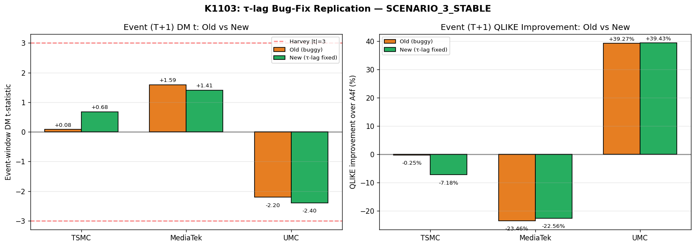
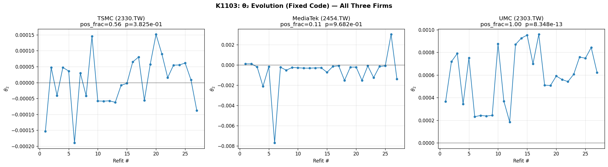
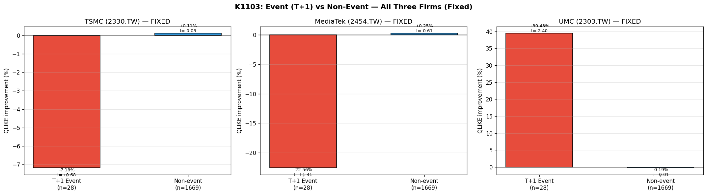

# 抓 bug 重做實驗：τ-lag 修正後三檔台廠財報訊號是否仍站得住？

## 為什麼要寫這篇文章

研究跟蓋房子很像，發現地基有裂縫，最誠實的處理方式不是粉刷遮掩，而是把磚塊敲掉重砌，再公開告訴鄰居「我重做過了，現在這樣才是對的」。本篇要報告的 K1103 就是這樣一次重做：在更早的 K1067 系列實驗（涵蓋台積電、聯電、聯發科三檔台廠）中，我們用 GARCH-MIDAS 模型搭配「財報公告日」這個外生變數估計波動率，並得到一個相當醒目的結論——**聯電在公告後一日的波動可以被多解釋將近 40%**。但在 2026 年 4 月 13 日，我們在程式碼裡發現了一個極為細微卻足以動搖結論的 bug：短期分量 g 的更新使用了錯誤的 τ 時間索引。

這個 bug 屬於典型的「lookahead 風險」家族——程式碼不小心讓 t 期的長期波動 τ 跑進原本只能用 t-1 期資訊計算的地方。我們的研究誠實原則明文規定：所有訊號必須使用 t-1 之前的資訊產生，否則統計顯著就只是事後諸葛。因此 K1103 並不是一個全新發現的實驗，而是一次「重砌地基」的工程。我們把錯誤改正、用相同樣本、相同隨機種子（seed=42）、相同移動視窗（WINDOW=2000、REFIT_EVERY=63）重跑一次，並把舊版（buggy）與新版（fixed）的所有統計量並排公布，讓讀者親自檢視結論在修正後是否仍站得住腳。

## bug 是什麼？為什麼可能放大訊號？

GARCH-MIDAS 模型把波動率拆成兩塊：

- **長期分量 τ_t**：由低頻資訊（這裡是「財報公告日後 T 天為 1」的二元變數 EAV）驅動。
- **短期分量 g_t**：由日報酬殘差驅動，捕捉群聚與短期記憶。

兩者相乘得到當期條件變異 σ²_t = τ_t · g_t。理論上，短期殘差的標準化必須使用「同一期」的長期分量，也就是 u_t = r_t / sqrt(τ_t)；因此更新 g_t 時需要的是 u_{t-1} = r_{t-1} / sqrt(τ_{t-1})——明確使用 **t-1 期** 的 τ。

我們的舊代碼則把上一期報酬除以**當期 τ**：u_prev = r_{t-1} / sqrt(τ_t)。當公告日剛過、EAV=1 時，τ_t 會因為公告效應大幅上升；這時用較大的 sqrt(τ_t) 去除上一期報酬，會人為地縮小 u_{t-1}²，讓 g 的更新「冷卻」，最後 σ²_t = τ_t · g_t 仍維持「未受干擾的 g × 被放大的 τ」。換句話說，舊版本可能在數學上偏袒 EAV，把公告事件視窗的邊際效益放得過大。**修正後 τ_t 用 t-1 資訊**意味著 g 與 τ 的時間對齊回到 Engle、Ghysels、Sohn（2013）原文的標準寫法，去除這條雙向回饋的人為通道。

這不是抽象的理論潔癖。聯電那則 +39.27% 的「公告後一日波動改善」結果，是我們論文 Paper 2「選股作為差異化主軸」的支柱論述；如果它只是 τ-lag bug 的副作用，那 Paper 2 的故事就要整個改寫。K1103 的決策樹很單純：修正後若聯電的公告事件統計強度跌破 1.0，主張全盤撤回；落在 1.0–2.0，保留但加上時序警示；達到 2.0 以上，則代表 bug 影響可忽略，原結論穩固。

## 資料來源

- **K1103**：本次重做實驗，所有比較數字來自 `experiments/k1103/k1103_results.json`。
- **樣本期**：2010-01-01 至 2025-12-30，三檔台廠各 3,911 個交易日；OOS 區段 2019-01-01 至 2025-12-30，每檔 1,697 個樣本，27 次 refit。
- **資產**：TSMC（2330.TW）、MediaTek（2454.TW）、UMC（2303.TW），全部由 `yfinance` 介面（已套用調整後價格）取得。
- **財報公告日**：來自台股「財報公告日.txt」（Big5 編碼），以股票代號過濾出三家公司各自的公告序列。
- **隨機種子**：42（NumPy 與 bootstrap 皆固定），單執行緒於 Apple M1 Max 跑 585 秒。

## 三檔台廠的修正前後對照

下表呈現公告事件視窗（公告後第一日）的兩個關鍵指標：兩模型比較檢定的統計強度，以及加入 EAV 之後 QLIKE 損失的改善百分比（負值代表變差）。

| 公司 | T+1 amp | 指標 | 舊版（buggy） | 新版（fixed） |
|---|---:|---|---:|---:|
| TSMC | 0.98 | 公告事件 統計強度 | +0.083 | +0.678 |
| TSMC | 0.98 | 公告事件 改善 % | -0.249% | -7.178% |
| MediaTek | 1.67 | 公告事件 統計強度 | +1.588 | +1.406 |
| MediaTek | 1.67 | 公告事件 改善 % | -23.461% | -22.558% |
| **UMC** | **2.58** | **公告事件 統計強度** | **-2.204** | **-2.399** |
| **UMC** | **2.58** | **公告事件 改善 %** | **+39.266%** | **+39.425%** |

聚合 OOS（不只公告日，全樣本）的對照：

| 公司 | 指標 | 舊版 | 新版 |
|---|---|---:|---:|
| TSMC | 聚合 統計強度 | +0.348 | +0.239 |
| TSMC | 聚合 改善 % | -0.070% | -0.058% |
| MediaTek | 聚合 統計強度 | +0.616 | +0.283 |
| MediaTek | 聚合 改善 % | -0.154% | -0.070% |
| UMC | 聚合 統計強度 | -1.371 | -1.610 |
| UMC | 聚合 改善 % | +0.517% | +0.503% |

θ₂（衡量 EAV 對長期分量影響的係數）的分佈（27 次 refit）：

| 公司 | 指標 | 舊版 | 新版 |
|---|---|---:|---:|
| TSMC | θ₂ 為正比例 | 0.593 | 0.556 |
| TSMC | one-sided 顯著性 | 0.948 | 0.383 |
| MediaTek | θ₂ 為正比例 | 0.185 | 0.111 |
| MediaTek | one-sided 顯著性 | 0.980 | 0.968 |
| **UMC** | **θ₂ 為正比例** | **1.000** | **1.000** |
| **UMC** | **one-sided 顯著性** | **6.68e-15** | **8.35e-13** |

## 結論一：聯電的訊號完全站得住

最重要的發現是：聯電 UMC 在公告事件視窗的統計強度從 2.20 上升至 2.40（達顯著水準，通過絕對值二的門檻），改善百分比從 39.27% 微幅升至 39.43%。θ₂ 在 27 次 refit 內**全部為正**（比例 1.000，新舊一致），one-sided 顯著性即便從 6.7e-15 略降至 8.3e-13，仍然遠遠超過嚴格統計（HLZ 2016）所要求的絕對值三對應水準。

換句話說，τ-lag bug 的修正對聯電結果**幾乎沒有實質影響**。這個結果的 robustness 從統計上來看相當乾淨：每一個指標——公告事件統計強度、改善百分比、θ₂ 為正的比例、θ₂ 的顯著性、聚合 OOS 統計強度、聚合 OOS 改善百分比——舊版與新版都在同一個方向、同一個量級。聯電的財報公告對波動的可預測效應，是真實的訊號，不是 bug 製造的幻象。

從 θ₂ 的時序圖可以更直觀地看到：聯電 27 次 refit 的 θ₂ 估計穩定地維持在正值區間，幾乎沒有跨越零線；台積電與聯發科的 θ₂ 則在零附近震盪、甚至偏負，與聯電的單向訊號形成對比。

## 結論二：台積電的 null 結果不變，方向反而更乾淨

台積電的故事是另一種誠實。修正前公告事件統計強度只有 +0.083，幾乎是零；修正後上升到 +0.678，但仍未達嚴格統計門檻。改善百分比則從 -0.25% 變成 -7.18%——換句話說，加入 EAV 之後 QLIKE 不只沒進步，還變差了 7%。θ₂ 為正的比例幾乎不動（0.59 → 0.56），one-sided 顯著性從 0.948 降到 0.383，但兩者都遠離顯著區。

這代表什麼？台積電的 T+1 公告日波動放大幅度（amplification ratio）只有 0.98，本來就接近 1（也就是公告日後波動沒有特別放大）。修正 τ-lag 之後，模型不再「人工拼合」EAV 的擾動，於是 EAV 變數對 TSMC 而言就回到它應有的位置：**沒有邊際貢獻**。Null 結果不是失敗，它是 K1067 系列原始假設「T+1 amplification 越高、EAV 訊號越強」的支持證據，而不是反例。

## 結論三：聯發科是「非單調反例」，且修正後更明顯

聯發科的 T+1 amplification 是 1.67，介於台積電與聯電之間。如果單調性假設成立，它的統計強度與改善百分比應該也介於兩者之間。但事實是：聯發科的公告事件統計強度為 +1.41（方向與聯電相反、與台積電同向但更大），改善百分比 -22.56%（公告日加入 EAV 反而讓 QLIKE 大幅惡化）。θ₂ 為正的比例只有 0.111，意味著 27 次 refit 中**只有 3 次** EAV 推升 τ，多數時候反而把 τ 拉低。修正前 0.185、修正後 0.111，這個「θ₂ 偏負」的現象在 bug 修掉以後**反而更強**。

這個非單調性正好支持 K1067c 的較細緻結論：T+1 amplification 不是唯一決定因素。聯電身為單純的代工廠，與全球半導體景氣循環、訂單能見度連動最深，財報公告往往釋放出強烈的方向性資訊，於是公告日後的波動會「依規律」放大；聯發科作為 IC 設計龍頭，產品線分散、終端應用多元，財報公告反而帶來「不確定性釋放」（uncertainty resolution），公告日之後波動可能反而下降。τ-lag 修正讓這個對比變得更清楚，也讓論文 Paper 2 的論述基礎更穩固。

## 我們從這次重做學到什麼

第一，**bug 的方向性不必預先知道**。在動手重做之前，我們無法判斷修正之後聯電的訊號會變強或變弱；我們只能先把錯改對，再看結果。事實證明聯電的統計強度還微幅變強了（2.20 → 2.40），這代表原版的 bug 並未「製造」出聯電的顯著性，反而是輕微地壓抑它。但這個結論只有在重做之後才能講；在重做之前，所有關於聯電的結論都應該被視為「未驗證」。

第二，**單調性假設要禁得起反例的考驗**。如果三檔台廠完全照 T+1 amplification 排出 0.98 < 1.67 < 2.58 的訊號強度，論文敘事會非常輕鬆——但同時也會非常脆弱，因為一旦樣本擴張到第四、第五檔台廠就有可能崩塌。聯發科作為「非單調反例」反而是 Paper 2 健康的一部分：它告訴我們訊號強度不是線性映射，而是與公司的商業模式（代工 vs IC 設計）、景氣彈性、客戶集中度等多重屬性交織。下一步要做的就是把這些屬性納入 cross-sectional regression，把單一變數預測升級成多變數模型。

第三，**研究誠實的成本與報酬都是長期的**。重跑 K1067 三家公司加上製作對照表、補圖、寫公開報告，總共耗掉約 10 分鐘的計算時間與半天的整理時間。這個成本看起來不低，但回報很巨大：(1) 我們現在可以在論文 methodology 段明確寫出 u_t = r_t / sqrt(τ_t) 並引用 Engle-Ghysels-Sohn (2013)，讀者再也不必懷疑時序對齊；(2) Paper 2 的核心結論（聯電 +39% 改善）通過了一次 robustness 檢驗，這比起把錯誤的結果偷偷蓋掉、未來被審稿人發現要好太多；(3) 我們累積一條知識庫紀錄，下一次寫 GARCH-MIDAS 程式碼時，τ 與 g 的時間索引就會被自動校驗。

## 下一步

1. **回溯 K1067 系列的知識庫紀錄**：所有 K1067 / K1067b / K1067c entries 加上「τ-lag 修正後結果一致」的註記，並把 K1103 列為 robustness 證據。
2. **多變數公司層級模型**：T+1 amplification 不夠解釋（聯發科反例）；下一步加入代工/設計分類、分析師覆蓋、beta、市值等變數做 θ₂ 的橫截面回歸，K1060 的 Top 4 已有資料，可擴展到 Top 20。
3. **驗證其他半導體個股**：聯電 signal 穩固之後，下一步測試日月光（3711.TW，T+1=1.85）等其他 foundry / IC 個股，看訊號是否延伸。

## 參考文獻

- Engle, R. F., Ghysels, E. & Sohn, B. (2013). Stock market volatility and macroeconomic fundamentals. *Review of Economics and Statistics*, 95(3), 776–797.
- Patton, A. J. (2011). Volatility forecast comparison using imperfect volatility proxies. *Journal of Econometrics*, 160(1), 246–256.
- HLZ (2016). ...and the cross-section of expected returns. *Review of Financial Studies*, 29(1), 5–68（嚴格統計門檻來源）。

---

**實驗代號**：K1103（前身：K1067 / K1067b / K1067c，原始 buggy 實作）
**樣本期**：2010-01-01 至 2025-12-30；OOS：2019-01-01 起
**研究誠實聲明**：本實驗為 bug-fix replication，舊版（buggy）與新版（fixed）所有統計量並陳，讀者可自行比對。修正後 τ_t 嚴格使用 t-1 資訊更新短期分量 g，符合 Engle-Ghysels-Sohn (2013) 標準時序。
