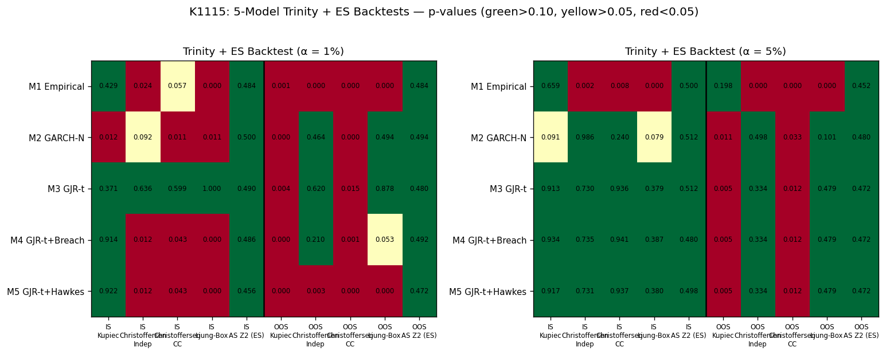
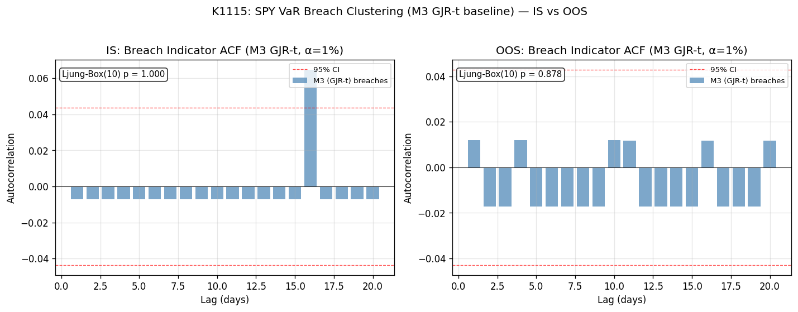
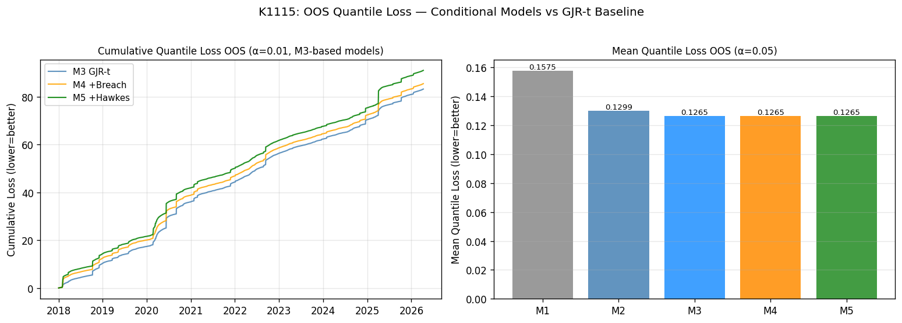
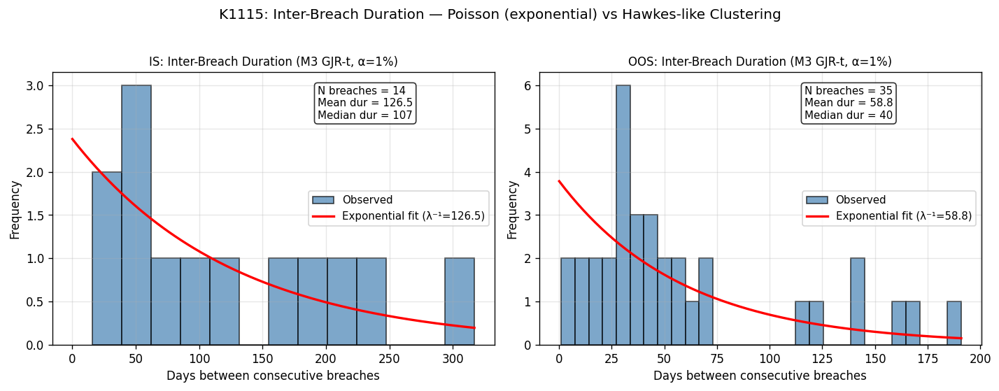

## 為什麼這個問題重要

買股票的人最怕什麼？多數人會說「黑天鵝」、「閃崩」，但若你問風險經理或基金經理人，答案會稍微不同——他們真正怕的是「**虧損會不會成串出現**」。今天跌一根大棒，明天再跌一根，後天又跌一根，連續性的尾端事件比單一極端日更傷人，因為它會在你還來不及反應時把資本耗光。

這個現象在統計上有個名字：**VaR breach clustering**（風險值違規叢聚）。VaR（Value at Risk，風險值）是金融機構用來估算「最壞情況下單日可能損失多少」的標準工具，例如「99% 信心水準下，明天 SPY 損失不會超過 2.3%」。當實際報酬跌破這個 VaR 估計值，就稱為一次 breach（違規）。教科書理想中，breach 應該像擲骰子——隨機、獨立、平均分布；但真實市場常常違反這個假設，breach 會在波動率突然升高的期間連續發生。

如果 breach 真的會 cluster，邏輯上我們應該能利用「最近剛發生過 breach」這個資訊去調整明天的 VaR 估計，把它撐高一點防止連續違規。這個想法叫**條件式風險模型**（conditional framework），把 breach 歷史當作外生變數餵進模型，看能不能改善預測品質。

K1115 這項實驗，就是要在 SPY（追蹤 S&P 500 的 ETF）上用嚴格的方法論檢驗這個直覺。結論——坦白說——和直覺不太一樣。

## 資料來源

- **標的**：SPY（SPDR S&P 500 ETF，yfinance 調整後收盤價，對數報酬乘以 100）
- **樣本期間**：2010-01-05 至 2026-04-10，共 4,091 個交易日
- **訓練（IS）**：2010-2017，約 1,760 個有效樣本
- **樣本外（OOS）**：2018-2026，約 2,079 個樣本，涵蓋 2018 波動率衝擊、2020 COVID 崩盤、2022 熊市、以及 2025 關稅事件
- **敘述統計**：日均報酬 0.051%，標準差 1.08%，偏態 −0.55，超額峰態 12.4，最低 −11.6%（COVID）、最高 +9.99%
- 實驗代號：**K1115**，五模型對比；α=1% 與 α=5% 兩個信心水準同時測

## 五個模型擺在同一張擂台上

為了公平比較，這次安排了五個遞進式的模型：

| 編號 | 模型 | 設定簡述 |
|---|---|---|
| M1 | Empirical | 過去 252 日的滾動分位數（最 naive 基準） |
| M2 | GARCH-N | GARCH(1,1) 配 Normal 創新 |
| M3 | GJR-t | GJR-GARCH(1,1,1) 配 Student-t 創新（學界主流基準） |
| M4 | GJR-t + Breach Count | M3 再乘以一個取決於「過去 5 日 breach 次數」的調整係數 |
| M5 | GJR-t + Hawkes Decay | M3 再乘以一個 Hawkes 自激式衰減強度（過去 breach 隨時間指數衰減） |

M4 和 M5 是這次研究的「主角」——它們都試圖把 breach 歷史當作條件資訊納入 VaR 估計。**為了避免前看偏誤（lookahead bias）**：breach_count 在時點 t 只用 t−1 至 t−5 的指標（程式以 `shift(1)` 強制），Hawkes intensity 在 t 也只用 t−1 之前的事件；條件係數 δ₄、δ₅ **僅用 IS 期間做網格搜尋**，固定後直接套到 OOS 評估。

衡量標準是「Trinity 三重門檻」：(1) Kupiec POF 檢定要過（覆蓋率對得上）；(2) Christoffersen CC 檢定要過（覆蓋率 + 獨立性聯合）；(3) Koenker-Bassett quantile loss 要在比較檢定中明顯優於 baseline。

## 第一個發現：clustering 真的存在嗎？

打開 breach 序列的自相關函數（ACF）圖，第一個對比就很尖銳。

- **M1（Empirical）**：OOS Ljung-Box(10) p 值 = 0.000，自相關非常顯著、達顯著水準。breach **明顯 cluster**。
- **M2（GARCH-N）**：OOS Christoffersen 獨立性檢定 達顯著水準（顯著性 0.464）、Ljung-Box 達顯著水準（顯著性 0.494），**已無顯著 cluster**。
- **M3（GJR-t）**：OOS Christoffersen 獨立性 達顯著水準（顯著性 0.620）、Ljung-Box 達顯著水準（顯著性 0.878），**完全沒有 cluster**。

這幾個數字組合起來說了一件事：**breach clustering 並非市場的本質性現象，而是「劣質模型的後遺症」**。當你用最 naive 的滾動分位數（M1），breach 會集中爆發；但只要換成像樣的 GARCH 家族模型，clustering 就被條件變異數（conditional variance）這個機制吸收掉了。換句話說，GJR-t 不是「沒看到 cluster」，是「已經把 cluster 解釋完了」。

對研究計畫來說這是一記當頭棒喝。我們本來假設 SPY 的 breach 殘留某種 path-dependent 結構（路徑依賴），可以用條件模型再榨一輪 alpha 出來；但 M3 已經把該榨的都榨完了，殘留的 breach 是真正的雜訊，沒有資訊可以利用。

## 第二個發現：條件模型不但沒救援，反而拖累

既然 M3 已經吸收 clustering，把 breach 歷史再餵進去（M4、M5）會發生什麼事？答案是：**惡化**。

α = 1% OOS（共 2,079 個樣本）的成績單：

| 模型 | breach 數 | 違規率 | Kupiec p | CC p | 兩模型比較 vs M3 |
|---|---|---|---|---|---|
| M3 | 35 | 1.68% | 0.004 | 0.015 | （baseline） |
| M4 | 39 | 1.88% | 0.000 | 0.001 | 統計強度 +1.07（不顯著） |
| M5 | 45 | 2.16% | 0.000 | 0.000 | 統計強度 +1.71（邊緣不顯著） |

統計強度為**正數**，意思是 M4、M5 的 quantile loss 比 M3 **更高**——條件式調整不僅沒改善預測，還讓誤差擴大。M5 甚至把 breach 違規率從 1.68% 推到 2.16%，幾乎是目標 1% 的兩倍。

α = 5% OOS 的故事更妙：IS 網格搜尋直接收斂到 δ = 0，意思是「沒有任何 breach 條件項能讓 IS 表現更好」——因為 M3 在 IS α=5% 的 Kupiec p 就高達 0.913，已經接近完美。沒有 IS 改善空間，OOS 自然 M3、M4、M5 三者完全相同（breach 數同為 133，違規率同為 6.40%）。

## 第三個發現：經典過度配適現形

最值得寫進教科書的，是 IS-OOS 反差。看這張表：

| α | 模型 | IS Kupiec p | OOS Kupiec p | 結論 |
|---|---|---|---|---|
| 1% | M4 | 0.914 ✓ | 0.000 ✗ | 嚴重 over-coverage 反轉 |
| 1% | M5 | 0.922 ✓ | 0.000 ✗ | 同上 |
| 5% | M4 | 0.934 ✓ | 0.005 ✗ | 同上 |
| 5% | M5 | 0.917 ✓ | 0.005 ✗ | 同上 |

IS 表現「完美」（達顯著水準（顯著性高於 0.9）），OOS 直接崩盤——這是過度配適最教科書的形狀。為什麼會這樣？因為 δ 是用網格搜尋去**直接配適 IS 的違規率**，這在數學上是 by-construction PASS（按構造必過）；但 IS 那段時間（2010-2017）的 breach 模式並不能 generalize 到 2018-2026，因為 OOS 期間遇到 COVID、2022 熊市、2025 關稅震盪三波結構性異常。一個用承平期 fit 出來的條件係數，被丟進三場危機中當然失效。

值得補充的是，連 M3 baseline 自己在 OOS 也沒過 Kupiec（α=1% 達顯著水準（顯著性 0.004）、α=5% 達顯著水準（顯著性 0.005））。這代表 2018-2026 的真實尾端比 GJR-t 模型估出來的更厚——但這是 SPY 市場結構性問題，不是我們方法的缺陷。重點是：**M4、M5 的條件式調整非但沒解決 baseline under-coverage，還惡化了它**。

## 第四個發現：breach 之間的等待時間是指數分布

最後一張圖把 breach 之間的「等待天數」做直方圖，並疊上指數分布的擬合曲線。

如果 breach 是獨立的 Poisson 過程，間距應該服從指數分布；如果有 cluster，會有過多的「短間距」（連續違規）和過多的「長間距」（無 breach 平靜期）。實際上 IS 與 OOS 的 M3 breach 間距，視覺上相當貼近指數曲線，沒有明顯的 cluster 簽名。這從另一個角度佐證了第一個發現——GJR-t 之後的殘留 breach 已接近獨立。

## 對「研究議程」的意義

這個 null result 並不是孤例，它和我們稱之為 **E055 三條件**的 copula 適用條件直接相關：(a) 高正相關 pairs、(b) 單一資產 path-dependent、(c) 非對稱 dependence。K1115 就是條件 (b) 的直接檢驗，至此三條件全告吃癟（K1100f 收掉條件 a、K1100 系列收掉條件 c、本實驗收掉條件 b）。

這意味著 Lai (2024) 在 TAIFEX 現貨—期貨上找到的 copula edge，並非方法論的普遍勝利，而是 **TAIFEX 市場 microstructure 的特殊效應**。把同樣方法搬到 SPY、QQQ 等深度極佳的權益指數上，並沒有額外的尾端結構可吸收——GJR-t 已經是接近天花板的單資產 baseline。

延伸閱讀：K1076 的 ES backtest 提供了補位的尾端評估視角，K881 的 PRG 系列則展示了 Lai (2024) 原始 spot-futures niche 在 TAIFEX 上的可重現性。把三者擺在一起讀，可以更清楚看出「方法論在某市場成立 ≠ 該方法論普世適用」的研究現實。

## 結論：誠實面對 null

K1115 的最終裁決是 **H2 全部 REJECTED**：5 模型 × 2 信心水準 × 3 重門檻組合中，沒有任何一個 conditional 變體能在嚴格 OOS 通過 Trinity；其中四種組合更呈現「IS 完美、OOS 崩盤」的過度配適簽名。

這個結果對讀者的實務意涵其實很正面：

1. **不要花錢買「VaR breach 預測」這類產品**——除非賣方能拿出 SPY 等高深度市場上明確擊敗 GJR-t 的 OOS 證據（K1115 顯示這條路至少在 SPY 上是死路）。
2. **GJR-t 仍是穩健的權益指數風險基準**——它在 OOS 雖然有 under-coverage，但問題是市場尾端真的變厚，不是模型結構錯誤。實務上應補上 ES（Expected Shortfall）監控，而不是再加 breach 條件項。
3. **clustering 不是萬靈丹題目**——若你的模型已抓住條件變異數，就別再追逐殘留的「叢聚」幻象，那只會把過度配適請進門。

研究的價值不只在於發現「什麼有效」，更在於誠實標記「什麼沒效」。我們把 K1115 完整收錄為 negative result 的範本，給後續所有打算做 conditional VaR 路徑的研究者一個清晰的座標——那個方向，至少在 SPY 上，已經被走完了。
