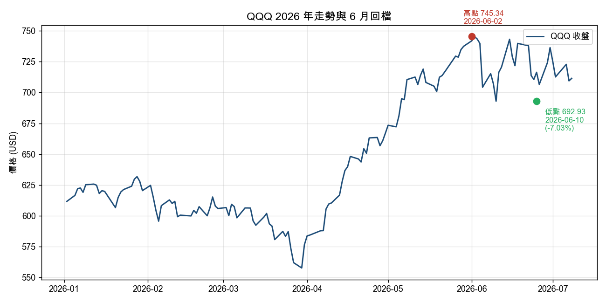
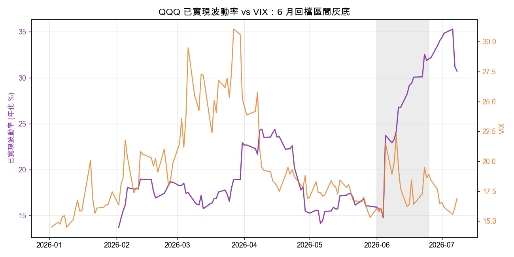
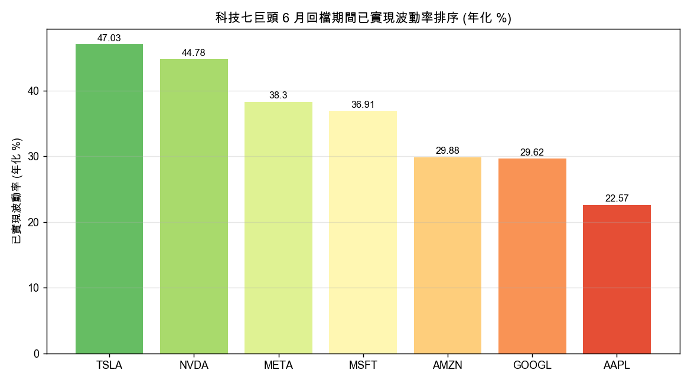

六月那波科技股回檔過去了。翻開帳戶，很多人有個共同的困惑：新聞說那斯達克「小幅回檔」，可是自己的持股怎麼跌得那麼有感。

我把 QQQ 和七巨頭的真實日收盤價全撈出來算了一遍。困惑是有道理的。指數跌得溫和，是因為它把跌得兇的和跌得少的攪在一起平均掉了。

## 先看真實跌幅：指數跟個股是兩回事

先講數字。用實際收盤價算高點到低點的跌幅（不是媒體標題那個攏統的「約一成」），六月這段的真實回檔長這樣：

| 標的 | 高點日 | 低點日 | 回檔幅度 |
|---|---|---|---|
| QQQ（那斯達克100 ETF） | 06-02 | 06-10 | -7.0% |
| MSFT 微軟 | 06-01 | 06-25 | -23.4% |
| NVDA 輝達 | 06-01 | 06-26 | -14.2% |
| META | 06-04 | 06-25 | -13.4% |
| AMZN 亞馬遜 | 06-01 | 06-25 | -13.1% |
| AAPL 蘋果 | 06-02 | 06-25 | -12.7% |
| TSLA 特斯拉 | 06-02 | 06-25 | -11.5% |
| GOOGL 谷歌 | 06-01 | 06-26 | -10.3% |

資料來源：yfinance 日收盤價，2026 年 1 月至 7 月 9 日。

QQQ 從高點到低點掉 7%，聽起來像小感冒。可是同一段時間，微軟自己跌掉將近四分之一，輝達、META、亞馬遜、蘋果都在 12% 到 14% 之間。指數的 7% 是把這些個股的傷口跟其他一百檔權值攪拌後的結果。

還有一個容易被忽略的細節：低點日期不一樣。QQQ 在 6 月 10 日就見了它的最低收盤，之後就在區間裡上上下下。但七巨頭裡的六檔，低點落在 6 月 25、26 日，比指數晚了兩個多星期。跌勢是分批、輪流發生的。今天殺半導體，過幾天輪到軟體，再過幾天換電商。指數每天都有人撐著，所以看起來平穩；持有單一個股的人，卻是實打實地吃到自己那一棒。

## 你感覺到的波動，比 VIX 告訴你的更頑固

這裡要講一個很多人會踩的坑。市場上大家習慣看 VIX，也就是那個俗稱「恐慌指數」的東西，用它來判斷「風波過了沒」。

VIX 這段時間的走法是：回檔前大約在 16 點附近晃，6 月 10 日衝到 22.22 見高，然後就開始往下退。等到 6 月 25 日、也就是多數科技股真正見到最低點那天，VIX 已經回落到 18.89。到 7 月 8 日更是降回 16.9，跟回檔前差不多。

問題來了。VIX 在 6 月 10 日就見高回落，可是七巨頭大部分在 6 月 25 日才落底。如果你 6 月中看到 VIX 開始降，就判斷「警報解除」，那你會在後半段最難熬的殺盤裡，被自己的持股修理。

我算了另一個更貼近體感的東西：已實現波動率。白話講，就是「過去這 20 個交易日，價格實際上抖得多厲害」，把它換算成年化的百分比。VIX 是市場對未來的猜測，已實現波動率是實際發生過的事實。

QQQ 的已實現波動率，回檔前是 16.0%，壓力段升到 25.2%，等到 6 月 25 日之後反而衝到 33.1%。看清楚了：股價都落底反彈了，實際波動的數字還在往上爬。

原因不神秘。20 個交易日的計算窗口，要等那幾根最大的黑K真正滾進窗口裡，數字才會飆到最高。所以已實現波動率天生就慢半拍，價格落底之後它才見頂。VIX 是往前看的預期，見高見得早；已實現波動率是往後算的事實，退得慢。這兩個東西描述的根本是不同的時間軸。

拿它們的高點對一下就很清楚。VIX 這段最高 22.22 出現在 6 月 10 日；QQQ 的已實現波動率最高點卻拖到 7 月初才出現。同一件事，一個提早喊、一個延後認。你用哪個判斷風險，得先想清楚自己問的是「市場現在怕不怕」還是「我的帳戶最近抖得兇不兇」。

順帶一提，還有一個更冷門但更好用的指標叫 VVIX，可以理解成「恐慌指數自己有多不穩」。它從回檔前的 91.6 一路衝到 108.16，這代表市場對波動本身的定價都變得躁動。這種訊號通常比 VIX 的絕對點位更早透露避險情緒在升溫。

## 「七巨頭」根本不是同一筆交易

第三件事，也是我覺得最實用的一點。大家講「科技七巨頭」的時候，語氣好像它們是一個整體。真的把個股的波動攤開來看，它們的差異大到不該被綁在一起討論。

回檔壓力段裡，這七檔的年化已實現波動率是這樣排的：

| 排名 | 個股 | 壓力段已實現波動率（年化） |
|---|---|---|
| 1 | TSLA 特斯拉 | 47.0% |
| 2 | NVDA 輝達 | 44.8% |
| 3 | META | 38.3% |
| 4 | MSFT 微軟 | 36.9% |
| 5 | AMZN 亞馬遜 | 29.9% |
| 6 | GOOGL 谷歌 | 29.6% |
| 7 | AAPL 蘋果 | 22.6% |

最抖的特斯拉是 47%，最穩的蘋果是 22.6%，中間差了 24.5 個百分點。這不是小數字。同樣掛著「科技巨頭」的名牌，特斯拉的波動是蘋果的兩倍多。

有意思的是跌幅深淺跟波動大小還對不太起來。微軟這段跌最深（-23.4%），但它的波動排第四，走的是一路陰跌、幅度大但每天沒有暴衝的樣子。特斯拉波動排第一，回檔幅度反而在七檔裡偏小（-11.5%），它是那種上沖下洗、來回甩你巴掌的類型。跌得深跟抖得兇，是兩種不同的難受。

對於重壓單一科技股、或是把「七巨頭」當成一個籃子無腦買的人，這個離散度是真正該擔心的。當你以為自己分散在七檔裡，實際上有一兩檔的波動貢獻了大部分的心跳。真正的分散，要看的是彼此波動的差異，不是名字聽起來像不像一國的。

## 給你帶走的兩件事

第一，看指數判斷自己的部位風險，會系統性低估。QQQ 那 7% 是稀釋後的平均值。你的帳戶裝的是具體的幾檔，不是那個平均值。想知道自己的真實風險，就得看自己那幾檔的個別波動，別拿指數的溫度計量自己的體溫。

第二，VIX 降下來不等於你的持股不抖了。VIX 講的是市場對未來的預期，通常在殺盤最猛那幾天就見高回落；你帳戶實際感受到的已實現波動率，會拖到價格落底之後才見頂，然後才慢慢退燒。判斷「風暴過了沒」的時候，這兩個時間差值得你多想一步。

六月這波過去了，數字留了下來。指數會說一個溫和的故事，個股會說另一個。信哪個，取決於你手上真正拿著什麼。
